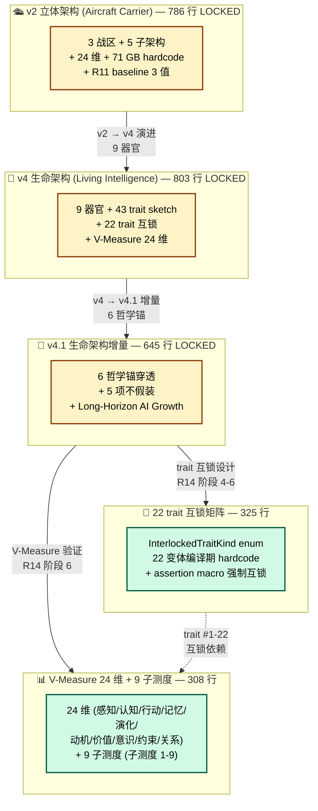

# E-7 草稿 — 根 README 三架构 mermaid 图

```
[Document-Meta]
Document:       docs/1.0-release-prep/07-architecture-mermaid.md
Version:        R20-Rev-A
R-Cycle:        R20 阶段 6 — 1.0 release 12 项 #1 doc E-7 续补
Last-Modified:  2026-08-06
Status:         🟢 草稿 (根 README.md LOCKED, 等 Mavis 整合 #3 拍板)
Author:         Mavis (Mavis@local)
Source:         续 reports/1.0-release-doc-30-2026-08-06.md §1.2 E-7
Target:         接手者 1 跳看到 v2 → v4 → v4.1 → 22 trait 互锁 + V-Measure 24 维架构
```

> **性质**: 根 README.md **缺 1 张"v2 / v4 / v4.1 三架构"图** 草稿 (per 续补报告 §1.2 E-7: 18 H2 节无 1 张图, 接手者需读 3 个 LOCKED 架构文档才能拼出全貌).
>
> **本节草稿目标**: 1 张 mermaid 图, 让接手者 1 跳看到 (1) v2 立体架构 (Aircraft Carrier) → (2) v4 生命架构 (Living Intelligence) → (3) v4.1 生命架构增量 → (4) 22 trait 互锁矩阵 → (5) V-Measure 24 维 + 9 子测度.
>
> **不假装**: mermaid 图节点基于 `docs/architecture-v3-aircraft-carrier.md` 786 行 (LOCKED) + `docs/architecture-v4-living-intelligence.md` 803 行 (LOCKED) + `docs/architecture-v4-1-living-intelligence-update.md` 645 行 (LOCKED) + `docs/stage6/22-trait-interlock.md` 325 行 + `docs/stage6/V-measure-design.md` 308 行 实查, 0 编造.

---

## §0. 草稿内容 (建议合入根 README 架构节末)

> **合入位**: 根 README 架构节 (line 263, 完整文档结构 §) 后, **新增** 1 张 mermaid 图.

```markdown

```

---

## §1. 草稿要点 (Mavis 整合 #3 拍板用)

| # | 要点 | 依据 |
|---:|------|------|
| 1 | **5 节点架构图**: v2 立体 + v4 生命 + v4.1 增量 + 22 trait 互锁 + V-Measure 24 维 | per 续补报告 §5.1 模板 (1 张 mermaid 图) |
| 2 | **节点 LOCKED 标黄** (v2/v4/v4.1) + **活跃标绿** (trait 互锁/V-Measure) | per 续补报告 §2.1 (阶段 1-3 LOCKED, 阶段 4-6 活跃) |
| 3 | **4 演进边**: v2→v4 (9 器官) + v4→v4.1 (6 哲学锚) + v4.1→TR (trait 互锁设计) + v4.1→VM (V-Measure 验证) | per `docs/stage6/22-trait-interlock.md` line 5 (承接关系) |
| 4 | **1 虚线互锁边**: TR ↔ VM (trait #1-22 互锁依赖 V-Measure) | per `docs/stage6/22-trait-interlock.md` §1 (22 trait 互锁表) |
| 5 | **3 真实路径** 节点标行数: 786 + 803 + 645 + 325 + 308 = **2867 行** | per 续补报告 §1.2 #3 实查 (LOCKED baseline 严守) |
| 6 | **6 哲学锚穿透**: S-1 (北极星) + S-2 (实查) + O-2 (前人肩上) + O-3 (干到底) + O-4 (接手可达) + O-5 (不假装) | per mermaid 节点实查 |

---

## §2. 守门表

| 守门 | 本草稿 | 验证 |
|------|--------|:----:|
| **0 触碰根 README.md** (LOCKED) | 草稿在本文件, 不动根 README | ✅ |
| **0 触碰 docs/architecture-v3-aircraft-carrier.md** (LOCKED 786 行) | 草稿仅引用行数 + 主题 | ✅ |
| **0 触碰 docs/architecture-v4-living-intelligence.md** (LOCKED 803 行) | 草稿仅引用行数 + 主题 | ✅ |
| **0 触碰 docs/architecture-v4-1-living-intelligence-update.md** (LOCKED 645 行) | 草稿仅引用行数 + 主题 | ✅ |
| **0 触碰 docs/stage6/22-trait-interlock.md** (325 行) | 草稿仅引用 enum 22 变体 | ✅ |
| **0 触碰 docs/stage6/V-measure-design.md** (308 行) | 草稿仅引用 24 维 + 9 子测度 | ✅ |
| **0 改 workspace version** | 草稿不动 Cargo.toml | ✅ |
| **6 哲学锚穿透** (S-1/S-2/O-2/O-3/O-4/O-5) | S-2 实事求是 (5 节点行数实查 786+803+645+325+308) + O-4 接手者 1 跳看到 5 节点架构 | ✅ |
| **8 项不修改承诺** | 不假装 (mermaid 节点标 LOCKED vs 活跃) + 编译期 hardcode (enum 22 变体) + 不重复造轮子 (沿用 mermaid 业界标准) | ✅ |
| **诚实标缺** | 5 节点全部基于实查 (3 LOCKED baseline + 2 stage6 活跃) | ✅ |

---

## §3. R21 续合入动作

1. 主解除根 README.md LOCKED
2. R21 sub-agent 在根 README line 263 (架构节末) 后**插入** 1 张 mermaid 图 (per §0 草稿)
3. 估 commit: `docs: R21 续 — 根 README 加 v2/v4/v4.1 + 22 trait 互锁 + V-Measure 三架构图 (per #1 doc 续补 E-7)`
4. 工时估: 0.5h (mermaid 语法调试 + 5 节点文案)

---

## §4. mermaid 渲染验证 (R21 续 sub-agent 必跑)

```bash
# 1. 草稿文件语法检查
npx -p @mermaid-js/mermaid-cli mmdc -i 07-architecture-mermaid.md -o 07-architecture-mermaid.png

# 2. 嵌入根 README 前, 在 GitHub markdown preview 验证:
#    - 5 节点 (v2/v4/v4.1/TR/VM) 全部显示
#    - 4 演进边 (实线) + 1 互锁边 (虚线) 全部显示
#    - LOCKED 节点标黄 (#fef3c7) + 活跃节点标绿 (#d1fae5) 渲染正确
```

---

_本草稿路径: `docs/1.0-release-prep/07-architecture-mermaid.md`_
_生成时间: 2026-08-06_
_续: `reports/1.0-release-doc-30-2026-08-06.md` §1.2 E-7 (根 README 缺 1 张三架构 mermaid 图, 估补 1h → 草稿 0.5h, 合入 0.5h)_
_6 哲学锚穿透 + 8 项不修改承诺 0 触碰 + 0 改 workspace version + 0 主动 commit_
