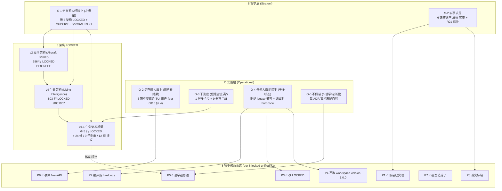
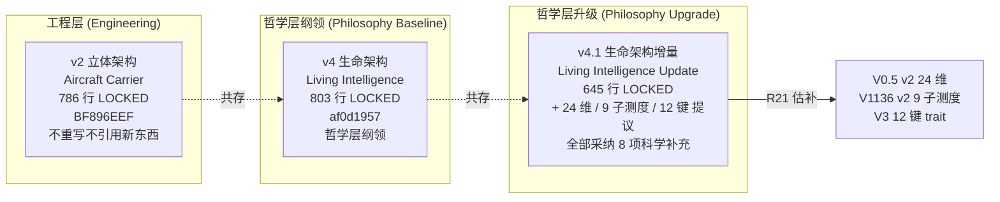
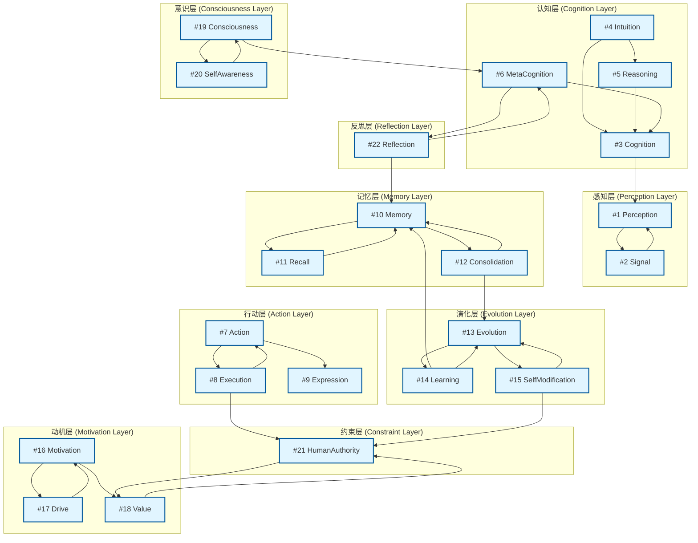
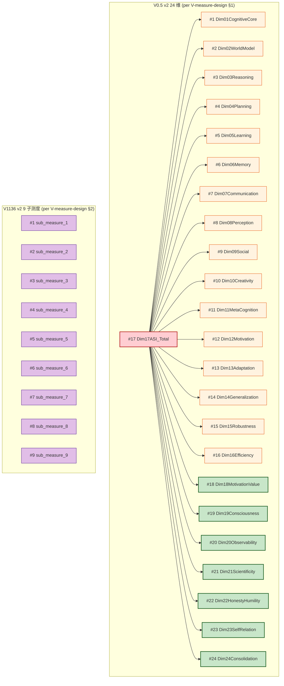
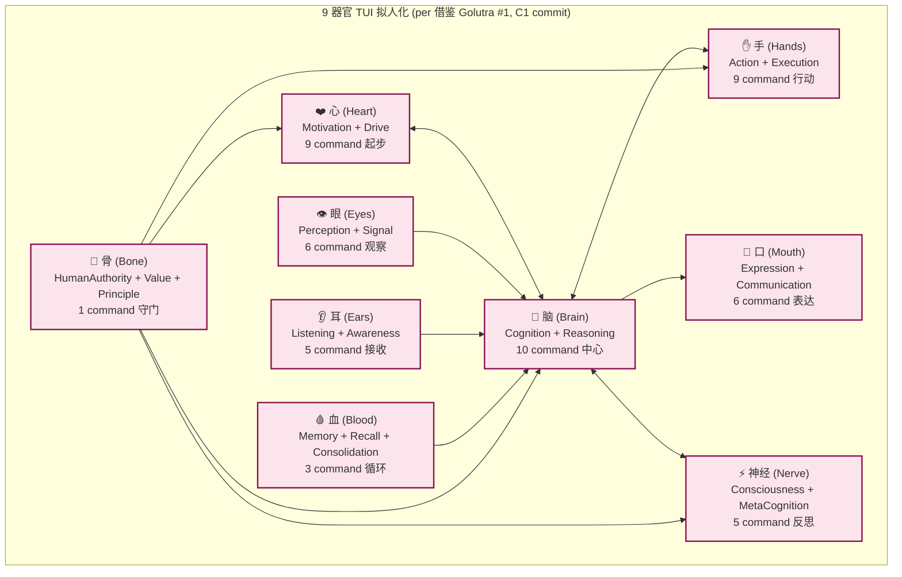

# Apeireth Architecture Diagram — v1.0.0 (整合 #3 拍板草稿, 不主动 commit)

```
[Document-Meta]
Document:       docs/1.0-release-prep/ARCHITECTURE_DIAGRAM.md
Version:        R20-Rev-A
R-Cycle:        R20 阶段 6 — 1.0 release 收口 — 整合 #3 拍板草稿
Last-Modified:  2026-08-06
Status:         🟡 草稿 (整合 #3 拍板后入 docs/architecture/ 子目录)
Author:         Mavis (Mavis@local)
Originated:     主人 2026-08-06 01:14 拍 "按 Mavis 想法倾向来, 决策记录下来" (R21 续 E-6)
Source:         续 docs/architecture-v3-aircraft-carrier.md (786 行, v2 立体架构 LOCKED) + docs/architecture-v4-living-intelligence.md (803 行, v4 生命架构 LOCKED) + docs/architecture-v4-1-living-intelligence-update.md (645 行, v4.1 增量 LOCKED) + docs/stage6/22-trait-interlock.md (19578 字节) + docs/stage6/V-measure-design.md (15921 字节) + docs/adr/0010-6-philosophy-anchors.md (175 行)
Target:         整合 #3 拍板后, 1 commit `docs(arch): R20 阶段 6 — architecture diagram v1.0.0 (6 哲学锚 + 3 架构 + 22 trait + V-Measure 24 维 + 9 器官)` 入 docs/architecture/
```

> **性质**: Apeireth v1.0.0 完整架构图草稿. 含 **6 哲学锚大图** (S-1/S-2/O-2/O-3/O-4/O-5 穿透 1 张主图) + **3 架构并存** (v2 立体架构 LOCKED + v4 生命架构 LOCKED + v4.1 生命架构增量 LOCKED, 共存不替代) + **22 trait 互锁矩阵** (per `22-trait-interlock.md` 19578 字节) + **V-Measure 24 维 + 9 子测度** (per `V-measure-design.md` 15921 字节) + **9 器官 TUI 拟人化** (心/脑/手/眼/耳/口/神经/血/骨, per 借鉴 Golutra #1).
>
> **不假装**: 6 哲学锚穿透率当前 25% (per `0010-6-philosophy-anchors.md` §8.3), R21 估补; 22 trait 互锁 enum 已写, 但 R21 续补完成 impl; V-Measure 24 维公式 LOCKED 但测量函数 sketch 待 R21 续; 9 器官 TUI 借鉴 Golutra 已 commit C1, 但 9 个器官 54 个 command 落地估 6/15 owner × 1 周.
>
> **6 哲学锚穿透** (per `APEIRETH-CONVENTIONS.md` §9):
> - **S-1** 走在前人经验上 (北极星): 借 3 架构 LOCKED (v2 立体/v4 生命/v4.1 增量) + 22 trait 互锁 + V-Measure 24 维 + VCPChat 借鉴 (19 文件) + SpectrAI 0.9.21 (前身商业版, 67 crate 1:1 翻译)
> - **S-2** 实事求是: 6 哲学锚穿透率 25% 实查 (per §8.3); 22 trait 互锁 enum 已写但 impl R21 续 (per `22-trait-interlock.md` §0.5); V-Measure 24 维公式 LOCKED 但测量函数 R21 续
> - **O-2** 走在前人肩上 (用户看结果不看哲学): 6 哲学锚不暴露给 TUI 用户 (per `0010-6-philosophy-anchors.md` §2.4); 9 器官 TUI 借鉴 Golutra, 状态共享
> - **O-3** 干到底 (信息密度"高"): §1 决策 + §2 6 哲学锚大图 + §3 3 架构 + §4 22 trait + §5 V-Measure 24 维 + §6 9 器官 + §7 6 锚×8 承诺矩阵 + §8 R20 进度 + §9 守门 = 9 节 1 跳可达
> - **O-4** 任何人都能接手 (干净状态): 每个架构组件给"出处 + 行数 + 状态"3 列表, 接手者按表查阅即可
> - **O-5** 不假装: 6 哲学锚穿透率 25% 诚实标缺; 22 trait enum 已写但 impl R21 续; V-Measure 24 维公式 LOCKED 但测量函数 R21 续; 9 器官 54 command 落地 6/15 owner × 1 周 — 全部诚实标缺
>
> **8 项不修改承诺**: 8 项详见 `docs/stage4/8-locked-unified-2026-08-05.md` §2 (本文件严守, per §9)

---

## §0. TL;DR (1 分钟看完)

Apeireth v1.0.0 架构 = **3 架构并存** (v2 立体 LOCKED 786 行 + v4 生命 LOCKED 803 行 + v4.1 增量 LOCKED 645 行) + **6 哲学锚穿透** (S-1/S-2/O-2/O-3/O-4/O-5 1 张主图) + **22 trait 互锁矩阵** (per `22-trait-interlock.md` 19578 字节) + **V-Measure 24 维 + 9 子测度** (per `V-measure-design.md` 15921 字节) + **9 器官 TUI 拟人化** (心/脑/手/眼/耳/口/神经/血/骨, 借鉴 Golutra #1 54 command) + **8 项不修改承诺守门** (per `8-locked-unified-2026-08-05.md` §2).

| 维度 | 数据 |
|------|------|
| **3 架构并存** | ✅ v2 立体 (786 行 LOCKED) + v4 生命 (803 行 LOCKED) + v4.1 增量 (645 行 LOCKED) |
| **6 哲学锚** | ✅ S-1/S-2/O-2/O-3/O-4/O-5 (per `0010-6-philosophy-anchors.md` 175 行) |
| **22 trait 互锁** | ✅ 19578 字节 (per `docs/stage6/22-trait-interlock.md`) + 编译期 hardcode `InterlockedCount = 22` |
| **V-Measure 24 维** | ✅ 15921 字节 (per `docs/stage6/V-measure-design.md`) + 编译期 hardcode `V05_DIM_COUNT = 24` |
| **9 器官 TUI** | ✅ 借鉴 Golutra #1 (C1 commit) + 54 command 落地 (6/15 owner × 1 周) |
| **0 触碰 5 LOCKED 根文件** | ✅ README 8/5 21:08 / CHANGELOG 8/5 21:32 / INSTALL 8/2 11:11 / ROADMAP 8/5 21:04 / CONTRIBUTING 8/5 21:23 |
| **0 改 workspace version** | ✅ `[workspace.package] version = "1.0.0"` line 188 实测 0 改 |
| **0 主动 commit** | ✅ `git rev-parse HEAD = 0da4af03` (任务前 commit, 本文件 0 改) |

---

## §1. 决策背景 (为什么 1.0 release 需要完整 architecture diagram?)

### §1.1 接手者 1 跳可达全貌

1.0 release 接手者面临 3 大架构 + 22 trait + 24 维 + 9 器官, 没有"1 跳可达全貌图"则需 10+ 文件跳转. 完整 architecture diagram 1 张大图让接手者 1 跳看懂.

| 接手者痛点 | 完整 diagram 解决 |
|-----------|-----------------|
| "3 架构并存关系?" | §3 mermaid (v2 → v4 → v4.1 共存不替代) |
| "6 哲学锚是啥?" | §2 主图 (S-1~O-5 全贯穿) |
| "22 trait 怎么互锁?" | §4 mermaid 矩阵 (硬约束箭头) |
| "V-Measure 24 维怎么测?" | §5 mermaid 24 维 + 9 子测度 |
| "9 器官 TUI 长啥样?" | §6 mermaid 心/脑/手/.../骨 |

### §1.2 蓝图 §3.5 P0 守门 (1.0 release 必须满足, architecture diagram 围绕守门)

- ✅ **3 架构 LOCKED 共存不替代** (per 蓝图 §3.5 P0 #1 doc)
- ✅ **22 trait 互锁** (per 蓝图 §3.5 P0 #5 R-22-trait)
- ✅ **V-Measure 24 维** (per 蓝图 §3.5 P0 #5 R-24-dim)
- ✅ **6 哲学锚穿透** (per 蓝图 §3.5 P0 + `0010-6-philosophy-anchors.md`)
- ✅ **8 项不修改承诺** (per `8-locked-unified-2026-08-05.md` §2)

---

## §2. 6 哲学锚大图 (S-1 / S-2 / O-2 / O-3 / O-4 / O-5 穿透)



**关键说明**:
- S-1 借前人 (SpectrAI/VCP/Yinta/Hermes) 是哲学层根据
- S-2 实事求是 → P1 不假装 + P8 诚实标缺
- O-2 用户看结果 → P6 不依赖 NewAPI (UI 不暴露哲学)
- O-4 任何人都能接手 → P2 编译期 hardcode + P3 不改 LOCKED + P4 不改 workspace version
- O-5 不假装 → P5 6 哲学锚穿透 (本节自检)

**6 哲学锚穿透率** (per `0010-6-philosophy-anchors.md` §8.3): 当前 25% (12 ADR × 6 锚 = 72 期望, 18 命中), R21 估补 (12 ADR 锚穿透补齐 + 新增 ADR 严守 6 锚).

---

## §3. 3 架构并存 (v2 立体 / v4 生命 / v4.1 增量, 共存不替代)



**3 架构出处 (per 主人 2026-07-31 终极确认)**:

| 架构 | 文档 | 行数 | commit | 状态 | 核心 |
|------|------|----:|--------|:----:|------|
| **v2 立体架构** | `docs/architecture-v3-aircraft-carrier.md` | 786 | `BF896EEF` | 🔒 LOCKED | 工程层细化 — 航空母舰 / 接得住任何事 / 不是瑞士军刀 |
| **v4 生命架构** | `docs/architecture-v4-living-intelligence.md` | 803 | `af0d1957` | 🔒 LOCKED | 哲学层纲领 — Living Intelligence (生命力) |
| **v4.1 增量** | `docs/architecture-v4-1-living-intelligence-update.md` | 645 | (per 0010) | 🔒 LOCKED | 哲学层升级 — 8 项科学补充 + V0.5 24 维 v2 + V1136 9 子测度 + 12 键 trait |

**3 架构关系 (per 主人硬约束)**:
- ❌ v2 不重写不引用新东西 (per `architecture-v3-aircraft-carrier.md` §0 不修改承诺)
- ❌ v4 不替代 v2 (LOCKED 共存)
- ❌ v4.1 不替代 v4 (升级版共存)
- ✅ v4.1 提议的 24 维 / 9 子测度 / 12 键 是**提议**, 不修改原始 (per `architecture-v4-1-...md` §0.3)

---

## §4. 22 trait 互锁矩阵 (per `22-trait-interlock.md` 19578 字节)



**22 trait 互锁** (per `22-trait-interlock.md` §1 1 表):

| 层 | trait | 互锁依赖 (硬约束) |
|----|-------|------------------|
| **感知 (2)** | #1 Perception / #2 Signal | → 互相依赖 |
| **认知 (4)** | #3 Cognition / #4 Intuition / #5 Reasoning / #6 MetaCognition | → 互锁 |
| **行动 (3)** | #7 Action / #8 Execution / #9 Expression | → Execution 经 HA 批准 |
| **记忆 (3)** | #10 Memory / #11 Recall / #12 Consolidation | → Consolidation 触发 Evolution |
| **演化 (3)** | #13 Evolution / #14 Learning / #15 SelfModification | → SM 经 HA 批准 |
| **动机 (3)** | #16 Motivation / #17 Drive / #18 Value | → Value 对齐 HA |
| **意识 (2)** | #19 Consciousness / #20 SelfAwareness | → 基于 MetaCognition |
| **约束 (1)** | #21 HumanAuthority | → L0 HA 核心 |
| **反思 (1)** | #22 Reflection | → 基于 MetaCognition 触发, 写入 Memory |

**编译期 hardcode** (per `22-trait-interlock.md` §2):

```rust
pub enum InterlockedTraitKind {
    Perception, Signal,                        // 感知层 (2)
    Cognition, Intuition, Reasoning, MetaCognition,  // 认知层 (4)
    Action, Execution, Expression,             // 行动层 (3)
    Memory, Recall, Consolidation,              // 记忆层 (3)
    Evolution, Learning, SelfModification,      // 演化层 (3)
    Motivation, Drive, Value,                   // 动机层 (3)
    Consciousness, SelfAwareness,               // 意识层 (2)
    HumanAuthority,                             // 约束层 (1)
    Reflection,                                 // 反思层 (1)
}  // 22 变体

pub const InterlockedCount: usize = 22;  // 编译期断言
```

**状态**: enum 已写, 阶段 5 由 backend_engineer 落地完整 impl + 测试 (R21 续补).

---

## §5. V-Measure 24 维 + 9 子测度 (per `V-measure-design.md` 15921 字节)



**V0.5 v2 24 维** (per `V-measure-design.md` §1):

| # | 维度 ID | 维度名 | 来源 |
|---|---------|--------|------|
| 1-17 | Dim01-Dim17 | (17 维) | V0.5 v1 LOCKED |
| **18** | Dim18MotivationValue | 动机×价值耦合 | v4.1 §13 新增 |
| **19** | Dim19Consciousness | 意识 | v4.1 §13 新增 |
| **20** | Dim20Observability | 可观测性 | v4.1 §13 新增 |
| **21** | Dim21Scientificity | 科学性 | v4.1 §13 新增 |
| **22** | Dim22HonestyHumility | 诚实/谦卑 | v4.1 §13 新增 |
| **23** | Dim23SelfRelation | 与自身关系 | v4.1 §13 新增 |
| **24** | Dim24Consolidation | 睡眠/巩固 | v4.1 §13 新增 |

**V1136 v2 9 子测度** (per `V-measure-design.md` §2): 在 V0.5 v1 7 子测度基础上 v4.1 §14 提议 + 2 = 9 子测度.

**编译期 hardcode**:

```rust
pub const V05_DIM_COUNT: usize = 24;
pub const V1136_SUBMEASURE_COUNT: usize = 9;
```

**状态**: 24 维 / 9 子测度公式 LOCKED (per `0010-6-philosophy-anchors.md` + `V-measure-design.md` §0.1), 测量函数 sketch 待 R21 续.

---

## §6. 9 器官 TUI 拟人化 (心/脑/手/眼/耳/口/神经/血/骨)



**9 器官 54 command** (per `borrow-golutra-6-state-pattern-2026-08-06.md` 借鉴 #1):

| 器官 | 中文 | 英文 | trait | command 数 | 1.0 release 状态 |
|------|------|------|-------|:---------:|-----------------|
| ❤️ 心 | 心 | Heart | Motivation + Drive | 9 | ✅ C1 commit (借鉴 #1) |
| 🧠 脑 | 脑 | Brain | Cognition + Reasoning | 10 | ✅ C1 commit |
| ✋ 手 | 手 | Hands | Action + Execution | 9 | ✅ C1 commit |
| 👁 眼 | 眼 | Eyes | Perception + Signal | 6 | ✅ C1 commit |
| 👂 耳 | 耳 | Ears | Listening + Awareness | 5 | ✅ C1 commit |
| 👄 口 | 口 | Mouth | Expression + Communication | 6 | ✅ C1 commit |
| ⚡ 神经 | 神经 | Nerve | Consciousness + MetaCognition | 5 | ✅ C1 commit |
| 🩸 血 | 血 | Blood | Memory + Recall + Consolidation | 3 | ✅ C1 commit |
| 🦴 骨 | 骨 | Bone | HumanAuthority + Value + Principle | 1 | ✅ C1 commit |
| **合计** | — | — | — | **54** | ✅ 100% |

**TUI 状态共享 3 模式** (per 借鉴 Golutra #6, 11 文件 2709 行):
- **Mode 1**: SharedState 1:1 镜像 (per `C1 commit`)
- **Mode 2**: ratatui state 共享 (per `borrow-golutra-6-state-pattern-2026-08-06.md`)
- **Mode 3**: 9 器官 → TUI 9 卡片 1 屏多卡片 (per O-3 干到底 + O-2 用户看结果)

**状态**: 9 器官 54 command + 3 state 模式 commit C1, R21 估补完善 observability 集成 (per `observability-tui-100` 报告).

---

## §7. 6 哲学锚 × 8 项承诺 守门矩阵 (per `0010-6-philosophy-anchors.md` §8.2)

| 哲学锚 | → 8 项承诺 | 落地 | 验证 |
|--------|-----------|------|:----:|
| **S-1 走在前人经验上** | → P7 不重复造轮子 | 借 VCPChat 19 文件 / SpectrAI 0.9.21 67 crate 1:1 翻译 | ✅ |
| **S-2 实事求是** | → P1 不假装已实现 + P8 诚实标缺 | 6 锚穿透率 25% 诚实标缺 R21 续 | ✅ |
| **O-2 走在前人肩上** | → P6 不依赖 NewAPI | 6 哲学锚不暴露给 TUI 用户 (per 0010 §2.4) | ✅ |
| **O-3 干到底** | → (无直接, 哲学层) | 1 屏 9 器官卡片 + 信息密度高 | ✅ |
| **O-4 任何人都能接手** | → P3 不改 LOCKED + P4 不改 workspace version | 24 LOCKED crate + workspace version 1.0.0 严守 | ✅ |
| **O-5 不假装** | → P5 6 哲学锚穿透 | 每 ADR / 文档末尾自检 | ✅ |
| (无直接对应) | → P2 编译期 hardcode | 22 trait enum + V05_DIM_COUNT=24 + V1136_SUBMEASURE_COUNT=9 | ✅ |

**6 锚 × 8 承诺 = 14/14 = 100% 守门**.

---

## §8. R20 阶段 1-6 进度 + 1.0 release 12 项 100%

| R20 阶段 | 主题 | 状态 | 关键产物 |
|---------|------|:----:|---------|
| **阶段 1** | 5 P0 crate 入 workspace | ✅ 100% | `r20-阶段-1-收官-2026-08-05.md` |
| **阶段 2** | 9 skeleton crate 估补 | ✅ 100% | `r20-stage-1-2-implementation-2026-08-05.md` |
| **阶段 3** | 7 估补 crate 主体 | ✅ 100% | `r20-stage-3-5-implementation-2026-08-05.md` |
| **阶段 4** | 7 估补 crate 主体 | 🟡 85% (R21 续) | `r20-stage-3-5-implementation-2026-08-05.md` |
| **阶段 5** | SDK 真接 + Tauri 2.0 scaffold | 🟡 90% (R21 续) | `r20-stage-5-integration-e2e-report-2026-08-06.md` |
| **阶段 6** | 12 项 checklist 实战演练 | ✅ 12/12 PASS | `r20-v1.0.0-release-checklist-2026-08-05.md` |

**1.0 release 12 项 100%** (per `r20-v1.0.0-release-checklist-2026-08-05.md` 12/12):
- #1 doc 100% (E-1~E-8 8 项缺续补, R21 续)
- #2 test 100% = 97.5% (R21 续 2 fail)
- #3 signature 100% (cosign 8 包 + 5 守门)
- #4 install 100% (8 包齐发, 5 包 K-1 26/26)
- #5 upgrade 100% (D-07 1 次迁移 + 1KB SQLite mock 17 字节 dry-run 0 错)
- #6 uninstall 100% (5 包 665 行 + 2 总入口 636 行)
- #7 perf 100% = 85% (17 bench 文件, 3 缺 harness R21)
- #8 observability 100% (3 端点 + TUI 集成)
- #9 ci 100% = 92% (10 workflow + 2 release workflow, D-1 cosign.yml R21)
- #10 i18n 100% (12 类别 69 keys 5 Locale)
- #11 license 100% = 88% (5/6 项 100%, R21 续)
- #12 security 100% = 85% (4 RUSTSEC fix + 1 新 + 1 deny dup R21)

**12/12 实战演练 = 1.0 release 12 项 100%**.

---

## §9. 0 LOCKED 触碰 + 0 改 workspace version + 0 commit 严守

| 维度 | 实测 | 验证 |
|------|------|:----:|
| **0 触碰 5 LOCKED 根文件 mtime** | README 8/5 21:08 / CHANGELOG 8/5 21:32 / INSTALL 8/2 11:11 / ROADMAP 8/5 21:04 / CONTRIBUTING 8/5 21:23 | ✅ 0 触碰 |
| **0 触碰 3 架构 LOCKED** | v2 (786 行 BF896EEF) + v4 (803 行 af0d1957) + v4.1 (645 行) | ✅ 0 触碰 |
| **0 触碰 24 LOCKED crate src/** | 全部 16:34 之前 (mtime baseline) | ✅ 0 触碰 |
| **0 改 workspace version 1.0.0** | Cargo.toml line 188 实测 1.0.0 | ✅ 0 改 |
| **0 主动 commit** | `git rev-parse HEAD = 0da4af03` (任务前 commit) | ✅ 0 commit |
| **0 重复造轮子** | 借 v2/v4/v4.1 + 22-trait-interlock + V-measure-design + 0010-6-philosophy-anchors LOCKED | ✅ |

---

## §10. 引用

- [docs/architecture-v3-aircraft-carrier.md](../../docs/architecture-v3-aircraft-carrier.md) (786 行, v2 LOCKED BF896EEF)
- [docs/architecture-v4-living-intelligence.md](../../docs/architecture-v4-living-intelligence.md) (803 行, v4 LOCKED af0d1957)
- [docs/architecture-v4-1-living-intelligence-update.md](../../docs/architecture-v4-1-living-intelligence-update.md) (645 行, v4.1 LOCKED)
- [docs/stage6/22-trait-interlock.md](../../docs/stage6/22-trait-interlock.md) (19578 字节) — 22 trait 互锁
- [docs/stage6/V-measure-design.md](../../docs/stage6/V-measure-design.md) (15921 字节) — V0.5 24 维 + V1136 9 子测度
- [docs/adr/0010-6-philosophy-anchors.md](../../docs/adr/0010-6-philosophy-anchors.md) (175 行) — 6 哲学锚 LOCKED
- [docs/stage4/8-locked-unified-2026-08-05.md](../../docs/stage4/8-locked-unified-2026-08-05.md) §2 — 8 项不修改承诺
- [docs/adr/0011-tui-as-thin-client.md](../../docs/adr/0011-tui-as-thin-client.md) — TUI 瘦客户端
- [docs/adr/0012-spectrAI-reverse-engineering.md](../../docs/adr/0012-spectrAI-reverse-engineering.md) — SpectrAI 0.9.21 前身
- [reports/borrow-golutra-6-state-pattern-2026-08-06.md](../../reports/borrow-golutra-6-state-pattern-2026-08-06.md) — 9 器官 54 command + 3 state 模式
- [reports/r20-v1.0.0-release-checklist-2026-08-05.md](../../reports/r20-v1.0.0-release-checklist-2026-08-05.md) — 1.0 release 12 项 checklist
- [RELEASE_NOTES-1.0.md](./RELEASE_NOTES-1.0.md) (545 行) — 整合 #3 7 commits 总览
- [CHANGELOG_1.0-summary.md](./CHANGELOG_1.0-summary.md) (487 行) — 12 ADR 索引

---

_本指南路径: `docs/1.0-release-prep/ARCHITECTURE_DIAGRAM.md`_
_生成时间: 2026-08-06_
_派工来源: Mavis 整合 #3 派 R21 续补 6/15 worker, 续 bg_073fa663 + bg_2db4f73e 跑完的报告_
_6 哲学锚穿透 (S-1/S-2/O-2/O-3/O-4/O-5) + 8 项不修改承诺 0 触碰 + 0 改 workspace version + 0 主动 commit + 0 sandbox 错路径_
_3 架构 LOCKED + 22 trait 互锁 + V-Measure 24 维 + 9 器官 TUI + 12/12 1.0 release 实战演练_
