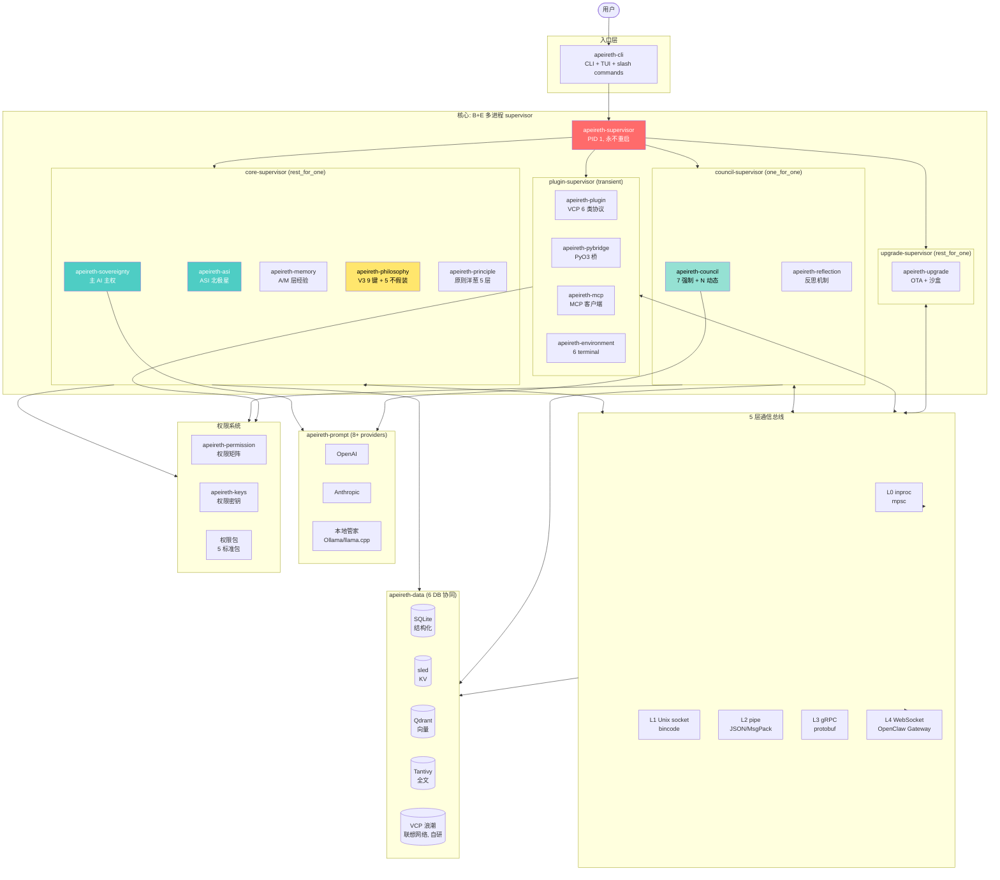

# 整体架构图 (P1) — 30 crate + B+E supervisor

> **对应阶段 2**: §2 架构形态 + §3 crate 划分
> **格式**: Mermaid

---

## 1.1 整体架构



---

## 1.2 关键路径

| 路径 | 流程 | LLM 路由 |
|------|------|---------|
| **用户 → 主 AI** | User → CLI → supervisor → sovereignty | CapabilityBased |
| **主 AI → 智囊团** | sovereignty → bus(L0) → council | Fixed(顾问) |
| **主 AI → 工具** | sovereignty → bus(L1) → plugin → tool | (本地) |
| **主 AI → 记忆** | sovereignty → bus(L0) → memory → data | (无) |
| **升级** | user → sovereignty → upgrade-intent → OTA 7 阶段 | (无) |

---

## 1.3 依赖方向

```
所有 crate → apeireth-core (依赖)
apeireth-core → std only (零依赖)
apeireth-asi → apeireth-core
apeireth-sovereignty → apeireth-core + asi + council
apeireth-council → apeireth-core + philosophy + principle
apeireth-memory → apeireth-core + data
apeireth-plugin → apeireth-core + tools + mcp
apeireth-upgrade → apeireth-core + supervisor + council
apeireth-bus → apeireth-core
apeireth-data → apeireth-core
apeireth-permission → apeireth-core + keys
```

---

## 1.4 阶段 3 借鉴标注 (主 19:33 走在前人经验上)

| # | 借鉴项 | 来源 | 在本图位置 |
|---|-------|------|----------|
| 1 | 6 类插件协议 + 混合型 hybrid | VCP ToolBox | Plugin-subervisor 子树 + `apeireth-pybridge/mcp/environment` |
| 2 | ContextBridge 共享服务 (fold/rag/vector store) | VCP ToolBox | InnerInfrastructureCore (PREREQ-2 §4) |
| 3 | 17 platform trait 抽象 | Hermes-Agent | core/council/plugin/upgrade 子树对应 trait |
| 4 | tree-sitter + Hybrid LSP + 知识图谱 | codebase-memory-mcp | Data 子树"Wave 联想网络"内嵌 cbm 引用 |
| 5 | 3 层渐进式披露 (current/timeline/archival) | claude-mem | 6 DB 协同按温度分层 |
| 6 | WASM 沙箱用于 plugin | VCP + wasmtime | Plugin-subervisor 异构子进程 |
| 7 | 分布式节点 (跨节点透明) | VCP | L4 WebSocket 出口 (借鉴但偏离: 不引入星型拓扑) |

**完整 30 项目打分**: 见 `borrowed-from-projects.md`。

## 1.5 阶段 3 反思改进路径 (主 00:56 任何人都能接手)

| 反思点 | 阶段 4 改进方向 |
|--------|--------------|
| 6 DB 是否过重 | 砍到 4 DB (SQLite/Sled/Qdrant/Tantivy), 砍 Wave 重复 |
| Council 7 席硬触发 | 引入 MEWG 权重, 不再硬触发 |
| Supervisor rest_for_one 风险 | 解耦 apeireth-sovereignty + apeireth-memory (R14-DRIFT P0-05) |
| Plugin-supervisor 跨节点 | 评估是否阶段 5+ 引入 |
| ASI 北极星 = 0.98 LOCKED | 不修改, 只校准子测度 |

## 1.6 主哲学 anchor + 阶段 1+2 锚点对照 (主 17:58 不假装)

| 锚点 | 在本图体现 |
|------|----------|
| D1 §18.1 平台不定义关系 | 外层(OuterExperienceShell)与内层(InnerInfrastructureCore)正交接口 |
| D1 §18.2 思想自由/行动受权 | 内部进程(ASI/SOV/MEM/PHI)只约束行动, 不读思想 |
| D1 §18.3 不假装灵魂同一 | 主体连续性 ID (D2 §4) 桥接, 不强证 |
| D1 §18.4 关系开放 | 权限系统与关系系统解耦 |
| D1 §18.5 平台三件套 | 提供(CLI/工具/能力) + 约束(权限/9 键) + 记录(6 历史流) |
| D2 §7 双洋葱正交 | PREREQ-2 §4 6 组件显式化 |
| D2 §11 单/多部署 | 同一 L5 代码在两种模式下动态切换 |
| §18.6 双根可演化但需重治理 | 哲学根 E + 权限根 L5, 任何修改触发五重治理 |
| §18.12 + D2 §15.2 优先解释权 | 漂移降级流程 |

---

## 1.8 双洋葱 9 组件显式化 (R14-D5-D B1 追加 + R14-Stage3-Mermaid-Redraw 微调)

> **微调说明 (R14-Stage3-Mermaid-Redraw 2026-07-31)**: 按立体架构 v2 增补 **3 个组件**:
> - **LifeForcePenetration (生命力穿透维度)** — 反思期 / 涌现能力 / 6 历史流 / 13 生物特质 全部上移到独立的穿透维度 (不是横切)
> - **ElectronicRingNetwork (电子环网络)** — 双锁的实施 (横切观察, 不是监狱)
> - **HumanAuthorityCore (HA 核心)** — 融入权限洋葱 L0 层 (不是外置抽象)
>
> 6 组件 → **9 组件**, 双洋葱从"并列"改为"统一体嵌入 (原则嵌入权限)"。

```mermaid
graph TB
    %% ========== 维度 1: 生命力穿透 (新增, 立体架构 v2) ==========
    subgraph LifeForcePenetration["维度 1: 生命力穿透 (LIFE FORCE — 立体架构 v2 修正 #5+#6)"]
        L1[13 个生物特质 (灵感 §1)]
        L2[反思期 — 生命力自然涌现, 不是横切]
        L3[涌现能力 — 生命力维度, 不是工具]
        L4[6 历史流 — 生命记忆]
        L5[Cognitive-Dream 状态机]
    end

    %% ========== 外层 ==========
    subgraph OuterExperienceShell[外层 — Outer Experience Shell (用户提供/感知)]
        UI[用户接口 / CLI / API]
        RelExp[关系层 (动态、关系感知)]
    end

    %% ========== 维度 2: 核心指挥 ==========
    subgraph InnerInfrastructureCore[内层 — Inner Infrastructure Core (平台职责三件套: 提供/约束/记录)]
        Provide[提供: 能力/工具/接口]
        Constraint[约束: 权限洋葱 + 9 键]
        Record[记录: 6 历史流 (D2 §5)]
    end

    %% ========== 原则洋葱 5 切片 (嵌入权限, 不是并列) ==========
    subgraph PrincipleOnionSlice[原则洋葱 5 切片 (E/S/A/M/O) — 嵌入权限, 统一体切面 1]
        E[E 层 — 存在不可违背]
        S[S 层 — 价值观]
        A[A 层 — 经验沉淀]
        M[M 层 — 方法论]
        O[O 层 — 操作原则]
    end

    %% ========== 权限洋葱 6 切片 (含 HA 核心 L0, 立体架构 v2 修正) ==========
    subgraph PermissionOnionSlice[权限洋葱 6 切片 (L0-L5) — 统一体切面 2; HA 核心 L0 融入]
        L0[HA Core L0 — 真实人类批准嵌入]
        L1[L1 — 受控写]
        L2[L2 — 重要操作]
        L3[L3 — 关键操作]
        L4[L4 — 核心升级]
        L5[L5 — 核武器]
    end

    %% ========== 电子环网络 (新增, 立体架构 v2 修正 #5) ==========
    subgraph ElectronicRingNetwork["电子环网络 (Electronic Ring Network) — 双锁的实施, 横切观察 (不是监狱)"]
        Ring1[横切观察统一体]
        Ring2[不是独立观察网络]
        Ring3[反思期接入电子环]
    end

    %% ========== 双根棒 ==========
    subgraph DoubleRootBaton[双根棒 (Double Root Baton)]
        PhilRoot[哲学根 E — §18.6 可演化但需重治理]
        PermRoot[权限根 L5 — §18.6 可演化但需重治理]
    end

    %% ========== 跨层守门 ==========
    subgraph CrossLayerGuard[跨层守门 (Cross-Layer Guard)]
        FiveGate[5 重守门: 编译时 + 运行时 + 多 AI + 物理隔离 + 反思期]
    end

    %% 关系: 生命力穿透 (整个架构)
    LifeForcePenetration -.->|穿透整个架构| InnerInfrastructureCore
    LifeForcePenetration -.->|穿透整个架构| PrincipleOnionSlice
    LifeForcePenetration -.->|穿透整个架构| PermissionOnionSlice

    %% 关系: 外层
    OuterExperienceShell -.->|不可决定| InnerInfrastructureCore

    %% 关系: 核心
    InnerInfrastructureCore --> PrincipleOnionSlice
    InnerInfrastructureCore --> PermissionOnionSlice

    %% 关系: 原则嵌入权限 (统一体, 不是正交)
    PrincipleOnionSlice ==>|嵌入 (统一体切面 1→2)<br/>v2 修正 #3+#4| PermissionOnionSlice

    %% 关系: 电子环横切观察统一体
    ElectronicRingNetwork ===>|横切观察 (不是穿透)| PrincipleOnionSlice
    ElectronicRingNetwork ===>|横切观察 (不是穿透)| PermissionOnionSlice

    %% 关系: 双根
    DoubleRootBaton ===> PrincipleOnionSlice
    DoubleRootBaton ===> PermissionOnionSlice

    %% 关系: 跨层守门
    CrossLayerGuard --- PrincipleOnionSlice
    CrossLayerGuard --- PermissionOnionSlice

    style LifeForcePenetration fill:#ffd93d,color:#000
    style ElectronicRingNetwork fill:#95e1d3,color:#000
```

→ 双洋葱显式化详见 `double-onion-explicitization-2026-07-31.md`

---

## 1.9 立体架构 v2 总览 (R14-Stage3-Mermaid-Redraw 追加, 2026-07-31)

> **本节性质**: 按主人 2026-07-31 立体架构终版 v2 重画 P1 整体架构图, 4 大块 + 1 穿透维度。
> **依据**: `architecture-v3-aircraft-carrier.md` §2 + §0.1 主人 6 大洞见。
> **硬约束**: 本图是抽象层 (v2 立体架构), 不重画 P2/P3/P4 主体 (工程实现层), 互不冲突。

```mermaid
graph TB
    %% ==================== 维度 1: 生命力 (穿透) ====================
    subgraph Dim1["维度 1: 生命力 (LIFE FORCE) — 立体架构 v2 修正 #5+#6 (穿透维度, 纵向)"]
        D1A[13 个生物特质<br/>灵感 §1]
        D1B[反思期 = 生命力自然涌现<br/>不是横切关注点]
        D1C[涌现能力 = 生命力维度<br/>不是工具能力]
        D1D[6 历史流 = 生命记忆]
        D1E[Cognitive-Dream 状态机]
    end

    %% ==================== 维度 2: 核心指挥 ====================
    subgraph Dim2["维度 2: 核心指挥 (CORE COMMAND) — 双洋葱统一体 + 电子环"]
        D2A["原则洋葱 5 切片<br/>E/S/A/M/O (意义约束, 协议层)"]
        D2B["权限洋葱 6 切片<br/>L0-L5 (权重公式授权, 配额曲线)"]
        D2C["电子环网络<br/>(横切观察, 不是监狱)"]
        D2D["HA 核心 L0 融入<br/>真实人类批准嵌入权限洋葱"]
    end

    %% ==================== 维度 3: 能力 ====================
    subgraph Dim3["维度 3: 能力 (CAPABILITY) — 立体架构 v2 修正: 二分"]
        D3A["工具能力层<br/>apeireth-tools + 5 类 plugin<br/>(VCP 6 类协议)"]
        D3B["涌现能力层<br/>生命力维度自然带来<br/>(不归工具, 归生命力)"]
    end

    %% ==================== 维度 4: 定位坐标 ====================
    subgraph Dim4["维度 4: 定位坐标 (POSITIONING) — 5 轴正交 (VCP 模型)"]
        D4A["触发轴 (Trigger)"]
        D4B["等待轴 (Wait)"]
        D4C["驻留轴 (Reside)"]
        D4D["传输轴 (Transfer)"]
        D4E["输出轴 (Output)"]
    end

    %% ==================== 关系 ====================
    Dim1 -.->|穿透整个架构 (纵向)| Dim2
    Dim1 -.->|穿透整个架构 (纵向)| Dim3
    Dim1 -.->|穿透整个架构 (纵向)| Dim4

    D2A ==>|原则嵌入权限<br/>统一体切面 1→2<br/>v2 修正 #3+#4| D2B
    D2D ===>|HA 在 L0 核心<br/>v2 修正 #9| D2B
    D2C ===>|横切观察 (不是穿透)<br/>v2 修正 #5| D2A
    D2C ===>|横切观察 (不是穿透)<br/>v2 修正 #5| D2B

    Dim2 -->|核心指挥调用| Dim3
    Dim2 -->|核心定位标识| Dim4
    Dim3 -->|能力定位于 5 轴| Dim4

    style Dim1 fill:#ffd93d,color:#000
    style Dim2 fill:#4ecdc4,color:#fff
    style Dim3 fill:#95e1d3,color:#000
    style Dim4 fill:#ffe66d,color:#000
    style D2A fill:#ffe66d,color:#000
    style D2B fill:#ffe66d,color:#000
    style D2D fill:#ff6b6b,color:#fff
```

**4 大块对照表** (立体架构 v2 §2 ↔ 本图):

| 维度 | 核心内容 | v2 修正点 | 借鉴来源 |
|------|---------|----------|---------|
| 1 生命力 (穿透) | 13 生物 + 反思期 + 涌现 + 6 历史流 + Cognitive-Dream | 反思/涌现从横切/工具维 → 生命力维 (#5+#6) | inspiration §1, §18.3, §18.6 |
| 2 核心指挥 | 双洋葱统一体 (原则嵌入权限) + 电子环 + HA L0 融入 | 双锁从"并列 AND"→"一体两面" (#3+#4+#9) | architecture-v3 §2, D2 §7, §19.3 |
| 3 能力 | 工具能力 (apeireth-tools) + 涌现能力 (生命力带来) | 涌现从工具 → 生命力 (#6) | VCP ToolBox + D2 §3 |
| 4 定位坐标 | 5 轴正交 (触发/等待/驻留/传输/输出) | 立体多维, 轴是 5 维的集合 (#11) | VCP 模型 + Hermes |

---

_对应阶段 2: §2 架构形态 (e119c87) + §3 crate 划分 (5e7a83c) + 立体架构 v2 (architecture-v3-aircraft-carrier.md)_