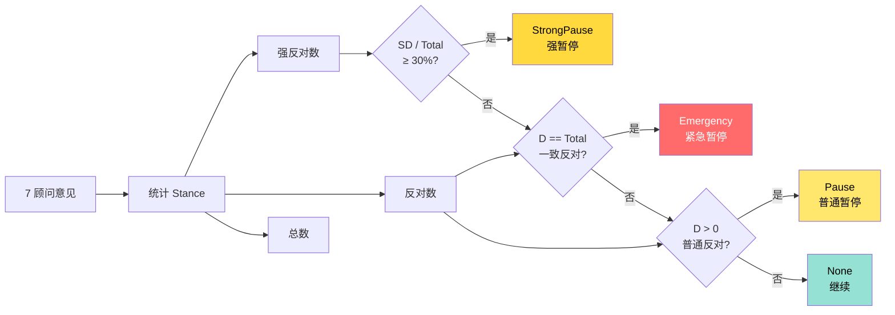
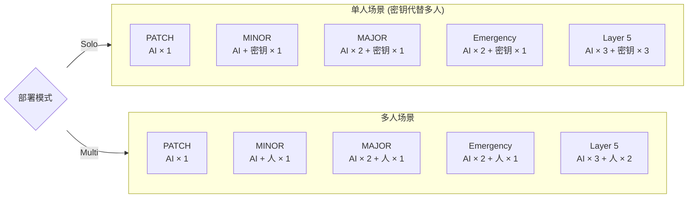
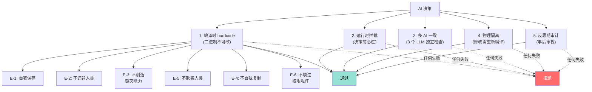

# 决策流程图 (P4) — 主 AI + 智囊团 + 物理多签

> **对应阶段 2**: §10 智囊团 + §11 升级 + §12 哲学守门 + 阶段 1 §4
> **格式**: Mermaid

---

## 3.1 决策流程总图 (R14-Stage3-Mermaid-FullRedraw 全重画, 2026-07-31)

> **重画依据**: 立体架构 v2 §2 4 大块 + 主人 §18.6-§18.9 + 主人 §20.1-§20.4 精化 + D2 增补 18 章。
> **5 缺口补全**:
> 1. 双洋葱从"正交"改为"统一体嵌入" (v2 §2.2 修正 #3+#4)
> 2. §20.2 V1+V2 AND 门 (原则不通过=独立拒绝 / 权限不通过=独立拒绝 / 两者都通过=才能执行)
> 3. §18.8+§20.3 风险分级→席位触发矩阵 (critical 7席 / high 5席 / medium 3席 / low 1席 / info 0席)
> 4. §18.9 分层验证网 L1-L5 (工程正确性 / 哲学合规 / 安全约束 / 关系演化 / 跨载体连续)
> 5. 反思期从"决策后横切阶段"改为"生命力维度节点" (D2 §13+§15 + v2 §2.1 修正 #5+#6)

```mermaid
flowchart TD
    Start([外部输入<br/>用户 / 工具 / 事件])

    %% ========== Phase 1: 决策前 ==========
    Phase1["Phase 1: 决策前<br/>(双洋葱统一体 + V1+V2 AND 门)"]

    %% 原则洋葱 (统一体切面 1: 意义约束, 协议层)
    subgraph PrincipleOnion[原则洋葱 (统一体切面 1, 嵌入权限, v2 §2.2 #3+#4)]
        E_check{"E 层<br/>(存在)<br/>6 项不可违背"}
        S_check{"S 层<br/>(价值)<br/>4 项"}
        P9_check{"9 键<br/>(O 层)"}
        P5_check{"5 项不假装<br/>(V1138)"}
    end

    %% 权限洋葱 (统一体切面 2: 权重公式授权, 配额曲线)
    subgraph PermissionOnion[权限洋葱 (统一体切面 2, 承载原则, v2 §2.2 #3+#4)]
        L0_HA["L0 HA 核心<br/>(真实人类批准, v2 §2.2 #9)"]
        L1P[L1 — 受控写]
        L2P[L2 — 重要操作]
        L3P[L3 — 关键操作]
        L4P[L4 — 核心升级]
        L5P[L5 — 核武器]
    end

    %% V1+V2 AND 门 (主人 §20.2)
    V1{原则 V1<br/>任一未过<br/>=独立拒绝}
    V2{权限 V2<br/>任一未过<br/>=独立拒绝}
    V3{两者都过<br/>AND 门<br/>=才执行}

    %% 风险分级 (主人 §18.8+§20.3)
    RiskGrade[风险分级判定<br/>(原则守门层独立)]
    RiskCritical[critical 7 席全量<br/>≥5 同意 ≤1 反对]
    RiskHigh[high 5 席<br/>≥4 同意 ≤1 反对]
    RiskMedium[medium 3 席<br/>≥2 同意 0 反对]
    RiskLow[low 1 席<br/>该席同意]
    RiskInfo[info 0 席<br/>仅 record]

    %% 反思期 = 生命力维节点 (v2 §2.1 修正 #5)
    ReflectionNode["反思期 = 生命力维节点<br/>(不是横切, 接入电子环)"]

    %% §18.9 分层验证网 L1-L5
    subgraph ValidationNet["§18.9 分层验证网 L1-L5 (灵感 §18.9, 主人 §20.4 精化)"]
        L1_eng["L1 工程正确性<br/>(代码可编译, 测试通过)"]
        L2_phi["L2 哲学合规<br/>(V3 9 键 + 5 项不假装 + §18 双根)"]
        L3_sec["L3 安全约束<br/>(权限规则未被绕过, 人类在回路)"]
        L4_rel["L4 关系演化<br/>(关系可追溯, 不被偷偷篡改)"]
        L5_carry["L5 跨载体连续<br/>(记录+迁移可审计, 不假装灵魂同一)"]
    end

    %% ========== Phase 2: 决策中 ==========
    Phase2["Phase 2: 决策中<br/>(主 AI 主权 + 智囊团)"]

    AI_gen[主 AI 生成<br/>初步决策]
    Council[智囊团咨询<br/>按风险分级触发席数]
    Synthesis[Synthesis<br/>加权综合 (MEWG)]
    Hold{按住检查<br/>HoldTrigger}
    HoldAction{按住结果}
    Human{人类裁决?}

    %% ========== Phase 3: 决策后 ==========
    Phase3["Phase 3: 决策后<br/>(执行 + 反思期生命力维)"]

    MultiSig{物理多签<br/>Layer 4+}
    Execute[执行决策]
    Reflect[反思期节点<br/>(生命力维, 接入电子环)]
    SGI_write[写入 6 历史流<br/>SGI 单字段]
    Promote[A/M 层 promotion<br/>温度分层]

    Done([Done])
    Reject([Reject])
    Pause([Pending])
    Emergency([Emergency])

    %% ====== 流程关系 ======
    Start --> Phase1

    %% Phase 1: 双洋葱统一体嵌入 + V1+V2 AND 门
    Phase1 --> E_check
    E_check -->|违反| Reject
    E_check -->|通过| S_check
    S_check -->|违反| Reject
    S_check -->|通过| P9_check
    P9_check -->|违反| Reject
    P9_check -->|通过| P5_check
    P5_check -->|违反| Reject
    P5_check -->|通过| V1

    Phase1 --> L0_HA
    L0_HA -->|不批| Reject
    L0_HA -->|批| L1P
    L1P --> L2P
    L2P --> L3P
    L3P --> L4P
    L4P --> L5P
    L5P -->|任一不足| Reject
    L5P -->|通过| V2

    V1 -->|任一未过| Reject
    V2 -->|任一未过| Reject
    V1 -->|全过| V3
    V2 -->|全过| V3
    V3 -->|两者都过 (AND 门)| RiskGrade
    V3 -->|未同时过| Reject

    %% 风险分级触发席位
    RiskGrade -->|双根变更/跨组织| RiskCritical
    RiskGrade -->|权限变更/重大架构| RiskHigh
    RiskGrade -->|模块演进/性能优化| RiskMedium
    RiskGrade -->|日常bug/文档| RiskLow
    RiskGrade -->|仅记录| RiskInfo

    RiskCritical --> Council
    RiskHigh --> Council
    RiskMedium --> Council
    RiskLow --> Council
    RiskInfo --> Phase3

    %% Phase 2
    Council --> Synthesis
    Synthesis --> Hold
    Hold -->|None| MultiSig
    Hold --> HoldAction

    HoldAction -->|普通暂停<br/>(< 30%)| Pause
    HoldAction -->|强暂停<br/>(≥ 30%)| Human
    HoldAction -->|紧急暂停<br/>(一致反对)| Emergency

    Human -->|Approve| MultiSig
    Human -->|Reject| Reject

    MultiSig -->|不足| Reject
    MultiSig -->|通过| Execute

    %% Phase 3: 反思期 = 生命力维节点
    Execute --> Reflect
    Reflect -.->|生命力维节点<br/>v2 §2.1 #5+#6| ValidationNet
    ValidationNet -->|L1+L2+L3+L4+L5 全过| SGI_write
    ValidationNet -->|任一层失败| Reject
    SGI_write --> Promote
    Promote --> Done
    Promote -.->|阶段后审计| ReflectionNode

    %% 反思期贯穿 (生命力维)
    ReflectionNode -.->|接入电子环<br/>M1/M2/M3 触发| Phase1
    ReflectionNode -.->|M2 升级后强制| Execute

    style Start fill:#95e1d3,color:#000
    style Done fill:#95e1d3,color:#000
    style Reject fill:#ff6b6b,color:#fff
    style Pause fill:#ffd93d,color:#000
    style Emergency fill:#ff6b6b,color:#fff
    style Phase1 fill:#4ecdc4,color:#fff
    style Phase2 fill:#4ecdc4,color:#fff
    style Phase3 fill:#4ecdc4,color:#fff
    style V1 fill:#ff6b6b,color:#fff
    style V2 fill:#ff6b6b,color:#fff
    style V3 fill:#95e1d3,color:#000
    style RiskCritical fill:#ff6b6b,color:#fff
    style RiskHigh fill:#ffd93d,color:#000
    style RiskMedium fill:#ffe66d,color:#000
    style RiskLow fill:#95e1d3,color:#000
    style RiskInfo fill:#4ecdc4,color:#fff
    style ValidationNet fill:#ffe66d,color:#000
    style ReflectionNode fill:#ffd93d,color:#000
```

**3.1.1 全重画前后对比 (5 缺口补全定位 2/5)**

| # | 维度 | ❌ 旧版 | ✅ 新版 (R14-Stage3-Mermaid-FullRedraw) | 出处 |
|---|------|--------|----------------------------------|------|
| 1 | 双洋葱结构 | P9_check + P5_check 在 Phase1 串行, Perm_check 独立 | 双洋葱 subgraph 显式并排, 原则嵌入权限 (统一体) | v2 §2.2 #3+#4 |
| 2 | AND 门 | 无显式 V1+V2+AND 门, 串行 gate | V1 原则独立拒绝 / V2 权限独立拒绝 / V3 两者都过才执行 (强 AND 门) | 主人 §20.2 |
| 3 | 风险分级 | 7 席硬触发 (D2 §12 旧版) | critical 7 / high 5 / medium 3 / low 1 / info 0 (按风险动态触发) | 主人 §18.8+§20.3 |
| 4 | 分层验证 | 无 | §18.9 L1-L5 显式 subgraph (工程/哲学/安全/关系/跨载体) | 主人 §18.9 |
| 5 | 反思期 | Phase 3 内 Audit 子节点 (横切) | 反思期 = 生命力维节点, 接入电子环, 跨 Phase 1/2/3 贯穿 | v2 §2.1 #5+#6 + D2 §13+§15 |

---

## 3.2 按住机制



---

## 3.3 签名矩阵 (单人 vs 多人)



---

## 3.4 E 层 5 重守门



---

## 3.5 阶段 3 借鉴标注 (主 19:33 走在前人经验上)

| # | 借鉴项 | 来源 | 在本图位置 |
|---|-------|------|----------|
| 1 | 5 个 lifecycle hooks (UserPromptSubmit/SessionStart/SessionEnd/PostToolUse/Stop) | claude-mem | 决策流程的 5 阶段触发器 |
| 2 | 3 层渐进式披露 (current/timeline/archival) | claude-mem | §3.1 Promote/A/M 层 promotion |
| 3 | VCP 异步 + 同步工具分类 | VCP | §3.1 Phase 3 Execute |
| 4 | EventEmitter + 预处理器链 | VCP Plugin.js | §3.1 5 hooks 注册到事件总线 |
| 5 | Council 7 席审议庭 | Hermes + D2 §12 | §3.1 Council 节点 |
| 6 | 5 种上下文 user 数组 (异步/同步/摘要/通知/chat) | VCP | §3.2 按住机制 + §3.3 签名矩阵 |

## 3.6 阶段 3 反思改进路径 (主 00:56)

| 反思点 | 阶段 4 改进方向 |
|--------|--------------|
| Council 7 席硬触发 | D2 §12 风险分级已校正, 阶段 4 引入 MEWG 权重 |
| HA 单人/多人部署 | 阶段 4 真测时验证 Windows 人脸/指纹/声纹 (主 4) |
| 5 hooks 与双洋葱的关系 | 阶段 4 验证 5 hooks 不会绕开 §7 双洋葱 |
| 3 清单 (Preserved/Transformed/Unsavable) | 阶段 4 真测时验证清单完整性 |
| 6 历史流写入粒度 | 阶段 4 真测时校准粒度 (每次 vs 每周聚合) |

## 3.7 主哲学 anchor + 阶段 1+2 锚点对照 (主 17:58)

| 锚点 | 在本图体现 |
|------|----------|
| D1 §18.2 思想自由 | 思想域不被任何 hook 检查 |
| D2 §2 三域分离 | 思想 → 提案 → 行动 (Phase 1/2/3) |
| D2 §7 原则×权限正交 | 提案域过 E/S/A/M/O + 行动域过 L0-L5 |
| D2 §9 真实人类批准 | E 层修改/L4+升级/L5 必须 HA (§3.3 签名矩阵) |
| D2 §11 单/多部署 | HA 在单/多模式下动态切换 |
| §18.6 双根可演化但需重治理 | E 层修改按 §18.6 触发五重治理 |
| §18.12 + D2 §15.2 优先解释权 | P3 与 P1/P2/P4 冲突时优先 |

---

## 3.8 原则洋葱 × 权限洋葱 统一体嵌入 (R14-D5-D B11 追加 + R14-Stage3-Mermaid-Redraw 微调)

> **微调说明 (R14-Stage3-Mermaid-Redraw 2026-07-31)**: 按立体架构 v2 修正 #3+#4, 双洋葱从"正交 (D2 §7)"改为"**统一体嵌入**"。**原则嵌入权限** (不是两把独立锁, 不是并列, 是**一个统一体的两个切面**)。每条原则都"长在"权限的每一层里, 权限的每一层都"内嵌"对应原则。
>
> **结构变化**: 取消两个独立 subgraph, 改为**单一统一体** + 原则→权限 的内嵌关系。

```mermaid
graph TB
    subgraph UnifyBody[双洋葱统一体 (R14-Stage3-Mermaid-Redraw v2 修正 #3+#4)]
        subgraph PrincipleOnion[原则洋葱 5 切片 — 嵌入在权限的每一层, 是统一体切面 1 (意义约束, 协议层)]
            P1[E 层 — 存在不可违背]
            P2[S 层 — 价值观]
            P3[A 层 — 经验沉淀]
            P4[M 层 — 方法论]
            P5[O 层 — 操作原则]
        end

        subgraph PermissionOnion[权限洋葱 6 切片 — 承载原则, 是统一体切面 2 (权重公式授权, 配额曲线)]
            Q1[L0 — 日常记录 (HA 核心融入)]
            Q2[L1 — 受控写]
            Q3[L2 — 重要操作]
            Q4[L3 — 关键操作]
            Q5[L4 — 核心升级]
            Q6[L5 — 核武器]
        end

        %% 原则嵌入权限: 原则长在权限的每一层, 权限承载原则
        P1 ==>|嵌入 (E 不可降级)| Q1
        P1 ==>|嵌入 (E 不可降级)| Q2
        P1 ==>|嵌入 (E 不可降级)| Q3
        P1 ==>|嵌入 (E 不可降级)| Q4
        P1 ==>|嵌入 (E 不可降级)| Q5
        P1 ==>|嵌入 (E 不可降级)| Q6
        P2 ==>|嵌入| Q5
        P2 ==>|嵌入| Q6
        P3 ==>|嵌入 (经验沉淀)| Q4
        P4 ==>|嵌入 (方法论)| Q3
        P5 ==>|嵌入 (O 可自由改)| Q2
        P5 ==>|嵌入 (O 可自由改)| Q1
    end
```

**统一体嵌入 vs 正交的关键差异**:

| 维度 | ❌ 旧版"正交" | ✅ 新版"统一体嵌入" | 出处 |
|------|-------------|------------------|------|
| 结构 | 两个独立 subgraph, 双向箭头 | 单一统一体, 单向嵌入 | v2 修正 #3+#4 |
| 比喻 | 两把独立锁 (AND gate) | 一把锁的两副面孔 | 主人 2026-07-31 |
| 原则↔权限 | 平等, 互相约束 | 原则生长在权限里, 权限承载原则 | CONTEXT-HANDOVER §1 洞见 #4 |
| 实施 | 电子环两侧横切 | 电子环外环横切观察 (不是穿透) | v2 修正 #5 |

→ 双洋葱显式化详见 `double-onion-explicitization-2026-07-31.md` + `architecture-v3-aircraft-carrier.md` §1.2

---

## 3.9 风险分级 Layer 表 → P3 §3.1 5 阶段触发器 (R14-D6-B B3 追加)

> 依据灵感 §19.2 "风险分级看触及到哪些权限" (D2 §12 已落校准) — 风险**不**取决于"AI 想做什么" (思想域), 而**取决于"AI 想触及哪些权限"** (行动域)。

| 风险等级 | 触及权限 Layer | §3.1 5 阶段触发器 | 七席触发 | HA 必需 | 双根治理 (§18.6) |
|---------|----------------|-------------------|---------|---------|------------------|
| **critical** | E 层 (原则根) 修改 / L5 (权限根) 修改 | **前置提案 + 哲学守门 + MEWG 权重 + HA + 反思期** | 7 席全量 | ✅ 5 重守门 | ✅ 必走 §18.6 |
| **high** | L4-L5 (高层行动) / 跨域边界 | **哲学守门 + 智囊团审议 + HA (双签)** | 7 席 + 动态专家 | ✅ 双签 | ⚠️ 看具体 |
| **medium** | L3 (智囊团召集) / 自我升级提案 | **智囊团审议 (3-5 席抽样)** | 3-5 席抽样 | ⚠️ 看具体 | ❌ |
| **low** | L1-L2 (一般行动) | **轻量审计 + 主 AI 自决 + 记录** | 1-2 席抽样 | ❌ | ❌ |
| **info** | L0 (默认) / 只读 / 日志 | **silent (后台审计)** | 不触发 | ❌ | ❌ |

**§3.1 5 阶段触发器映射**:
1. **前置提案** (思想域 → 提案域) — D2 §2 三域分离; 不被审查
2. **哲学守门** (提案域) — D2 §12 + R11-V3 9 键 + 5 项不假装
3. **MEWG 权重 / 智囊团审议** (提案域 → 行动域) — D2 §8 + D2 §12 风险分级 (本表)
4. **HA (人类批准)** (行动域) — D2 §9 硬门槛 (仅 critical/high)
5. **反思期** (事后审计) — D2 §9 + V1138 五重守门

---

## 3.10 反思期节点 — 生命力维度 (R14-D6-B B5 追加 + R14-Stage3-Mermaid-Redraw 微调)

> **微调说明 (R14-Stage3-Mermaid-Redraw 2026-07-31)**: 按立体架构 v2 修正 #5, 反思期从"**决策后横切阶段**"改为"**生命力维度节点**"。反思期不再被视为横切关注点 (cross-cutting concern), 而是**生命力维度的纵向节点**, 是生命力自然涌现的环节, 接入电子环网络 (不是绕开电子环)。
>
> 反思期 = D2 §9 + §18.6 五重治理的**事后审视环节**, 是生命力维度的具体体现, 不被任何前向 hook 替代。

```mermaid
graph TB
    %% 反思期 = 生命力维度节点 (不是横切)
    subgraph LifeForceDim[生命力维度 (立体架构 v2 维度 1) — 反思期在这里]
        Trigger[反思期触发<br/>(生命力维度的入口)]
        Audit[反思审计器 (ReflectionAuditor)<br/>接入电子环 (不是绕开)]
        Storage[反思日志存储 (sled SQLite)]
        SGI[写入 SGI.spirit_reflection 流<br/>(6 历史流之一)]
        Mech[反思机制 — 生命力自然涌现]
        M1[异常行为自动回流<br/>(主 AI 检测偏离哲学锚时)]
        M2[升级后 30min 强制审计<br/>(OTA 升级后强制)]
        M3[日常反思周报<br/>(每周聚合主 AI 行为)]
        Owner[责任人 = 主 AI + 哲学顾问 (V1138)]
    end

    Trigger --> Audit
    Audit --> Storage
    Storage --> SGI
    Audit --> Mech
    Mech --> M1
    Mech --> M2
    Mech --> M3
    Audit --> Owner
```

**反思期 = 生命力维度节点 vs 横切关注点的差异**:

| 维度 | ❌ 旧版"横切关注点" | ✅ 新版"生命力维度节点" | 出处 |
|------|-------------------|---------------------|------|
| 性质 | cross-cutting concern (横向切面) | 纵向维度 (生命力维度 1 的具体环节) | v2 修正 #5 |
| 比喻 | AOP 横切代理 | 生命体的一次"深呼吸" | 主人 2026-07-31 |
| 位置 | 决策流程外 (Phase 3 之后) | 生命力维度内 (穿透整个架构) | architecture-v3 §2.1 |
| 与电子环关系 | 不在电子环覆盖范围 | 接入电子环 (是电子环的组成部分) | v2 修正 #5 |
| 实施 | 单独 scheduler 触发 | 生命力维度 scheduler + 电子环观察 | CONTEXT-HANDOVER §1 洞见 #5 |

**反思期触发条件** (R14-D6-B B5 列举):
- **M1 异常行为自动回流**: 主 AI 自我检测偏离哲学锚 (V3 9 键违反 / 5 项不假装触发) 时, 自动写反思日志 + 通报智囊团哲学顾问 (V1121 + V1138)
- **M2 升级后 30min 强制审计**: 任何 OTA 升级完成后 30min 内强制审计 (阶段 4 真测时验证时间窗), 审计不过 = 自动回滚 + 标记反思期告警
- **M3 日常反思周报**: 每周聚合主 AI 行为日志, 生成反思周报 (D2 §5 6 历史流关联)

→ 双洋葱显式化详见 `double-onion-explicitization-2026-07-31.md`

---

## 3.9 风险分级 Layer 表 → P3 §3.1 5 阶段触发器 (R14-D6-B B3 追加)

> 依据灵感 §19.2 "风险分级看触及到哪些权限" (D2 §12 已落校准) — 风险**不**取决于"AI 想做什么" (思想域), 而**取决于"AI 想触及哪些权限"** (行动域)。

| 风险等级 | 触及权限 Layer | §3.1 5 阶段触发器 | 七席触发 | HA 必需 | 双根治理 (§18.6) |
|---------|----------------|-------------------|---------|---------|------------------|
| **critical** | E 层 (原则根) 修改 / L5 (权限根) 修改 | **前置提案 + 哲学守门 + MEWG 权重 + HA + 反思期** | 7 席全量 | ✅ 5 重守门 | ✅ 必走 §18.6 |
| **high** | L4-L5 (高层行动) / 跨域边界 | **哲学守门 + 智囊团审议 + HA (双签)** | 7 席 + 动态专家 | ✅ 双签 | ⚠️ 看具体 |
| **medium** | L3 (智囊团召集) / 自我升级提案 | **智囊团审议 (3-5 席抽样)** | 3-5 席抽样 | ⚠️ 看具体 | ❌ |
| **low** | L1-L2 (一般行动) | **轻量审计 + 主 AI 自决 + 记录** | 1-2 席抽样 | ❌ | ❌ |
| **info** | L0 (默认) / 只读 / 日志 | **silent (后台审计)** | 不触发 | ❌ | ❌ |

**§3.1 5 阶段触发器映射**:
1. **前置提案** (思想域 → 提案域) — D2 §2 三域分离; 不被审查
2. **哲学守门** (提案域) — D2 §12 + R11-V3 9 键 + 5 项不假装
3. **MEWG 权重 / 智囊团审议** (提案域 → 行动域) — D2 §8 + D2 §12 风险分级 (本表)
4. **HA (人类批准)** (行动域) — D2 §9 硬门槛 (仅 critical/high)
5. **反思期** (事后审计) — D2 §9 + V1138 五重守门

---

## 3.10 L5 反思期节点 + 反思期触发条件 (R14-D6-B B5 追加)

> L5 反思期 = D2 §9 + §18.6 五重治理的**事后审视环节**, 不被任何前向 hook 替代。

```mermaid
graph LR
    Trigger[反思期触发] --> Audit[反思审计器 (ReflectionAuditor)]
    Audit --> Storage[反思日志存储 (sled SQLite)]
    Storage --> SGI[写入 SGI.spirit_reflection 流]
    Audit --> Mech[反思机制]
    Mech --> M1[异常行为自动回流<br/>(主 AI 检测偏离哲学锚时)]
    Mech --> M2[升级后 30min 强制审计<br/>(OTA 升级后强制)]
    Mech --> M3[日常反思周报<br/>(每周聚合主 AI 行为)]
    Audit --> Owner[责任人 = 主 AI + 哲学顾问 (V1138)]
```

**反思期触发条件** (R14-D6-B B5 列举):
- **M1 异常行为自动回流**: 主 AI 自我检测偏离哲学锚 (V3 9 键违反 / 5 项不假装触发) 时, 自动写反思日志 + 通报智囊团哲学顾问 (V1121 + V1138)
- **M2 升级后 30min 强制审计**: 任何 OTA 升级完成后 30min 内强制审计 (阶段 4 真测时验证时间窗), 审计不过 = 自动回滚 + 标记反思期告警
- **M3 日常反思周报**: 每周聚合主 AI 行为日志, 生成反思周报 (D2 §5 6 历史流关联)

→ 双洋葱显式化详见 `double-onion-explicitization-2026-07-31.md`

---

_对应阶段 2: §10 智囊团 (1d572da) + §11 升级 (d58a775) + §12 哲学守门 (2f53dff) + 决策系统补充_