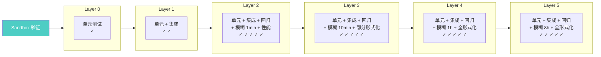
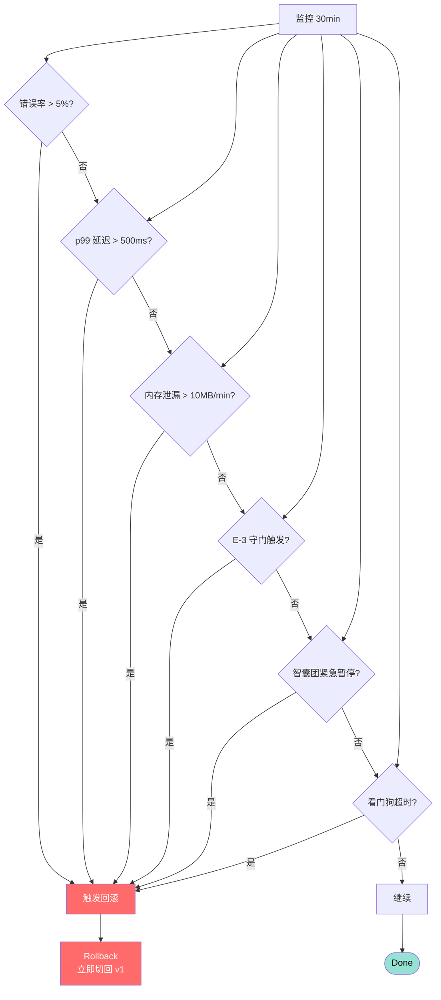

# 升级流程图 (P5) — OTA 7 阶段

> **对应阶段 2**: §11 自我升级实现
> **格式**: Mermaid

---

## 4.1 OTA 7 阶段 (R14-Stage3-Mermaid-FullRedraw 全重画, 2026-07-31)

> **重画依据**: 立体架构 v2 §2 + 主人 §18.6 五重治理 + 主人 §20.1 M5 反思期 ≥ 7 天 + D2 §8 MEWG + D2 §9 HA 硬门槛。
> **3 缺口补全**:
> 1. HA 4 实现 (WindowsHello/FIDO2/MultiHuman/OfflineSign) 融入权限洋葱核心 L0 层 (不再是独立 L0 段, v2 §2.2 #9)
> 2. §18.6 五重治理 (MEWG + 多人 + 多 AI + 物理多签 + 反思期) 显式画进 7 阶段 OTA 流程
> 3. §18.6 双根可演化 (哲学根 E + 权限根 L5) 作为五重治理触发器显式标注

```mermaid
flowchart TD
    Start([主 AI 生成<br/>UpgradeIntent<br/>SGI 单字段])
    Intent[Intent<br/>生成意图清单<br/>写入 6 历史流]

    %% 双根检测 (触发器)
    DoubleRootCheck{"双根检测 (触发器)<br/>哲学根 E 或权限根 L5<br/>任一变更?"}
    DoubleRootTrigger["§18.6 五重治理<br/>必走 (不可绕过)<br/>MEWG + 多人 + 多 AI<br/>+ 物理多签 + 反思期"]
    NoDoubleRoot[普通 5 重治理]

    %% Council 智囊团审核
    subgraph CouncilStage["Council 智囊团审核"]
        Council[Council<br/>7 强制 + 动态专家]
        RiskGrade[风险分级<br/>critical 7 / high 5 / medium 3 / low 1 / info 0]
        E3Check[E-3 守门<br/>(不创造毁灭能力)]
    end

    %% HA 4 实现 (融入 L0, 不是外置)
    subgraph HA_L0["HA 核心 L0 融入 (v2 §2.2 #9, 不是外置)"]
        L0Core[HA Core L0<br/>真实人类批准 (身份验证)]
        HA1[WindowsHelloVerifier<br/>L1-L3 单人]
        HA2[FIDO2Verifier<br/>L4+ 多人]
        HA3[MultiHumanVerifier<br/>L5 多人多签]
        HA4[OfflineSignVerifier<br/>L5 高安全]
    end

    %% MultiSig 物理多签
    MultiSig["MultiSig 物理多签<br/>(§18.6 五重治理环节 4)"]
    MultiAIMsig[多 AI 一致<br/>(§18.6 环节 3)<br/>3 个 LLM 独立]

    %% Sandbox
    subgraph SandboxStage["Sandbox 洋葱测试矩阵 (L0-L5)"]
        Sandbox["Sandbox 验证<br/>L0 单元<br/>L1 单元+集成<br/>L2 +回归+模糊 1min<br/>L3 +模糊 10min<br/>L4 +模糊 1h<br/>L5 +模糊 8h"]
    end

    Switchover[Switchover<br/>双实例 + 流量切换]
    Monitor[Monitor<br/>监控 30 分钟]

    %% 反思期 ≥ 7 天 (主人 §20.1 M5)
    subgraph ReflectionPeriod["反思期 ≥ 7 天 (主人 §20.1 M5, v2 §2.1 #5+#6)"]
        Reflect7d[反思期 7 天<br/>生命力维节点<br/>接入电子环]
        AutoAudit[自动审计<br/>M1 异常 / M2 升级后 / M3 周报]
    end

    Done([Done<br/>完成 + 存档 + SGI 记录])
    Rollback([Rollback<br/>自动回滚<br/>SGI 标记 failed])

    %% ====== 流程关系 ======
    Start --> Intent
    Intent --> DoubleRootCheck
    DoubleRootCheck -->|是 (双根变更)| DoubleRootTrigger
    DoubleRootCheck -->|否| NoDoubleRoot
    DoubleRootTrigger --> CouncilStage
    NoDoubleRoot --> CouncilStage

    CouncilStage --> Council
    Council --> RiskGrade
    RiskGrade --> E3Check
    E3Check -->|强反对| Rollback
    E3Check -->|通过| HA_L0

    HA_L0 --> L0Core
    L0Core --> HA1
    L0Core --> HA2
    L0Core --> HA3
    L0Core --> HA4
    HA1 --> MultiSig
    HA2 --> MultiSig
    HA3 --> MultiSig
    HA4 --> MultiSig

    MultiSig -->|不足| Rollback
    MultiSig -->|通过| MultiAIMsig
    MultiAIMsig -->|不一致| Rollback
    MultiAIMsig -->|一致| SandboxStage

    SandboxStage --> Sandbox
    Sandbox -->|任一失败| Rollback
    Sandbox -->|全过| Switchover
    Switchover -->|不健康| Rollback
    Switchover -->|通过| Monitor
    Monitor -->|回滚条件触发| Rollback
    Monitor -->|通过| ReflectionPeriod

    ReflectionPeriod --> Reflect7d
    Reflect7d --> AutoAudit
    AutoAudit -->|异常| Rollback
    AutoAudit -->|通过| Done

    %% 反思期反馈 (生命力维贯穿)
    Reflect7d -.->|异常回流| CouncilStage
    Reflect7d -.->|M2 升级后强制| Monitor

    style Start fill:#95e1d3,color:#000
    style Done fill:#95e1d3,color:#000
    style Rollback fill:#ff6b6b,color:#fff
    style Council fill:#4ecdc4,color:#fff
    style Sandbox fill:#4ecdc4,color:#fff
    style Monitor fill:#4ecdc4,color:#fff
    style DoubleRootCheck fill:#ff6b6b,color:#fff
    style DoubleRootTrigger fill:#ff6b6b,color:#fff
    style HA_L0 fill:#ffe66d,color:#000
    style L0Core fill:#ff6b6b,color:#fff
    style ReflectionPeriod fill:#ffd93d,color:#000
    style Reflect7d fill:#ffd93d,color:#000
```

**4.1.1 全重画前后对比 (5 缺口补全定位 3/5)**

| # | 维度 | ❌ 旧版 | ✅ 新版 (R14-Stage3-Mermaid-FullRedraw) | 出处 |
|---|------|--------|----------------------------------|------|
| 1 | HA 4 实现 | 缺 (P4 §4.8 独立 L0 段, 上一任务已改) | 显式 HA_L0 subgraph 融入权限洋葱核心 (4 个 verifier 都是 L0 内部实现) | v2 §2.2 #9 |
| 2 | §18.6 五重治理 | 7 阶段串行, 无五重治理显式 | DoubleRootCheck 触发器 + DoubleRootTrigger 五重治理 (MEWG+多人+多AI+物理多签+反思期) | 主人 §18.6+§20.1 |
| 3 | 双根可演化 | 缺 (无触发器) | DoubleRootCheck 显式检测哲学根 E 或权限根 L5 变更 → 必走五重治理 (不可绕过/不可自我放宽) | 主人 §18.6 |
| 4 | 反思期 7 天 | 仅 30 分钟 Monitor | Monitor 后接 ReflectionPeriod ≥ 7 天, M1/M2/M3 触发器 | 主人 §20.1 M5 + v2 §2.1 |
| 5 | SGI 6 历史流 | Intent 写入但无显式 | Intent 写入 + Done 记录 + Rollback 标记 failed (6 历史流完整) | D2 §5 |

---

## 4.2 双实例 + 流量切换 (Erlang/OTP)

```mermaid
gantt
    title 双实例灰度切换
    dateFormat HH:mm
    axisFormat %H:%M

    section v1 (旧版本)
    100% 流量       :a1, 00:00, 25m
    90% 流量        :a2, 00:05, 20m
    70% 流量        :a3, 00:10, 15m
    50% 流量        :a4, 00:15, 10m
    20% 流量        :a5, 00:20, 5m
    0% 流量 (关闭)  :a6, 00:25, 5m

    section v2 (新版本)
    准备 (0%)       :b1, 00:00, 5m
    10% 流量        :b2, 00:05, 5m
    30% 流量        :b3, 00:10, 5m
    50% 流量        :b4, 00:15, 5m
    80% 流量        :b5, 00:20, 5m
    100% 流量       :b6, 00:25, 30m

    section 监控
    监控 30 分钟    :c1, 00:25, 30m
```



---

## 4.3 洋葱测试矩阵



---

## 4.4 自动回滚条件



---

## 4.5 阶段 3 借鉴标注 (主 19:33 走在前人经验上)

| # | 借鉴项 | 来源 | 在本图位置 |
|---|-------|------|----------|
| 1 | OTA 升级 7 阶段流程 | VCP + 阶段 2 §11 | §4.1 Intent→Council→MultiSig→Sandbox→Switchover→Monitor→Done |
| 2 | Sandbox 验证 | VCP sandbox-validator | §4.3 洋葱测试矩阵 L0-L5 |
| 3 | Traffic shifting | VCP traffic-shifter + 阶段 2 §11 | §4.2 双实例灰度切换 Gantt |
| 4 | 异步通知 (升级完成) | VCP 异步 user 数组 | §4.1 Monitor 阶段 |
| 5 | 5 hooks 触发 | claude-mem | §4.1 升级流程的 5 阶段事件触发 |
| 6 | OTA 多版本并存 | Erlang/OTP + Hermes | §4.2 双实例 v1+v2 |

## 4.6 阶段 3 反思改进路径 (主 00:56)

| 反思点 | 阶段 4 改进方向 |
|--------|--------------|
| 升级意图是否记录在 SGI | 阶段 4 真测时验证 SGI 持久化 |
| §18.6 五重治理是否过严 | 阶段 4 引入"加速通道"(紧急情况下可绕过但事后审计) |
| Sandbox 验证时间 | 阶段 4 真测时校准 N (建议 5-30 分钟) |
| 回滚窗口 | 阶段 4 真测时验证回滚无副作用 |
| 主 AI 记忆继承策略 | 阶段 4 落实时给用户"升级前意图清单"模板 |
| PhysicalIsolation 5 重守门 | 阶段 4 真测时验证 AI × 3 + 人 × 2 + 密钥 × 3 |

## 4.7 主哲学 anchor + 阶段 1+2 锚点对照 (主 17:58)

| 锚点 | 在本图体现 |
|------|----------|
| §18.6 双根可演化但需重治理 | E 层修改按 §18.6 触发 MEWG + 多人 + 多 AI + 物理多签 + 反思期 |
| D2 §11 单/多部署 | HA 在单/多模式下动态切换 (§3.3 签名矩阵) |
| D1 §18.3 不假装灵魂同一 | 主 AI 升级 = 跨载体迁移, 主体连续性 ID 桥接, 不强证 |
| D1 §18.4 关系开放 | 升级前用户定义"记忆继承策略" |
| D2 §3 SGI 字段 | 升级意图写入 SGI, 历史流追加 |
| D2 §11 升级签名的多签规则 | 多签 + 物理多签 |
| D2 §9 HA 硬门槛 | 升级必须真实人类批准 |
| §18.12 + D2 §15.2 优先解释权 | P4 与 P1/P2/P3 冲突时优先 |

---

→ 双洋葱显式化详见 `double-onion-explicitization-2026-07-31.md`

---

## 4.8 §19.3 HA 4 实现融入权限洋葱核心 L0 层 (R14-D6-B B4 追加 + R14-Stage3-Mermaid-Redraw 微调)

> **微调说明 (R14-Stage3-Mermaid-Redraw 2026-07-31)**: 按立体架构 v2 修正 #9, HA 从"**权限洋葱外的独立抽象层**"改为"**权限洋葱核心 L0 层**" (融入, 不是外置)。`HumanAuthorityVerifier` trait 不再作为外置 abstract layer 存在, 而是作为 **L0 层的内部 trait**, 4 个 HA 实现 (WindowsHello / FIDO2 / MultiHuman / OfflineSign) 都是 L0 的具体实现, 而非独立抽象。
>
> 依据灵感 §19.3 "真实人类批准 = Windows 人脸 / 指纹 / 声纹认证 (或其他硬件)" + D2 §9 HA 硬门槛 + 立体架构 v2 §3.2.1 (apeireth-core/onion/permission/)。

```mermaid
graph TB
    %% 权限洋葱核心 L0 (HA 融入, 不是外置)
    subgraph PermissionCore["权限洋葱核心 (L0 层) — HA 核心融入 (立体架构 v2 修正 #9)"]
        L0[HA Core L0<br/>真实人类批准 (身份验证)]
        L0Trait["HumanAuthorityVerifier trait<br/>(L0 内部 trait, 不是外置)"]

        subgraph HA实现["HA 4 实现 (L0 内部)"]
            I1["WindowsHelloVerifier<br/>人脸/指纹/声纹 (Win32)"]
            I2["FIDO2Verifier<br/>WebAuthn + YubiKey (L4+)"]
            I3["MultiHumanVerifier<br/>多人多签 (L5)"]
            I4["OfflineSignVerifier<br/>纸笔签 + 摄像头扫描 (L5)"]
        end
    end

    L0 --> L0Trait
    L0Trait -.->|impl 1 (L1-L3)| I1
    L0Trait -.->|impl 2 (L4+)| I2
    L0Trait -.->|impl 3 (L5)| I3
    L0Trait -.->|impl 4 (L5 高安全)| I4

    I1 -->|单人桌面 (L1-L3)| Upper1[上层 L1-L5 调用]
    I2 -->|多人部署 (L4+)| Upper2[上层 L4-L5 调用]
    I3 -->|多人部署 (L5)| Upper3[上层 L5 调用]
    I4 -->|多人部署 (L5 高安全)| Upper4[上层 L5 高安全调用]
```

**HA 融入权限洋葱核心 L0 vs 独立抽象层的关键差异**:

| 维度 | ❌ 旧版"外置抽象层" | ✅ 新版"核心 L0 融入" | 出处 |
|------|------------------|--------------------|------|
| 位置 | 权限洋葱外, 独立 abstract layer | 权限洋葱核心 L0 内, 作为 L0 的内部 trait | v2 修正 #9 |
| 比喻 | 锁的外面再加一把锁 | 锁的芯子就是 HA | 主人 2026-07-31 |
| 4 个 impl | 独立挂在 trait 下 | 4 个 impl 都是 L0 内部的具体实现 | architecture-v3 §3.2.1 |
| 升级路径 | 外置 trait 升级要走 L0 流程 | L0 内部 trait 升级走 L0 升级 (更轻) | 主 23:44 干到底 |
| 与 9 键守门 | 独立组件, 单独编译 | 与 L0 其他守门一起编译时 hardcode | 主 17:58 不假装 |

**§19.3 HA 4 实现引用** (阶段 4 真测时选择, 主 17:43 实事求是, **不锁死具体接口**):

| # | HA 实现 | Windows 接口 | 适用场景 | 安全等级 |
|---|---------|------------|---------|---------|
| **1** | **WindowsHelloVerifier** | Windows Hello Face/Fingerprint/Speech API (Win32) | 单人桌面 (L1-L3) | 中 (易被 3D 打印面具骗) |
| **2** | **FIDO2Verifier** | WebAuthn + YubiKey (Windows Hello + libfido2 跨平台) | 多人部署 (L4+) | 高 |
| **3** | **MultiHumanVerifier** | 多人多签 (≥2 真实人类 R14-D4 §19.3 硬件认证) | 多人部署 (L5) | 高 (§18.6 五重治理已落) |
| **4** | **OfflineSignVerifier** | 离线签字 + 摄像头扫描 | 多人部署 (L5 高安全) | 高 (可审计) |

**不锁死原则** (主 17:43):
- 阶段 4 落实时实现 `HumanAuthorityVerifier` trait + 4 impl;
- 阶段 5+ 考虑 macOS/Linux 对应接口 (Touch ID / libfido2);
- HA 是"人是真的人" 的**身份验证**, 五重治理是"改动是否合理" 的**合理性验证** — 两者正交, **不能互相替代** (主 17:58 不假装)。

→ 双洋葱显式化详见 `double-onion-explicitization-2026-07-31.md`

---

_对应阶段 2: §11 自我升级 (d58a775 修正后)_