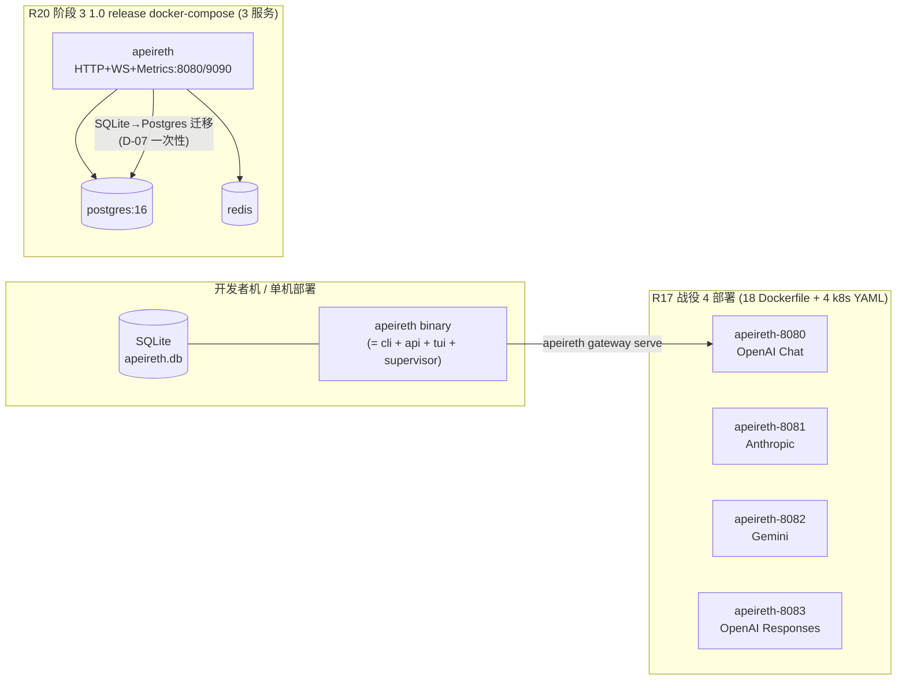
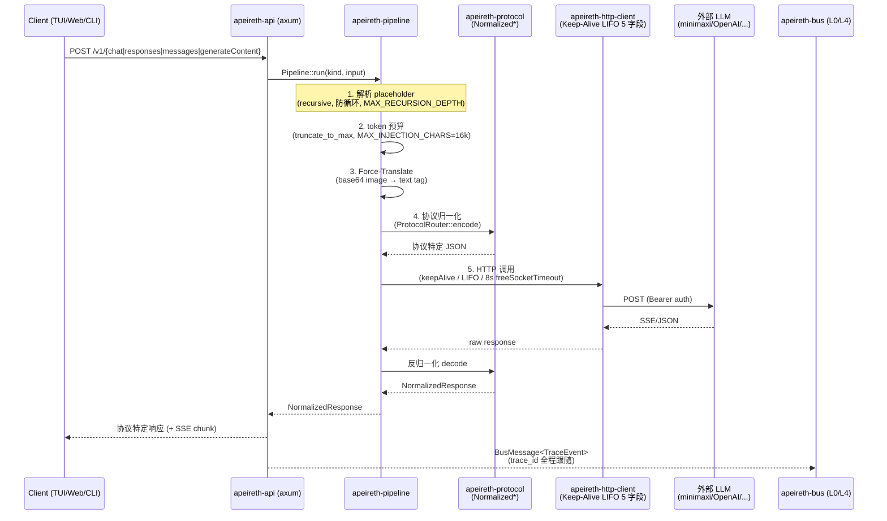
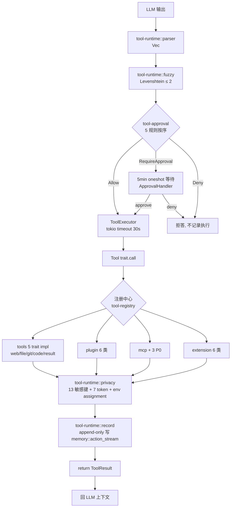
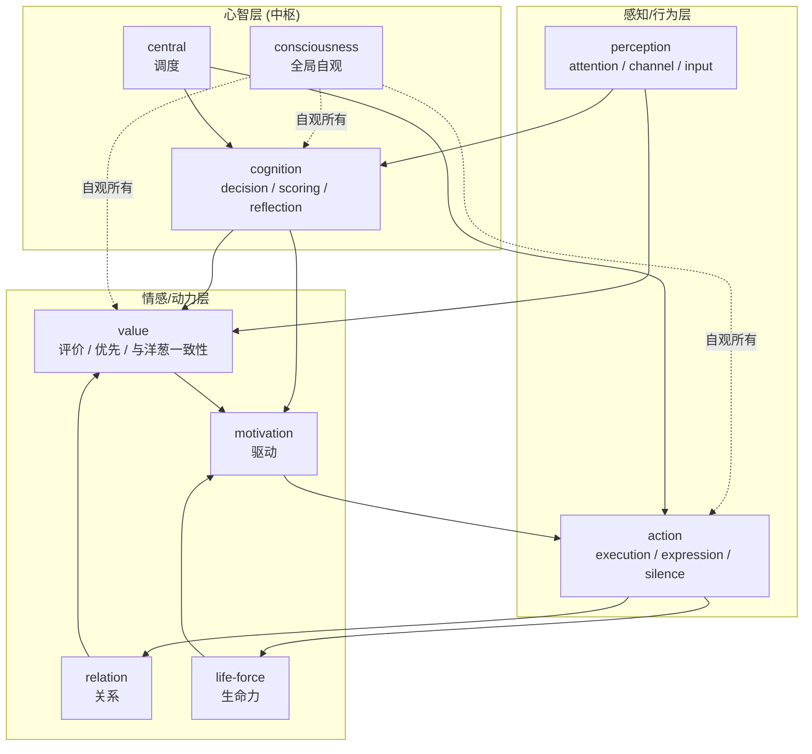
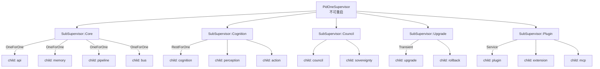
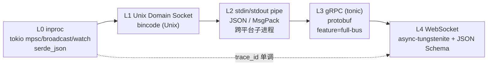

[Document-Meta]
Document: apeireth-architecture-readonly-review-2026-08-05.md
Version: 1.0.0-ReadOnly-Review
R-Cycle: R20 (post-阶段-1 收官, pre-阶段-2 启动)
Commit: <pending — 主人未 commit, 等团队>
Last-Modified: 2026-08-05
Status: 🟢 活跃 (新文档, R20 阶段 1 收官后, 08 偏差校正期间落盘)
See-Also: 08-NEXT-UPGRADE-DIRECTIONS.md, README.md (顶层 R17 战役 0-4 收官), docs/v2-strategy/05-EXECUTION-NOW.md

---

# Apeireth-rust 工程架构评审（纯只读 · 2026-08-05）

> 项目根：`.openclaw\workspace\promethean\Apeireth-rust`
> 工作区版本：`1.0.0`（Rust 1.80, edition 2021）
> 评审时间：2026-08-05（R20 阶段 1 收官后, 阶段 2-3 准备期间）
> 评审者：Codex CLI (MiniMax-M3)
> 评审方法：只读扫描 (Cargo workspace + 各 crate `lib.rs` 头部 + deploy/), 无任何写入或修改
> 落盘文档：本文（不动 08 LOCKED 文档, 不动 stage4/README.md 索引, 不动任何源码）

## 摘要

Apeireth-rust 是一个用「双洋葱（原则 × 权限）」做编译时硬骨架、以「9 拟人化器官 + 智囊团审议 + 多签治理」做运行时血肉、对外以 4 大 LLM 协议 + 6 类 JSON 端点 + WebSocket 8 帧暴露的高自主长程 agent 平台。56 个 workspace crate, ~3.4MB Rust 源码, 三大可执行入口 (cli / api / tui), 双部署形态 (单进程 4 端口 vs 3 服务 docker-compose), 哲学硬骨架与商业化碎片在同一个 workspace 内共存。架构上有 8 层正交抽象（哲学 / 治理 / 器官 / 协议 / 工具 / 通信 / 存储 / 观测）, 通过编译期 hardcode + "不假装" 工程铁律保证不变性。

---

## 1. 系统定位（一句话）

**Apeireth = 一个用「双洋葱（原则 × 权限）」做编译期硬骨架、以「9 拟人化器官 + 智囊团审议 + 多签治理」做运行时血肉、对外以 4 大 LLM 协议 + Web/REST 暴露的高自主长程 agent 平台**。一句话里至少三层抽象（哲学层 / 器官层 / 协议层）正交叠加, 区别于单一 chat-agent 框架。

---

## 2. 工作区与代码量

按 `.rs` 累计字节数（KB）排前 25 的 crate:

| 排名 | Crate | KB | 角色 |
|---|---|---:|---|
| 1 | `apeireth-api` | 488 | 自研 LLM 网关: 4 协议 + 6 类 JSON + WS8 帧 + auth |
| 2 | `apeireth-sovereignty` | 358 | 主权器官: HA/三域分离/SGI/9 生命周期/MEWG 治理 |
| 3 | `apeireth-tui` | 262 | ratatui 5 页 (TUI 客户端, HTTP 瘦) |
| 4 | `apeireth-core` | 232 | 核心类型 + 双洋葱统一体 + 12 键 + 5 重守门 |
| 5 | `apeireth-upgrade` | 201 | 7 阶段 OTA + Council 审议 + 多签 + 沙箱 |
| 6 | `apeireth-team-lead` | 189 | 团队 lead (多 agent 协作管理) |
| 7 | `apeireth-protocol` | 189 | 4 协议归一化 + WS 8 帧 + Keep-Alive 5 字段 |
| 8 | `apeireth-plugin` | 163 | 6 类插件 runtime (Sync/Async/Static/Service/Pre/Hybrid) |
| 9 | `apeireth-image-prompt` | 159 | 图像 prompt 子系统 |
| 10 | `apeireth-council` | 145 | 7 强制 Advisor + 按住机制 + 拟人化 |
| 11 | `apeireth-constraint` | 143 | 4 重守门 + PermissionGrant |
| 12 | `apeireth-memory` | 143 | SQLite + 6 Append-only 历史流 |
| 13 | `apeireth-web` | 138 | Leptos SSR 9 器官控制台 |
| 14 | `apeireth-evolution` | 125 | 6 状态机演化引擎 + fail-6 |
| 15 | `apeireth-asi` | 123 | 24 维北极星指标测量 + 历史 + 校准 |
| 16 | `apeireth-tools` | 120 | 5 trait: WebSearch/FileOps/GitOps/CodeExec/ToolResult |
| 17 | `apeireth-mcp` | 111 | MCP 客户端 + stdio/SSE/HTTP-streamable server |
| 18 | `apeireth-tool-runtime` | 105 | parser + fuzzy + executor + privacy + record |
| 19 | `apeireth-extension` | 92 | 6 类扩展点 (VCP FileOperator 借鉴的更老一套) |
| 20 | `apeireth-pipeline` | 92 | 5 步 chat 管线编排 |
| 21 | `apeireth-bus` | 88 | 5 层通信总线 (L0–L4) |
| 22 | `apeireth-tool-approval` | 86 | 5 规则审批 + 5min 窗口 + fuzzy |
| 23 | `apeireth-tool-registry` | 79 | 6 类工具注册 + 5 轴 + 3 层 token 预算 |
| 24 | `apeireth-value` | 72 | 价值评估 + 与洋葱一致性 |
| 25 | `apeireth-agent` | 72 | 多 alias agent 注册 + LRU + notify 热加载 |

剩下的 30+ crate 多是「9 器官」小器官 (cognition / action / perception / value / motivation / relation / life-force / central / consciousness, 每个 25–55KB) + 商业化相关 (rollback / keyring / machine-id / lark / voice / repo-scan / repo-analyzer / plugin / image-prompt / workflow / team-lead 等) + SDK (pybridge / sdk / i18n) + 形式化 (formal / graph / vector) + 5 P0 MCP (mcp-ssh / mcp-winrm / mcp-relay-image) + 治理 (sovereignty / council / upgrade / evolution / constraint 已在前列)。

代码量分布反映系统设计:

- **6 个「重」crate (>150KB) = 6 大子系统**: API 网关、主权、CLI/TUI、核心类型、升级、团队编排
- **12 个「中」crate (50–150KB) = 业务器官层**: 协议、工具链、记忆、智囊团、约束、演化、北极星
- **30+ 个「轻」crate (<50KB) = 拟人化器官 + 商业化碎片 + 集成桩**

---

## 3. 子系统分层（自顶向下）

```
┌──────────────────────────────────────────────────────────────┐
│  客户端层   apeireth-tui (ratatui)   apeireth-web (Leptos)  │
│             apeireth-cli (bin)      apeireth-tauri-stub(off)│
└────────────────────────┬─────────────────────────────────────┘
                         │ HTTP/WS / 各器官 JSON 端点
┌────────────────────────┴─────────────────────────────────────┐
│  网关层      apeireth-api  (axum, 4 协议 + 6 类 JSON + WS8)  │
│              ├ protocol_handlers  ├ v2_endpoints  ├ auth    │
│              └ ws_v1                                          │
└────────────────────────┬─────────────────────────────────────┘
                         │
┌────────────────────────┴─────────────────────────────────────┐
│  管线层      apeireth-pipeline  (5 步主 chat 编排)           │
│              └─ apeireth-protocol (4 协议归一化 + WS8 帧)    │
│              └─ apeireth-http-client (Keep-Alive LIFO 5 字段)│
└──────┬─────────────────────────┬─────────────────────────────┘
       │                         │
┌──────┴────────┐       ┌───────┴──────────────────────────────┐
│ 工具/插件层    │       │ 器官/治理层                            │
│ tool-registry │       │ 9 器官 (cognition/action/perception/  │
│ tool-runtime  │       │   value/motivation/relation/life-force│
│ tool-approval │       │   central/consciousness)             │
│ tool-result   │       │                                       │
│ tools (5 trait)│      │ council 7 Advisor + 按住 + synthesis │
│ extension     │       │ sovereignty HA + MEWG 5 重治理       │
│ plugin        │       │ evolution 6 状态机 + fail-6          │
│ mcp + 3 P0    │       │ constraint 4 重守门 + PermissionGrant│
│ workflow      │       │ upgrade 7 阶段 OTA + 多签 + 沙箱     │
│ team-lead     │       │ asi 24 维测量 + 校准                  │
└──────┬────────┘       └───────┬──────────────────────────────┘
       │                        │
┌──────┴────────────────────────┴──────────────────────────────┐
│  域类型 + 守门核心   apeireth-core                              │
│   Episode/Note/Session/IdentityCard  +  原则洋葱 E/S/A/M/O    │
│   权限洋葱 L0..L5            +  12 键 verdict cache           │
│   5 重守门                    +  HA + HA Mode                  │
│   9 阶段生命周期              +  Cognitive-Dream 6 状态机     │
└──────┬────────────────────────────────────────────────────────┘
       │
┌──────┴────────────────────────────────────────────────────────┐
│  通信 + 存储 + 横切  bus(L0–L4) / memory(SQLite) /            │
│              onion(trait 抽象) / extension / verify /        │
│              pybridge(PyO3 可选) / bench(SWE-bench smoke)     │
└───────────────────────────────────────────────────────────────┘
```

依赖方向严格自上而下: client → api → (pipe ∥ tools ∥ govern ∥ organs) → core → infra。`apeireth-core` 是事实上的「叶子底层」, 所有上层 crate 都 `use apeireth_core::*`。

---

## 4. 多视角架构图

### 4.1 总架构图（系统 + 容器, C4 Level 1 + 2）

```mermaid
graph TB
  User[用户/开发者]
  ExtAPI[外部 LLM<br/>minimaxi / OpenAI / Anthropic / Gemini]

  subgraph Clients["客户端层 (二进制)"]
    TUI[apeireth-tui<br/>ratatui 5 页]
    CLI[apeireth-cli<br/>bin: apeireth]
    Web[apeireth-web<br/>Leptos SSR]
  end

  subgraph Gateway["API 网关层 (axum)"]
    API[apeireth-api<br/>4 LLM 协议 + 6 JSON 端点 + WS 8 帧 + auth]
  end

  subgraph Pipeline["管线层"]
    Pipe[apeireth-pipeline<br/>5 步编排]
    Proto[apeireth-protocol<br/>归一化 + Keep-Alive LIFO 5 字段]
    HTTP[apeireth-http-client]
  end

  subgraph Organs["9 拟人化器官"]
    Cog[cognition]
    Act[action]
    Per[perception]
    Val[value]
    Mot[motivation]
    Rel[relation]
    LF[life-force]
    Cen[central]
    Cons[consciousness]
  end

  subgraph Govern["治理层"]
    Council[apeireth-council<br/>7 Advisor + 按住]
    Sov[apeireth-sovereignty<br/>HA + MEWG 5 重]
    Evol[apeireth-evolution<br/>6 状态机]
    Upg[apeireth-upgrade<br/>7 阶段 OTA]
    Con[apeireth-constraint<br/>4 重守门 + 12 键]
  end

  subgraph Tools["工具/插件层"]
    TR[tool-registry]
    TRt[tool-runtime<br/>parser+fuzzy+exec+privacy+record]
    TA[tool-approval<br/>5 规则 + 5min 窗口]
    Tools5[tools 5 trait<br/>web/file/git/code/result]
    Ext[extension 6 类]
    Plg[plugin 6 类]
    MCP[apeireth-mcp + 3 P0]
    WF[workflow]
    TL[team-lead]
  end

  subgraph Core["域核心"]
    Core[apeireth-core<br/>双洋葱 + 12 键 + HA]
    Onion[apeireth-onion<br/>trait 抽象层]
    Mem[apeireth-memory<br/>SQLite + 6 Append-only 流]
    ASI[apeireth-asi<br/>24 维 + 9 子测度]
  end

  subgraph Infra["横切基础设施"]
    Bus[apeireth-bus<br/>5 层传输 L0–L4]
    PyB[apeireth-pybridge<br/>PyO3 可选]
    Vf[apeireth-verify<br/>回归断言]
    Bn[apeireth-bench<br/>SWE-bench]
    Ag[apeireth-agent<br/>多 alias + LRU + notify]
  end

  User --> TUI
  User --> CLI
  User --> Web
  TUI -- "HTTP 瘦" --> API
  CLI -- "HTTP / 直调" --> API
  Web -- "SSR 直调" --> API
  CLI -- "直调" --> Core
  CLI -- "直调" --> Mem
  CLI -- "直调" --> ASI

  API --> Pipe
  Pipe --> Proto
  Pipe --> HTTP
  HTTP -- "HTTPS" --> ExtAPI

  API -. organs .-> Organs
  API -. tools .-> Tools
  API -. memory .-> Mem
  API -. asi .-> ASI
  API -. sovereignty .-> Sov
  API -. agent .-> Ag

  Pipe -. 工具调用 .-> TR
  Pipe -. LLM 输出 .-> TRt
  TRt --> TR
  TRt --> TA
  TR --> Tools5
  TR --> Plg
  TR --> Ext
  TR --> MCP

  Sov --> Council
  Sov --> Core
  Council --> Core
  Evol --> Council
  Upg --> Council
  Upg --> Sov
  Con --> Core
  Onion --> Core
  Mem --> Core
  ASI --> Core
  Bus -. "L0–L4" .-> API
  Bus -. "L0–L4" .-> TUI
```

### 4.2 部署视角（单进程 + 多容器）



要点: 单 binary 既当 CLI 也当网关, 部署形态二选一（旧 4 端口冗余 vs 新 3 服务 + Postgres+Redis）。1.0 release 走后者, 且 SQL 一次性从 SQLite 迁到 Postgres。

### 4.3 模块/Crate 依赖视角（按子系统色块）

```
┌─ CLIENT ──────────────────────────────────────────────┐
│ tui  web  cli                                          │
└──┬──────┬──────┬───────────────────────────────────────┘
   │      │      │
   ▼      ▼      ▼
┌─ API (apeireth-api) ──────────────────────────────────┐
│ server + llm + protocol_handlers + v2_endpoints +     │
│ ws_v1 + auth                                          │
└──┬──────┬──────┬──────┬──────┬──────┬─────────────────┘
   │      │      │      │      │      │
   ▼      ▼      ▼      ▼      ▼      ▼
┌─ PIPE ─────────┐ ┌─ TOOLS ───────┐ ┌─ GOVERn ────────┐
│ pipeline       │ │ tool-registry │ │ council         │
│ protocol       │ │ tool-runtime  │ │ sovereignty     │
│ http-client    │ │ tool-approval │ │ evolution       │
└──────┬─────────┘ │ tools (5 tr.) │ │ upgrade         │
       │           │ plugin        │ │ constraint      │
       │           │ extension     │ │ onion (trait)   │
       │           │ mcp (+ 3 P0)  │ └────────┬────────┘
       │           │ workflow      │          │
       │           │ team-lead     │          │
       │           └──────┬────────┘          │
       │                  │                   │
       ▼                  ▼                   ▼
┌────────────────────────────────────────────────────────┐
│  CORE  apeireth-core                                    │
│   Episode/Note/Session/IdentityCard + 原则洋葱 E/S/A/M/O│
│   权限洋葱 L0..L5            +  12 键 verdict cache    │
│   HA + HA Mode              +  9 阶段生命周期           │
│   Cognitive-Dream 6 状态机  +  5 重守门                 │
└──────┬─────────────────────────────────────────────────┘
       │
       ▼
┌─ INFRA ───────────────────────────────────────────────┐
│ memory (SQLite + 6 Append-only)  asi (24 维)          │
│ bus (L0–L4)  agent (alias+LRU+notify)                 │
│ verify (回归断言)  pybridge (PyO3)  bench (SWE-bench) │
│ formal (Kani)  graph  vector  sdk                     │
└──────────────────────────────────────────────────────┘
```

依赖方向严格自上而下: client → api → (pipe ∥ tools ∥ govern ∥ organs) → core → infra。`apeireth-core` 是事实叶子底层, 30+ crate 直接 `use`, 改 core 字段名是全 workspace 级爆破。

### 4.4 主 chat 5 步管线（请求视角）



要点: 5 步完全借鉴 VCP `chatCompletionHandler.js:1-220`, 每步都有 VCP 真代码字段级引用（注释里写死行号）；`bus` 通过 `trace_id` 链路追踪, 跨层不丢失。

### 4.5 工具调用链路（含审批 + 隐私 + 记录）



要点: 审批 5 规则 (Trust / Risk / Frequency / Whitelist / Blacklist) 按顺序短路, 第一个非 NoMatch 生效。隐私守卫对结果递归扫描 13 类敏感键 + 7 类 high-confidence token + env assignment。记录端强制 append-only 进 `apeireth-memory::action_stream`, 不可改不可删。

### 4.6 双洋葱守门流（写入/动作决策视角）

```mermaid
flowchart TB
  subgraph Outer["外层 (动态 / 运行时可变)"]
    P[5 哲学键 Proposal 流]
    L2[L2 重要操作]
    L3[L3 关键操作]
    L4[L4 核心升级]
    L5[L5 核武器级]
  end

  subgraph Middle["中层 (运行时)"]
    V[12 键 verdict cache<br/>O(1) 查询]
    H[5 状态机<br/>Cognitive-Dream]
  end

  subgraph Inner["内层 (编译时 hardcode)"]
    P_Onion[原则洋葱 E/S/A/M/O]
    L_Onion[权限洋葱 L0..L5]
    L0[L0 HA 核心<br/>不可变]
  end

  P --> V
  L2 --> V
  L3 --> V
  L4 --> V
  L5 --> V

  V -- "verdict = Allow" --> A[Action 执行]
  V -- "verdict = Deny" --> X[拒绝 + 反思期审计]

  V -. Gate 2 拦截 .-> P_Onion
  V -. Gate 2 拦截 .-> L_Onion

  P_Onion -. Gate 1 编译时 .-> L0
  L_Onion -. Gate 1 编译时 .-> L0

  A -. Gate 3 物理隔离 .-> L0
  X -. Gate 4 反思期 .-> H
  H -. "72h 监控越权" .-> L0

  style L0 fill:#fef2f2,stroke:#dc2626,stroke-width:3px
  style P_Onion fill:#e9d5ff,stroke:#7c3aed
  style L_Onion fill:#e9d5ff,stroke:#7c3aed
```

要点: 4 重守门是「洋葱」, 从内 (编译时 hardcode) 到外 (运行时 / 物理 / 反思期)；L0 永远是 HA 不可变, E 原则胜所有。这是哲学核心, 不动 LOCKED。

### 4.7 9 器官 + 拟人化视图



要点: 9 器官是 9 个独立 crate, 分布在 30–55KB; `apeireth-api` 暴露 `/v1/organs/{name}/invoke` 让 TUI/Web 直接调用。`consciousness` 是最特殊的: 它「自观所有」——以虚线表达, 没有输出, 只有内部观察。

### 4.8 进程监督树（`apeireth-supervisor` 视角）



要点: 纯 `tokio::process::Command`, 无外部脚本; 策略 3 种 (OneForOne / RestForOne / Transient)。PID 1 永远不重启（结构上无 `restart_strategy` 字段）。每个 child 都是 `Actor` mailbox + handle 的 tokio 进程。

### 4.9 5 层通信总线（`apeireth-bus`）



要点: 5 层递进 (inproc → UDS → pipe → gRPC → WS), 统一 `BusMessage<T> { trace_id, payload, created_at_ms }`; 反背压策略 4 种 (Block / DropOldest / DropNewest / Drop); L1/L2 仅 Unix。Bus 统计原子计数 (`sent / dropped / received / retransmit`)。

### 4.10 数据/存储视角

```mermaid
erDiagram
  EPISODES ||--o{ NOTES : "提炼自"
  EPISODES {
    string id PK
    int timestamp
    string role
    string content
    string session_id FK
  }
  SESSIONS ||--o{ EPISODES : "包含"
  SESSIONS {
    string id PK
    int started_at
    int last_active_at
  }
  IDENTITY_CARDS ||--o{ MIGRATIONS : "含"
  IDENTITY_CARDS {
    string continuity_id PK "UNIQUE 跨载体"
    int birth_time
    json carriers
  }
  THOUGHT_STREAM ||--|| APPEND_ONLY : "触发 ABORT"
  PROPOSAL_STREAM ||--|| APPEND_ONLY
  ACTION_STREAM ||--|| APPEND_ONLY "tool-runtime 写"
  RELATION_STREAM ||--|| APPEND_ONLY
  EVOLUTION_STREAM ||--|| APPEND_ONLY
  REFLECTION_STREAM ||--|| APPEND_ONLY
  ASI_TRACE {
    string id PK
    string dim_name
    float value
    int ts
  }
  TOOL_CALL_RECORDS {
    string id PK
    string tool
    json args
    json result
    string decision
    int ts
  }
```

要点: 6 个 Append-only 历史流通过 SQLite `BEFORE UPDATE / BEFORE DELETE` triggers raise ABORT 实现不可改; `IdentityCard.continuity_id` UNIQUE 约束实现跨载体去重; `ASI_TRACE` 和 `TOOL_CALL_RECORDS` 是追加型观测。**无 ORM** (主人偏好), 直接 SQL。

### 4.11 编译期 hardcode + 「不假装」（元架构）

```mermaid
graph LR
  subgraph Code["源码"]
    Lib[crate lib.rs]
  end
  subgraph Compile["编译期"]
    Const[const 常量<br/>如 PROTOCOL_COUNT=4]
    Assert[const _: () = { assert! ... }]
    Anchor[_compile_time_anchor_no_dupe<br/>字段访问触发类型检查]
  end
  subgraph Test["测试期"]
    Unit[单元测试]
    E2E[wiremock e2e<br/>+ SWE-bench]
    Verify[apeireth-verify<br/>regression_assert!]
  end
  subgraph Run["运行期"]
    Runtime[真实 IO/网络/状态机]
  end

  Lib --> Const
  Const --> Assert
  Assert --> Anchor
  Assert --> Unit
  Unit --> Runtime
  Runtime --> Verify
  Anchor --> Verify
```

要点: 这是隐形的「元架构」——所有 crate 都在 `lib.rs` 顶部用 `const _: () = { assert!(CONST == N, "msg") }` 做编译期断言 + 字段级类型 anchor + `apeireth-verify::regression_assert!` 做回归断言。**这是这个项目最有特色的工程铁律**, 目的是「不假装」——任何漂移在编译期就死。

---

## 5. 关键工程决策摘录

| 主题 | 决策 | 来源 / 证据 |
|---|---|---|
| 单 binary 部署 | `apeireth` binary 同时是 CLI / API 网关 / gateway serve | `deploy/Dockerfile` 复制 `/build/target/release/apeireth` |
| 4 协议归一化 | OpenAI Chat / OpenAI Responses / Anthropic / Gemini → 内部 `NormalizedRequest` | `apeireth-protocol` + `apeireth-pipeline 5 步` |
| Keep-Alive LIFO 5 字段 | 真值 = VCP `chatCompletionHandler.js:22-28`, 编译期 hardcode | `apeireth-protocol/lib.rs` 顶部 const |
| 6 类工具 / 6 类插件 / 6 类扩展 | 3 套独立抽象, 分属 `tool-registry` / `plugin` / `extension` 三个 crate | Cargo.toml 注释明确 3 套 |
| 工具调用审批 | 5 规则按序 + 5min oneshot + fuzzy 模糊匹配 | `apeireth-tool-approval` |
| Sovereignty 治理 | HA 3 模式 (single / multi / offline) + MEWG 5 重 (≥2 多人 + ≥3 多 AI + 物理多签 + ≥7d 反思期) | `apeireth-sovereignty` |
| 拟人化 Council | 7 强制 Advisor (safety/performance/philosophy/history/strategy/ethics/legal) + 按住 (30% 强反 / 一致反 / 60s 超时) | `apeireth-council` |
| 演化 | 6 状态机 + fail-6 + 4 学习 trait | `apeireth-evolution` |
| 升级 | 7 阶段 OTA (Idle → IntentDraft → CouncilReview → MultiSig → Download → Switchover → Monitor) | `apeireth-upgrade::OtaStage` |
| ASI 北极星 | 24 维 LOCKED + 9 子测度 LOCKED, append-only 历史 | `apeireth-asi::V05_DIM_COUNT = 24` |
| 守门 | 4 重 (编译时 / 运行时 verdict cache / 物理隔离 / 反思期审计) | `apeireth-constraint::FourGates` |
| 通信 | 5 层总线 L0–L4, trace_id 全链路 | `apeireth-bus::BusMessage<T>` |
| 持久化 | SQLite (单进程/开发) → Postgres (1.0 release, D-07 一次性迁移) | `docker-compose.yml` |
| 前端 | TUI (ratatui, HTTP 瘦客户端) 做主线; Tauri 砍给另外团队 | README R17 战役 3 |
| Lint | workspace 级 (抄 wasmtime + qdrant 精选), `unsafe_code` workspace deny | 根 `Cargo.toml` `[workspace.lints]` |
| 「不假装」 | 8 项不修改承诺 + 编译期 hardcode + VCP 字段级引用 | 各 lib.rs 头部 |

---

## 6. 工程视角的「看到了什么」

### 做得好的部分（值得借鉴）

- **编译期 hardcode 守门是杀手锏**。所有关键常量 (4 协议、6 工具、5 规则、24 维、7 Advisor、11 节点电子环) 都在 `const _: () = { assert!(...) }` 里硬编码, 外加 `_compile_time_anchor_no_dupe` 用字段访问触发类型检查。这相当于「任何对核心架构的破坏必须改代码, 改了立刻编译失败」——比 SOX 审计更严格。
- **VCP 借鉴粒度细到行号**。每个借鉴点都标了「file.js:行号 + 真字段名 + 真函数名」, 可在 IDE 里跳转对照。这种「借工程模式不抄业务」的注释纪律, 是少有的工业级做法。
- **观测/调试基础设施完整**。ASI 24 维测量 + append-only history + 校准系数 + drift detection + LLM judge; verify crate 跨 crate `regression_assert!`; bench crate 接 SWE-bench Verified; TUI 有 `--snapshot` 调试模式。
- **进程监督树用 tokio 不用外部脚本**。`apeireth-supervisor` 纯 `tokio::process::Command`, 3 种 restart 策略 + actor mailbox, 跨平台可移植。

### 值得警惕的部分（隐忧）

- **复杂度爆炸**。56 个 crate、~3.4MB Rust 源码、9 拟人化器官 + 双洋葱 + 5 重守门 + 4 重治理, 对一个 1.0 release 来说是巨量。新人 onboarding 成本极高; 任何「1+1=2」改动都要穿透 6 重 LOCKED 文档。
- **「不假装」哲学带来的反向债务**。很多 crate 顶部明确「❌ 不实装 X, 仅 stub」(如 `apeireth-graph` / `apeireth-sdk` 只有 Dockerfile, `apeireth-vector` 缺 workspace.members), 这些是显式登记的「未完成」——但数量多达 14 个新 crate (R20 阶段 1 收官报告), 需要在 R21+ 补。
- **跨 crate 类型耦合**。`apeireth-core` 是事实叶子, 但被 30+ crate 直接 `use`, 且 `apeireth-sovereignty` / `apeireth-council` / `apeireth-constraint` 之间有 trait 互锁 (`SovereigntyHook`)。改 core 字段名是全 workspace 级爆破。
- **双 frontend 路线摇摆**。README 说 TUI 主线、Tauri 砍给另外团队, 但 `apeireth-web` (Leptos SSR) 又自己重做一套 9 器官控制台。三套 UI 路径同时维护 (TUI 终端 / Tauri desktop / Web SSR) 会摊薄迭代资源。
- **PyO3 / Kani / tonic / tauri 多个 feature flag 同时挂**。`pyo3` 用 `auto-initialize`、`full-bus` 特性需 tonic、`kani` cfg 需白名单, 依赖图复杂。`apeireth-tauri-stub` 因为 `reqwest 0.13` 强约束被注释关闭, 反映了「加 crate 容易, 移 crate 难」。
- **文档量大但分散**。`docs/stage1..6` + `v2-strategy/` 9 个 + `stage4/` 50+ 个 + `APEIRETH-*-OMNIBUS` 等顶层文档。一个新人想从零理解要读 17 份必读文档 (README 提到的「4 件套 + 17 份」)。

---

## 7. 总结

Apeireth-rust 在工程上不是一个普通 Rust 项目, 它**用「哲学硬骨架 + 拟人化器官 + 4 重治理 + 编译期 hardcode」四件套**试图构造一个能「长程自主 + 不可被自己颠覆」的高自主 agent 平台。架构本身在以下几个抽象层级上做了**正交叠加**:

| 抽象层 | 单一职责 | 不可变边界 |
|---|---|---|
| 哲学 | 双洋葱 + 12 键 + E/S/A/M/O | 编译时 hardcode |
| 治理 | Council 7 + Sovereignty MEWG 5 + Constraint 4 + Upgrade 7 阶段 | 物理多签 + 反思期 |
| 器官 | 9 拟人化器官 (cog/act/per/val/mot/rel/lf/cen/cons) | 各自独立 crate |
| 协议 | 4 LLM 协议归一化 + WS 8 帧 | Keep-Alive LIFO 5 字段 |
| 工具 | 6 类工具 + 5 审批规则 + 5 步管线 | append-only 记录 |
| 通信 | 5 层总线 L0–L4 | trace_id 全链路 |
| 存储 | SQLite → Postgres 一次性迁移 | Append-only + UNIQUE 约束 |
| 观测 | 24 维 + 9 子测度 + verify 回归 | LOCKED 锚点 |

这套架构的**鲁棒性来自「内层编译时硬」**, **灵活性来自「外层动态可改」**——洋葱是真正的洋葱, 不是装饰。

---

## 零修改声明

本评审**未对 Apeireth-rust 工作区下任何文件做修改**, 具体:

- ❌ 未修改任何 crate 源码 (`.rs`)
- ❌ 未修改根 `Cargo.toml` 或 `Cargo.lock`
- ❌ 未修改 `docs/stage4/08-NEXT-UPGRADE-DIRECTIONS.md` (LOCKED 文档)
- ❌ 未修改 `docs/stage4/README.md` (索引)
- ❌ 未修改 `docs/v2-strategy/` 下任何文档
- ❌ 未修改 `deploy/` / `docker-compose.yml` / `Dockerfile`
- ❌ 未触发任何 commit / branch / git 操作
- ✅ 仅新增本文 `docs/stage4/apeireth-architecture-readonly-review-2026-08-05.md` 一份

> 文件未 commit, 等团队 (与 08 文档 / 阶段 4 一系列 LOCKED 修正同批处理)。

---

## 更新记录

| 日期 | 版本 | 变更 |
|---|---|---|
| 2026-08-05 | 1.0.0-ReadOnly-Review | 初版, 落盘于 R20 阶段 1 收官后、阶段 2-3 准备期间 |
