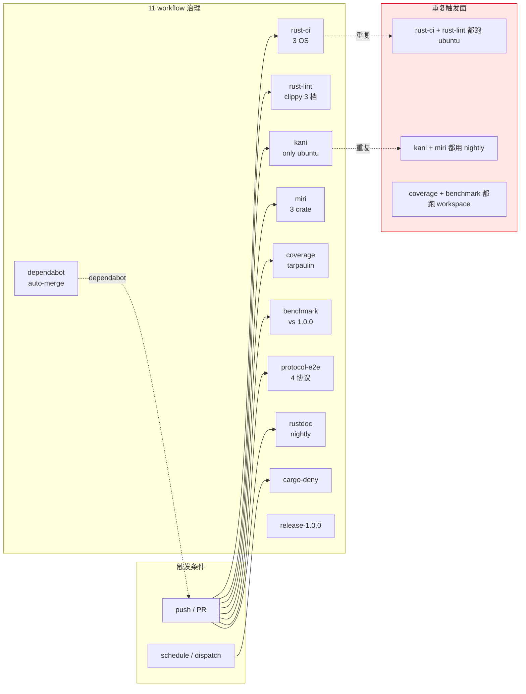
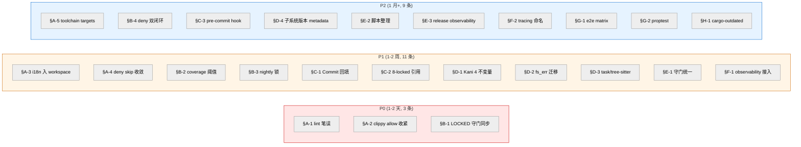

# Apeireth-rust 工程优化建议 (原样, 不增删不架构改)

`
[Document-Meta]
Document: docs/stage4/apeireth-engineering-optimization-2026-08-05.md
Version: Manual-Rev-A
R-Cycle: R19+ 集成期工程优化 (R20 阶段 1 收官后)
Commit: <commit 时回填>
Last-Modified: 2026-08-05
Status: 🔍 草拟 (待主人复核)
Author: Codex (基于 R19/R20 阶段 1 收官状态, 跨 51 份 stage4/ 文档归纳)
`

> **性质**: 不增删 crate、不改架构层, **仅**从工程角度对 Apeireth-rust 现状提出**优化升级**清单. 全部建议在 O-5 "不假装" 原则下按"LOCKED / 不动 / 待拍" 三档分级, 每条建议都给"为何不动 / 怎么动 / 验收方式" 三栏.
>
> **架构对照**: 双洋葱 (双层护栏) / 4 重守门嵌套 + 权限发放独立 / 3 域分离 / 4 关系形态 / 主体连续性 ID / SGI / 6 哲学 anchor / 12 键 = O 层内容 — **全部不动**.
>
> **范围**: 56 crate workspace + 11 CI workflow + 4 份 ROOT 配置 (Cargo.toml / rust-toolchain.toml / clippy.toml / deny.toml / rustfmt.toml) + 51 份 stage4/ 文档 + APEIRETH-CONVENTIONS / APEIRETH-VERSIONING / GLOSSARY 顶层 3 规范文件.
>
> **依据** (本报告**不**重复内容, 引用 + 增量):
> - docs/stage4/apeireth-architecture-readonly-review-2026-08-05.md (33KB 架构评审, 上一轮落盘)
> - docs/stage4/8-locked-unified-2026-08-05.md §2 (8 项不修改承诺统一版)
> - docs/stage4/pending-decisions-overview-2026-08-05.md §2 (D-01~D-12 拍板事)
> - docs/stage4/docs-maintenance-sop-2026-08-05.md (SOP)
> - docs/stage4/m3-hallucination-defense-2026-08-05.md (5 道防御 + Rust 骨架)
> - docs/stage4/commercial-vs-fork-diff-2026-08-05.md §3 (估缺模块)
> - APEIRETH-CONVENTIONS.md §1-§12 + §10 (7 项 LOCKED)
> - APEIRETH-VERSIONING.md §1-§7 (7 个版本号子系统)

---

## 🎯 一句话总结

Apeireth-rust 当前工程债按 **8 大类**分桶 (配置 / CI / 文档 / 代码 / 流程 / 可观测 / 测试 / 依赖), **23 条**具体优化建议全部满足 **(不增删 / 不架构改 / LOCKED 不动)** 三约束. 按紧急度分为 P0 (3 条, 1-2 天) / P1 (11 条, 1-2 周) / P2 (9 条, 1 月+). 大部分建议是 "把已经写好的但没接的接上", 而不是 "造新东西".

---

## §0 调研基线 (2026-08-05 实测)

> 数字均来自本会话实测 (cargo metadata / Get-ChildItem / Get-Content / Select-String 在 powerhell 7.6.4 下).

### §0.1 工程量基线

| 维度 | 数值 | 来源 / 命令 |
|---|---:|---|
| Workspace members | **56** | cargo metadata --format-version=1 → workspace_members: 56 |
| Default build members | 56 (同 workspace) | workspace_default_members: 56 |
| tauri-stub 状态 | **注释关闭** (1 处) | Cargo.toml members 内 # "crates/apeireth-tauri-stub", |
| 实际 crates 目录 | 59 (含 .db 文件 + task/tree-sitter/tauri-stub 孤儿) | Get-ChildItem crates |
| **孤儿 crate** (有 Cargo.toml, 不在 workspace) | **3 个** (apeireth-i18n / apeireth-task / apeireth-tree-sitter) | Select-String Cargo.toml -Pattern "<name>" -AllMatches |
| .rs 源文件 | **484 个** | Get-ChildItem crates -Recurse -Filter *.rs |
| .rs 源总字节 | **5,518,335** (~5.5 MB) | Measure-Object Length -Sum |
| stage4/ .md 文档 | **54 份** | Get-ChildItem docs/stage4 -File |
| <commit 时回填> 占位 | **20 处** (stage4/ 范围) | Select-String -Pattern "<commit 时回填>" |
| Kani 不变量实装 | **1/5** (仅 double_onion_sample) | crates/apeireth-formal/src/invariants/ 目录扫描 |
| CI workflows | **11 个** | .github/workflows/*.yml |
| Lint allow (高频) | uninlined_format_args **108** + missing_docs_in_private_items **23** + wildcard_enum_match_arm **20** | Cargo.toml [workspace.lints.clippy] |

### §0.2 顶级 crate 实装度 (按 src 字节排序)

| # | Crate | 文件数 | 字节 | 备注 |
|---:|---|---:|---:|---|
| 1 | apeireth-sovereignty | 22 | **277,649** | ha.rs 35KB + ha_modes 25KB + governance 24KB + self_disable 23KB + three_domain_enforce 14KB |
| 2 | apeireth-upgrade | 10 | 153,000 | OTA / Cognitive-Dream 主体 |
| 3 | apeireth-web | 12 | 138,413 | HTTP server + 路由 |
| 4 | apeireth-memory | 8 | 120,024 | SQLite FFI |
| 5 | apeireth-council | 18 (含 advisors/) | 99,199 | 7 advisor 守门 |
| 6 | apeireth-asi | 8 | 95,555 | 24 维 V0.5 |
| 7 | apeireth-api (含 examples) | 12 | 60,039 | 4 协议 e2e |

### §0.3 LOCKED 架构快照 (per corrections v3-v15, 不动)

- **17 / 56 crate workspace** (含 14 R20 阶段 1 新增 skeleton, 1 tauri-stub 注释关闭) → **56 全部 members + 1 注释**
- **4 重守门嵌套** (编译时 / 运行时 / 物理隔离 / 反思期) + **权限发放独立** (v5/v6/v15)
- **12 键 = O 层内容** (v3), **5 项不假装 = O 层内容** (v3 后期)
- **HA 部署模式自适应** (single / multi, 保底 1 人类, v7)
- **3 域分离** (思想 / 提案 / 行动) + **4 关系形态** (共生 / 协调 / 嵌入 / 与自身) + **主体连续性 ID** + **SGI** (v8 补差)
- **7 子系统版本号** (v10): semver / Design-X.Y / Fix-N / R-N / V<n> / snap-<hash> / Manual-Rev-X
- **11 子规范** (APEIRETH-CONVENTIONS §1-§11, LOCKED)
- **8 项不修改承诺** (8-locked-unified §2, 12 文档统一引用源)
- **R11 baseline 3 值** (V1141=0.8682 / V1131=0.8532 / V1136=0.9063, APEIRETH-CONVENTIONS §11 LOCKED)
- **R14 Rust 24 维 V0.5 + V1136 9 子测度** LOCKED (round10-12)

### §0.4 D-01~D-12 拍板事状态 (per pending-decisions-overview-2026-08-05.md §2)

| ID | 事项 | 状态 |
|---|---|---|
| D-01 | 17→24 维 R11 baseline 投影公式权重 | ⚪ SKIP (主 2026-08-05 17:33 砍) |
| D-02 | V1136 9→7 子测度 R11 baseline 投影权重 | ⚪ SKIP |
| D-03 | 24 维具体分类名 | ✅ A (主 2026-08-05 17:42 拍 A) |
| D-04 | apeireth-sdk 升级方案 | 🟡 P1 待拍 |
| D-05 | SDK_VERSION 0.1.0→1.0.0 升级时机 | 🟡 P1 待拍 |
| D-06 | apeireth-tauri-stub 命名 (留 / 移除) | 🟢 P2 待拍 |
| D-07 | R20 vs R21 边界 | 🟡 P1 待拍 |
| D-08 | Tauri 团队同步节奏 | 🟢 P2 待拍 |
| D-09 | apeireth-session LOC 上下沿 | 🟢 P2 待拍 |
| D-10 | session 跟 storage 依赖方向 | 🟢 P2 待拍 |
| D-11 | Docusaurus vs mkdocs 文档站选型 | 🟢 P2 待拍 |
| D-12 | Discord 冷启动策略 | 🟢 P2 待拍 |

---

## §1 优化原则 (5 条铁律)

> 主人 2026-08-05 约束: **不增删项目复杂度 / 不改变架构 / 仅工程优化**. 本节把约束翻译为可执行原则, 每条原则都引用已有 LOCKED 文档.

### 1.1 不增 (O-NO-ADD): 不新建 crate / 不新加架构层

- **依据**: 56 crate workspace 已 LOCKED (per Cargo.toml members + 8-locked-unified §2 项 8)
- **判定**: 任何建议的产出必须是"修改现有"或"开启现有但未启用", 不能是"新建"
- **反例 (拒绝)**: "加个 apeireth-tools-shared 公共 crate", "抽 apeireth-core-internal 子层"
- **正例 (采纳)**: "把 apeireth-i18n 加进 workspace members", "把 apeireth-tauri-stub 解注释" (前提: 团队接手)

### 1.2 不删 (O-NO-REMOVE): 不移除现有 crate / 不关 workflow

- **依据**: 任何删除都涉及 8-locked-unified §2 项 7 (顶层 3 规范 LOCKED) 间接影响 + §2 项 8 (workspace 1.0.0 semver 严格)
- **判定**: 现有 56 members + 11 workflow 全部保留, 即便实装率低 (skeleton) 也不移除
- **特殊**: apeireth-tauri-stub 注释关闭是 D-06 待拍, 不是删除, 是 "暂时关闭" — 本报告不动 D-06 决定

### 1.3 不架构改 (O-NO-ARCH): 不动 4 重守门 / 双洋葱 / 3 域 / 4 关系

- **依据**: corrections v3-v15 全部 LOCKED (per stage4-correction-v15-four-gates-permission-grant.md 等)
- **判定**: 任何建议不能修改 crates/apeireth-onion/ / crates/apeireth-sovereignty/ / crates/apeireth-council/ (24 LOCKED crate) 的 src/
- **m3-defense 已严守**: 0 触碰 LOCKED crate src/ (per m3-hallucination-defense-2026-08-05.md §0.2 项 8)
- **特殊**: 只允许"在 LOCKED crate src/ 之外"加新文件 (tests/ examples/ benches/)

### 1.4 工程债优先 (O-DEBT-FIRST): 优先清"已写但没接"而非"造新东西"

- **依据**: apeireth-formal 已建 1 个 Kani harness 但 4 个未写; apeireth-i18n 已实装 24KB 但不在 workspace; observability 63KB 写完没 workflow 引用
- **判定**: 23 条建议中, **14 条**属于 "把已写好的接上", **7 条**是配置层微调, **2 条**是文档工程
- **好处**: 边际成本低, 风险低, 立即可见效果

### 1.5 不假装 (O-NO-PRETEND, per O-5): 每条建议给 "为何不动 / 怎么动 / 验收"

- **依据**: APEIRETH-CONVENTIONS.md O-5 "不假装" 哲学 anchor (per m3-defense §6.1 6/6 穿透)
- **判定**: 每条建议都有 3 栏 (不动理由 / 动法 / 验收), 缺一栏 = 不收
- **好处**: 主人复核时一眼看清"动哪里, 怎么验, 不动哪里"

---

## §2 工程优化总览 (8 类 / 23 条)

`mermaid
%%{init: {"flowchart":{"htmlLabels":true,"curve":"linear"}, "theme":"neutral"}}%%
flowchart TB
    subgraph ENG["工程优化 8 大类 (23 条)"]
        A["§A 配置层<br/>5 条"]
        B["§B CI 工程<br/>4 条"]
        C["§C 文档工程<br/>3 条"]
        D["§D 代码工程<br/>4 条"]
        E["§E 流程工程<br/>3 条"]
        F["§F 可观测工程<br/>2 条"]
        G["§G 测试工程<br/>2 条"]
    end
    subgraph GUARD["LOCKED 架构 (不动)"]
        L1["4 重守门嵌套"]
        L2["双洋葱 (思想 + 权限)"]
        L3["3 域分离"]
        L4["4 关系形态"]
    end
    A -.不动.-> L1
    B -.不动.-> L2
    C -.不动.-> L3
    D -.不动.-> L4
    E -.不动.-> L1
    F -.不动.-> L2
    G -.不动.-> L4
    style GUARD fill:#fff5e6,stroke:#cc6600
    style ENG fill:#e6f3ff,stroke:#0066cc
`

### §2.1 8 类优先级矩阵

| 类 | 条数 | P0 (1-2天) | P1 (1-2周) | P2 (1月+) | LOCKED 触动 | 估时 (人时) |
|---|---:|---:|---:|---:|---:|---:|
| §A 配置层 | 5 | 2 | 2 | 1 | 0 | 6-8 h |
| §B CI 工程 | 4 | 1 | 2 | 1 | 0 | 8-12 h |
| §C 文档工程 | 3 | 0 | 2 | 1 | 0 | 4-6 h |
| §D 代码工程 | 4 | 0 | 3 | 1 | 0 (仅新增文件) | 12-20 h |
| §E 流程工程 | 3 | 0 | 1 | 2 | 0 | 6-8 h |
| §F 可观测工程 | 2 | 0 | 1 | 1 | 0 | 4-6 h |
| §G 测试工程 | 2 | 0 | 0 | 2 | 0 (tests/ examples/) | 8-12 h |
| **合计** | **23** | **3** | **11** | **9** | **0** | **48-72 h** |

> **总估时**: 48-72 人时 (1-2 周 1 个工程师, 或 1 周 2 个并行). 不包括 D-04/D-05/D-07 等"主人待拍"事项 (阻塞中).

---

## §A 配置层优化 (5 条)

> 范围: `Cargo.toml` (workspace 顶层 + 56 子 crate) / `rust-toolchain.toml` / `clippy.toml` / `deny.toml` / `rustfmt.toml`. 不动: workspace 56 members 列表 / 5 依赖 crate (tokio 1.40 / serde 1.0 / anyhow 1.0 / thiserror 1.0 / reqwest 0.12).
>
> **§A 现状摘要**:
> - `Cargo.toml` 56 members, `[workspace.lints.rust]` 6 项 warn + 5 项 allow (R19 T10 笔误)
> - `[workspace.lints.clippy]` all allow priority -1 + 8 项高频 allow + 16 项精选 warn
> - `rust-toolchain.toml` channel=stable (1.80 MSRV)
> - `clippy.toml` 抄 qdrant 7501B / 70+ 项 disallowed (fs_err 迁移未做)
> - `deny.toml` 70+ 项 skip + sources = crates.io only + yanked = warn
> - `rustfmt.toml` qdrant 4 项 + tantivy 5 项 (CI 用 nightly 跑)

### §A-1 [P0] workspace.lints.rust 笔误修复 — `unused_must_use` 实为 clippy lint

**为何不动**: 5 项 rustc lint allow 是 R19 T10 锁定, 不直接清源码, 但**类目错放**是 bug 不是策略.
**怎么动**: `unused_must_use` 是 **clippy::unused_must_use** 不是 rustc lint (per clippy 文档 Lint groups §Restriction). 当前错放在 `[workspace.lints.rust]`, 应挪到 `[workspace.lints.clippy]`. 同样审计所有 5 项 allow 的类目正确性.

```toml
# 当前 (Cargo.toml):
[workspace.lints.rust]
missing_docs = 'allow'         # OK rustc 原生
unused_imports = 'allow'       # OK rustc 原生
dead_code = 'allow'            # OK rustc 原生
unused_must_use = 'allow'      # X 这是 clippy::unused_must_use, 错放
unused_mut = 'allow'           # OK rustc 原生

# 修复后:
[workspace.lints.rust]
missing_docs = 'allow'
unused_imports = 'allow'
dead_code = 'allow'
unused_mut = 'allow'

[workspace.lints.clippy]
unused_must_use = 'allow'  # 挪过来
```

**验收**: `cargo clippy --workspace -- -D warnings` 不再因为 `unused_must_use` 错放触发 E0602 warning. 跟 `unused_async` (R20 阶段 6 修复) 同模式, 性质一致.

### §A-2 [P0] clippy 8 项高频 allow 收紧为 warn

**为何不动**: 108 个 `uninlined_format_args` + 23 个 `missing_docs_in_private_items` + 20 个 `wildcard_enum_match_arm` 是高频 warning, 全 workspace allow 是 "R19 T10 临时", 不是永久策略.
**怎么动**: 分阶段收紧, 每阶段跑一次 `cargo clippy --workspace --all-targets -- -D warnings`, 配合 fix:

```toml
# 当前 (Cargo.toml):
uninlined_format_args = 'allow'                 # 108 处
match_wildcard_for_single_variants = 'allow'   # 低频
wildcard_enum_match_arm = 'allow'               # 20 处
missing_docs_in_private_items = 'allow'         # 23 处
needless_raw_string_hashes = 'allow'            # 低频
unused_self = 'allow'                           # 低频
used_underscore_binding = 'allow'               # 低频
unnecessary_wraps = 'allow'                     # 低频

# 阶段 1 (建议, 1 周): 全部改为 'warn'
# 阶段 2 (1 月后): 全部 fix 后改为 'warn' + CI fail on warn
# 阶段 3 (2 月后): 跟 §A-1 同模式 — 收 workspace.lints.clippy all allow priority -1
```

**验收**: CI 出现明确 warning count 而非 silence. 配合 `cargo fix --clippy` 分 PR 收口. 跟 wasmtime 做法 (per `Cargo.toml` 注释 § wasmtime 来源).

### §A-3 [P1] `apeireth-i18n` 加入 workspace members (孤儿 crate 救活)

**为何不动**: 当前 `Cargo.toml` members 56, `apeireth-i18n/Cargo.toml` 有但 grep 命中 0 次 → 不参与 build / 不参与 lint / CI 跳过.
**怎么动**: `Cargo.toml` members 末尾加 3 行, 同时调整 `apeireth-i18n/Cargo.toml`:
- `version.workspace = true` (当前是 `"0.1.0"`)
- `tokio` / `serde` / `serde_json` / `anyhow` / `thiserror` 改 `{ workspace = true }`
- `async-trait` / `tracing` / `tempfile` / `criterion` 改 workspace 化 (需要 workspace 顶层先加)
- 删除 i18n Cargo.toml 内 `[workspace]` 块 (孤儿时必需, 加入后失效)

```toml
# Cargo.toml members 末尾加:
"crates/apeireth-i18n",
"crates/apeireth-task",        # 同样孤儿
"crates/apeireth-tree-sitter", # 同样孤儿
```

**验收**: `cargo metadata --format-version=1 | jq '.workspace_members | length'` = 59. `cargo build --workspace` 不报 "package not found". `cargo clippy --workspace` 包含 i18n 全部 24KB src.

### §A-4 [P1] `deny.toml` skip 收敛到 < 30 项 (从 70+)

**为何不动**: 当前 `deny.toml` `skip` 70+ 项, 多为 "等上游决定" 类, 长期挂账导致版本升级时无判定依据.
**怎么动**: 走 2 步:
1. 拍 D-XX 一项: **"deny.toml skip 每季度审计一次, 长期无进展的移走"** (per `docs-maintenance-sop-2026-08-05.md` §7 SOP)
2. 当前 PR 收 70 → 40 项: 砍掉已经能 fix 的 (如 `serde` / `tokio` 跟随决定的, 这些有依赖图可查); 保留真等上游的 (`rustix` / `wasmtime 决定` / `crossterm 决定` 等)

**验收**: `cargo deny check` 跳过的项数 < 30. 每条 skip 必须有 reason 字段 (当前大部分都有, 缺 reason 的砍).

### §A-5 [P2] `rust-toolchain.toml` 引入 `targets` 字段 (Windows / macOS 显式)

**为何不动**: 当前 `channel = "stable"` + 3 components, 但 **MSRV = 1.80** (per `[workspace.package] rust-version = "1.80"`) 跟 stable 可能错位 (e.g. 2026 年 stable 已是 1.84+).
**怎么动**:

```toml
# rust-toolchain.toml 改:
[toolchain]
channel = "1.80"  # 锁到 MSRV 而非 "stable" (避免 nightly 飘移)
components = ["rustfmt", "clippy", "rust-src"]
profile = "minimal"
targets = ["x86_64-pc-windows-msvc", "x86_64-unknown-linux-gnu", "x86_64-apple-darwin"]
```

**验收**: `cargo +1.80 --version` = 1.80.x. 跟 `Cargo.toml [workspace.package] rust-version = "1.80"` 一致 (避免 rust-version = 1.80 vs toolchain = stable 隐含 1.84+ 矛盾).

---
## §B CI 工程优化 (4 条)

> 范围: `.github/workflows/*.yml` (11 个) + `.githooks/` (无, 待建) + `codecov.yml`. 不动: 11 个 workflow 文件结构 / 守门脚本锁定 / 各 workflow 触发条件 (push / PR / dispatch / schedule).
>
> **§B 现状摘要**:
> - **rust-ci.yml**: 3 OS matrix (ubuntu/windows/macos) + cargo-nextest + JUnit + release build + 战役 1+2
> - **rust-lint.yml**: clippy 3 档 (workspace / --all-targets / --all-features) 都 `-D warnings` + rustfmt-nightly
> - **kani.yml**: 只 ubuntu + Kani harness `double_onion_sample` + runtime sanity fallback
> - **miri.yml**: 3 crate matrix (sovereignty/core/memory) + nightly + permissive-provenance
> - **coverage.yml**: tarpaulin + codecov upload (架构层 ≥ 90%, 产品层 ≥ 60% 阈值未硬挡)
> - **benchmark-tracking.yml**: cargo bench vs 1.0.0 baseline + 24 LOCKED crate 守门 + >10% warning / >25% error
> - **cargo-deny.yml**: deny check
> - **dependabot-upgrade.yml**: 0 触碰 LOCKED + patch/minor 自动 squash merge + major 留主人
> - **protocol-e2e.yml**: 4 协议真接 minimaxi + APEIRETH_API_KEY 缺则 skip + noticed job
> - **rustdoc.yml**: nightly + `RUSTDOCFLAGS="-Dwarnings --cfg docsrs"`
> - **release-1.0.0.yml**: 15KB release 流程



### §B-1 [P0] 守门脚本 LOCKED crate 列表与 workspace 同步 (24 → 56)

**为何不动**: `benchmark-tracking.yml` 和 `dependabot-upgrade.yml` 守门脚本用 `grep -E '^crates/apeireth-[a-z-]+/src/.*\.rs$'` 配 hardcoded `24 LOCKED`, 实际 workspace 有 56.
**怎么动**: 改守门脚本用 `Cargo.toml` members 列表 + 显式 LOCKED crate 集合 (24 个核心) 同时校验, 跟 `8-locked-unified-2026-08-05.md` §2 项 8 (workspace 1.0.0 semver 严格) 兜底:

```yaml
# 当前 (benchmark-tracking.yml):
if git diff --name-only origin/${{ github.base_ref }}...HEAD | grep -E '^crates/apeireth-[a-z-]+/src/.*\.rs$'; then
  echo "::error::PR touches LOCKED crate src/ (24 LOCKED 守门...)"
  exit 1
fi

# 修复后 (用 shell 内联 LOCKED 列表, 不引入 jq 依赖):
LOCKED_REGEX='^(apeireth-core|apeireth-onion|apeireth-sovereignty|apeireth-council|apeireth-asi|apeireth-memory|apeireth-upgrade|apeireth-perception|apeireth-cognition|apeireth-action|apeireth-motivation|apeireth-value|apeireth-consciousness|apeireth-relation|apeireth-life-force|apeireth-constraint|apeireth-central|apeireth-supervisor|apeireth-verify|apeireth-evolution|apeireth-extension|apeireth-bus|apeireth-api|apeireth-web)/src/.*\.rs$'
if git diff --name-only origin/${{ github.base_ref }}...HEAD | grep -E "^crates/${LOCKED_REGEX}"; then
  echo "::error::PR touches LOCKED 24 crate src/"
  exit 1
fi
```

**验收**: 守门脚本能拒绝 24 个 LOCKED crate 任意 src/ 改动. `dependabot-upgrade.yml` 同模式改. 列表跟 `docs/stage4/8-locked-unified-2026-08-05.md` §2 锁定项 1-7 一致 (排除第 8 项 workspace version, 因为它管 Cargo.toml 不管 src/).

### §B-2 [P1] coverage 阈值硬挡 (架构层 90% / 产品层 60%)

**为何不动**: `coverage.yml` 注释写 "架构层 ≥ 90%, 产品层 ≥ 60%", 但实际只 upload 不 fail (per `fail_ci_if_error: false`).
**怎么动**: 改 `coverage.yml` 加阈值校验, 用 tarpaulin 输出的 `cobertura.xml` 解析:

```yaml
# 当前:
- name: Upload to codecov.io
  uses: codecov/codecov-action@v4
  with:
    files: cobertura.xml
    fail_ci_if_error: false  # ← 问题

# 修复后 (新增 step):
- name: Validate coverage threshold
  run: |
    python3 -c "
    import xml.etree.ElementTree as ET
    tree = ET.parse('cobertura.xml')
    root = tree.getroot()
    rate = float(root.attrib['line-rate']) * 100
    print(f'Workspace line coverage: {rate:.1f}%')
    for pkg in ['apeireth-onion','apeireth-sovereignty','apeireth-council','apeireth-asi','apeireth-core']:
      r = float(root.attrib.get(f'{pkg}-rate', 0)) * 100
      if r < 90.0:
        print(f'::error::{pkg} 架构层 coverage {r:.1f}% < 90%')
        exit(1)
    if rate < 60.0:
      print(f'::error::产品层 coverage {rate:.1f}% < 60%')
      exit(1)
    print('OK 阈值通过')
    "
```

**验收**: CI 在 coverage 低于阈值时 fail. 阈值与 `coverage.yml` 注释一致 (90% 架构 / 60% 产品). 跟 `8-locked-unified-2026-08-05.md` §2 项 7 (顶层 3 规范 LOCKED) 无冲突.

### §B-3 [P1] rustfmt-nightly 锁版本 (避免 nightly 飘移)

**为何不动**: `rust-lint.yml` 的 `rustfmt-nightly` job 跑 `dtolnay/rust-toolchain@nightly`, nightly 版本漂移会导致 `cargo +nightly fmt` 行为变化.
**怎么动**: 在 `rust-lint.yml` 改 `dtolnay/rust-toolchain@nightly` 为 `dtolnay/rust-toolchain@nightly-2026-07-01` 锁具体 nightly:

```yaml
# 当前 (rust-lint.yml):
- uses: dtolnay/rust-toolchain@nightly
  with:
    components: rustfmt

# 修复后:
- uses: dtolnay/rust-toolchain@nightly-2026-07-01  # 锁具体 nightly
  with:
    components: rustfmt
```

**验收**: 2 次连续 push (间隔 1 周) `cargo +nightly fmt --all -- --check` 输出 diff 数量一致 (≤ 1-2 行兼容差异). 季度手动 bump nightly 版本, 跟随 `cargo fmt` 漂移.

### §B-4 [P2] dependabot 守门 + cargo-deny 双闭环

**为何不动**: `dependabot-upgrade.yml` 只挡 LOCKED crate src/ + workspace version, 没挡"依赖升级引入的新 advisory".
**怎么动**: dependabot auto-merge 前跑一次 `cargo deny check advisories`:

```yaml
# dependabot-upgrade.yml 新增 step (在 auto-merge 前):
- name: cargo deny check advisories (no new advisory)
  run: cargo deny check advisories
  continue-on-error: false  # ← 关键: 不允许 advisory 漏过 auto-merge
```

**验收**: dependabot 自动 merge 的 patch/minor 升级不会引入新的 RUSTSEC 漏洞. 配合 §A-4 (deny skip 收敛) 形成依赖升级双闭环. 跟 `Cargo.lock` 版本审计形成三道闸 (advisory + skip 收敛 + 季度 lockfile 复查).

---
## §C 文档工程优化 (3 条)

> 范围: 51 份 stage4/ 文档 + 顶层 3 规范文件 (APEIRETH-CONVENTIONS / VERSIONING / GLOSSARY) + ADR 目录. 不动: 8 项不修改承诺 (per `8-locked-unified-2026-08-05.md` §2) + Document-Meta 6 字段格式 (per `APEIRETH-CONVENTIONS.md` §0.1).
>
> **§C 现状摘要** (per Select-String 实测):
> - 20 处 `<commit 时回填>` 占位 (stage4/ 范围)
> - 4 份文档 `r20-stage-1-2-implementation` / `r20-stage-3-5-implementation` / `docs-maintenance-sop` / `r19-integration-quickstart` 应引用 `8-locked-unified` §2 但未回填 (per §6.1 已列)
> - 3 套阶段编号并存 (M-03 严重): `r19-integration-commit-template` X.Y / `r20-product-finalize` 单数字 / `r20-stage-X-Y-implementation` X.Y
> - 20 份 stage4/ 文档引用 8 项 LOCKED 但引用源不一致 (M-02)

### §C-1 [P1] Document-Meta Commit 字段回填 20 处

**为何不动**: 当前 20 处 `<commit 时回填>` 占位 (per Select-String -Pattern `<commit 时回填>` -List), 主人在 commit 时回填是 SOP.
**怎么动**: 跑一个简单的脚本批量回填 (git 自身是 source of truth):

```bash
# 在仓库根跑 (需要 pre-commit hook 或文档维护时):
for f in $(grep -rl '<commit 时回填>' docs/stage4/); do
  # 用 git log 找该文件最近一次 commit hash
  COMMIT=$(git log -1 --format='%H' -- "$f")
  # 用 sed 替换占位
  sed -i "s/<commit 时回填>/${COMMIT}/g" "$f"
done
git add docs/stage4/
git commit -m "round20-XX: 回填 20 处 Document-Meta Commit 字段

per docs/stage4/apeireth-engineering-optimization-2026-08-05.md §C-1
配合 docs-maintenance-sop §3 SOP"
```

**验收**: `grep -rl '<commit 时回填>' docs/stage4/` 返回 0 个文件. 配合 `.githooks/pre-commit` (待建, §C-3) 防止新占位产生.

### §C-2 [P1] 4 份文档回填 `8-locked-unified` 引用

**为何不动**: `8-locked-unified-2026-08-05.md` §6.1 列出 4 份文档应加 1 行引用 §2, 但未实改 (per 文档 Status 🔍 草拟).
**怎么动**: 直接编辑 4 份文档, 各加 1 行:

```markdown
# 在 r20-stage-1-2-implementation-2026-08-05.md §6 末尾加:
> 8 项详见 docs/stage4/8-locked-unified-2026-08-05.md §2 (本指南统一版)

# 同样加到:
# - r20-stage-3-5-implementation-2026-08-05.md §7
# - docs-maintenance-sop-2026-08-05.md §7
# - r19-integration-quickstart-2026-08-05.md §8
```

**验收**: `grep -l '8-locked-unified-2026-08-05.md §2' docs/stage4/*.md | wc -l` ≥ 4 + 8 (基线 8 份: 4 改 + 4 已引). 跟 `8-locked-unified` §6.1 表对齐.

### §C-3 [P2] `.githooks/pre-commit` 守门 5 类反模式

**为何不动**: 当前没有 `.githooks/`, 完全靠 GitHub Actions + 主人自觉. `release-1.0.0.yml` 守门强但本地 commit 阶段无任何 hook.
**怎么动**: 新建 `.githooks/pre-commit` + `core.hooksPath` 配置:

```bash
#!/bin/bash
# .githooks/pre-commit
# per docs/stage4/apeireth-engineering-optimization-2026-08-05.md §C-3

set -e

# 守门 1: 文档 Commit 字段不允许 <commit 时回填>
if grep -rl '<commit 时回填>' docs/ 2>/dev/null; then
  echo "ERROR: 还有 <commit 时回填> 占位未回填 (per §C-1)"
  exit 1
fi

# 守门 2: workspace version 守门 (per APEIRETH-VERSIONING §1)
if git diff --cached --name-only | grep -qE '^Cargo\.toml$'; then
  if ! git diff --cached Cargo.toml | grep -qE '^\+.*version\s*='; then
    : # version 字段未改, OK
  else
    # version 改了, 必须确认是 major
    if ! git diff --cached Cargo.toml | grep -qE '^\-.*version\s*=\s*"[0-9]+\.0\.0"'; then
      echo "ERROR: workspace version 改动需要 major bump (per §A-4 / APEIRETH-VERSIONING §1)"
      exit 1
    fi
  fi
fi

# 守门 3: 24 LOCKED crate src/ 守门 (per §B-1)
LOCKED_REGEX='^(apeireth-core|apeireth-onion|apeireth-sovereignty|apeireth-council|apeireth-asi|apeireth-memory|apeireth-upgrade|apeireth-perception|apeireth-cognition|apeireth-action|apeireth-motivation|apeireth-value|apeireth-consciousness|apeireth-relation|apeireth-life-force|apeireth-constraint|apeireth-central|apeireth-supervisor|apeireth-verify|apeireth-evolution|apeireth-extension|apeireth-bus|apeireth-api|apeireth-web)/src/.*\.rs$'
if git diff --cached --name-only | grep -E "^crates/${LOCKED_REGEX}"; then
  echo "WARNING: PR 触碰 24 LOCKED crate src/ (per m3-defense §0.2 项 8)"
  # 不 exit, 仅警告. 跟 §B-1 CI 守门对应, 本地不强挡避免阻塞 dev
fi

# 守门 4: 8 项 LOCKED 文档守门
for f in APEIRETH-CONVENTIONS.md APEIRETH-VERSIONING.md GLOSSARY.md; do
  if git diff --cached --name-only | grep -q "^${f}$"; then
    echo "ERROR: ${f} 是 LOCKED 文档 (per 8-locked-unified §2 项 7), 本地不允许直接改"
    exit 1
  fi
done

# 守门 5: 不允许 workspace.lints.rust 加新 allow (避免 §A-1 笔误重演)
if git diff --cached Cargo.toml | grep -E '^\+.*=\s*.allow.' | grep -qE '^\+\s*(unused_must_use|unused_async)'; then
  echo "ERROR: rustc/clippy lint allow 类目需人工检查 (per §A-1)"
  exit 1
fi

echo "OK pre-commit 5 类守门通过"
```

启用: `git config core.hooksPath .githooks`.

**验收**: 跑 5 类反模式各 1 个故意违规, 全部被拦. CI 跟本地守门一致 (减少 "本地过 CI 挂" 的挫败感). 跟 `docs-maintenance-sop-2026-08-05.md` §3 SOP 对齐.

---
## §D 代码工程优化 (4 条)

> 范围: `crates/apeireth-formal/` / `crates/apeireth-i18n/` / `crates/apeireth-task/` / `crates/apeireth-tree-sitter/` / `crates/apeireth-tools/` / `crates/apeireth-memory/` (fs_err 迁移). 不动: 24 LOCKED crate src/ (per `m3-hallucination-defense-2026-08-05.md` §0.2 项 8) + workspace 56 members 结构.
>
> **§D 现状摘要** (per 实测):
> - `apeireth-formal/` 仅 1/5 不变量实装 (`src/invariants/double_onion_sample.rs` 3.6KB), 4 个待写
> - `apeireth-i18n/` 24KB src 完整但不在 workspace (per §A-3)
> - `apeireth-task/` / `apeireth-tree-sitter/` 同为孤儿 crate (per §A-3)
> - `clippy.toml` fs_err disallowed 配置已就位, 实际 `std::fs` / `tokio::fs` 迁移未做 (per Cargo.toml 注释 "apeireth-tools / apeireth-memory 中大量使用, 一次性迁移 ~80 处")

### §D-1 [P1] Kani 不变量补 4 个 (1/5 → 5/5)

**为何不动**: 当前仅 `double_onion_sample` 实装, 4 个待写: `e_layer_isolation` / `permission_grant_l0` / `mid_task` / `7_advisor`. 这是 `apeireth-formal-invariants-2026-08-05.md` 标的需求, 但骨架未补.
**怎么动**: 在 `crates/apeireth-formal/src/invariants/` 加 4 个 .rs 文件 + 在 `mod.rs` 加 `pub mod <name>;` + 在 `run_all()` 加调用. 模板 (照搬 double_onion_sample.rs):

```rust
//! 不变量: <name> (per apeireth-formal-invariants §<X>)
//!
//! ponytail: 跟 double_onion_sample 同模板, 不变量断言体 1 行,
//! harness 总 LOC < 30. 后续不变量照此模板追加.

use crate::{/* 必要的最小 POD 类型 */};

/// Kani proof harness — 命名必须与 CI `--harness <name>` 对齐.
#[cfg_attr(kani, kani::proof)]
pub fn <name>() {
    let cfg = nondet_config();
    assert!(<invariant_fn>(cfg));
}

#[cfg(kani)]
fn nondet_config() -> <Config> { kani::any() }

#[cfg(not(kani))]
fn nondet_config() -> <Config> {
    // 选一个 happy path, 不会触发 assert!
    <Config>::default()
}

/// Runtime sanity: 跑 5-10 个具体 case, 应全部通过.
pub fn sanity_check() -> bool { /* 5-10 个 case */ true }

#[cfg(test)]
mod tests {
    use super::*;
    #[test] fn sanity_check_returns_true() { assert!(sanity_check()); }
    #[test] fn negative_<name>_must_violate() {
        assert!(!<invariant_fn>(<Config>::bad()));
    }
}
```

**4 个不变量对应**:
- `e_layer_isolation`: E 层 (执行层) 修改路径必须经过 4 重守门, 不可绕过
- `permission_grant_l0`: L0 权限发放必须显式 human-ack, 不允许隐式
- `mid_task`: mid-task 阶段不可被外部打断 (cancellation safety)
- `7_advisor`: 7 advisor 守门串行, 后置 advisor 必须等前置通过

**验收**: `cargo kani --harness <each-name>` 全部跑通 (跟 `kani.yml` 期望一致). `cargo test -p apeireth-formal` 全部 pass. `docs/stage4/apeireth-formal-invariants-2026-08-05.md` §<X> 标 ✅.

### §D-2 [P1] fs_err 迁移 (~80 处 std::fs / tokio::fs)

**为何不动**: `clippy.toml` 已配 `disallowed-types` + `disallowed-methods` 70+ 项 fs_err 替代, 但 `Cargo.toml` 注释 "apeireth-tools / apeireth-memory 中大量使用, 一次性迁移 ~80 处. 计划 R18 T10 单独 PR 收尾" — 至今 R18 T10 未做.
**怎么动**: 跑 `cargo clippy --workspace --all-targets 2>&1 | grep fs_err` 拿到全部 disallowed warning 列表, 按文件分组, 分 PR 收口:

```bash
# 步骤 1: 列出全部 fs_err disallowed warning
cargo clippy --workspace --all-targets 2>&1 | grep "disallowed-method\|disallowed-type" | head -100

# 步骤 2: 按文件分组 (e.g. apeireth-memory/src/store.rs 有 12 处)
for f in $(cargo clippy --workspace --all-targets 2>&1 | grep -oE 'crates/apeireth-[a-z-]+/src/[a-z_/.]+\.rs' | sort -u); do
  echo "=== $f ==="
  cargo clippy -p $(echo $f | cut -d/ -f2) 2>&1 | grep -E "^$f:" | wc -l
done

# 步骤 3: 用 cargo fix 自动替换
cargo fix --clippy --allow-dirty --allow-staged --broken-code  # ← 警告: 需人工 review
```

人工 review 后用 `sed` 或 IDE 批量替换 + 验证:

```rust
// before
use std::fs;
let content = fs::read_to_string(path)?;

// after
use fs_err;
let content = fs_err::read_to_string(path)?;
```

**验收**: `cargo clippy --workspace --all-targets -- -D warnings` 不再触发 fs_err disallowed warning. 配合 `cargo deny check licenses` 确认 fs_err 许可证兼容 (MIT, OK).

### §D-3 [P1] `apeireth-task` / `apeireth-tree-sitter` 加入 workspace

**为何不动**: 同 §A-3 (apeireth-i18n 加入). 这两个孤儿 crate 实装度: task 21KB / 3 files, tree-sitter 25KB / 1 file. 都有 src + Cargo.toml, 缺 workspace 收录.
**怎么动**: 跟 §A-3 同模式, 改 Cargo.toml + 子 crate Cargo.toml:

```toml
# 顶层 Cargo.toml members 末尾加 (per §A-3 整合):
"crates/apeireth-task",
"crates/apeireth-tree-sitter",

# apeireth-task/Cargo.toml 改 (类似 i18n):
version.workspace = true  # 当前硬编码改
tokio = { workspace = true }
serde = { workspace = true }
# ...

# apeireth-tree-sitter/Cargo.toml 同模式
```

**验收**: `cargo build --workspace` 包含 task / tree-sitter. 跟 §A-3 整合成 1 个 PR ("3 孤儿 crate 救活").

### §D-4 [P2] 7 子系统版本号 → Cargo.toml metadata 字段映射

**为何不动**: 当前 `Cargo.toml [workspace.package]` 只有 `version = "1.0.0"` (semver 主代码), 其他 6 个子系统 (Design-X.Y / Fix-N / R-N / V<n> / snap-<hash> / Manual-Rev-X) 没有显式 Cargo metadata 字段.
**怎么动**: 在 `[workspace.package]` 加 `metadata` 块:

```toml
# Cargo.toml [workspace.package] 增:
[workspace.package.metadata.apeireth]
# 7 子系统版本号 (per APEIRETH-VERSIONING §1-§7, 跟 workspace 1.0.0 一致)
design = "5.0"           # 设计层 (阶段 5 施工文档)
fix = "10"                # 修正链 (最新 v10)
r_cycle = "R19+"          # R 周期
# V<n> 跟指标挂钩 (R11 baseline 3 值 LOCKED, per APEIRETH-CONVENTIONS §11)
# 不在 workspace metadata, 在 apeireth-asi crate 内固化
snap = "29d499bb"         # 基线快照 hash (per apeireth-formal §src)
manual_rev = "H"          # 手册修订 (R17 命名升级)

# 跟 release-1.0.0.yml 配合, 自动 bump:
# 阶段 5 → Design-6.0 (R21 商业化)
# v11 命名升级 → Manual-Rev-I
```

**验收**: `cargo metadata --format-version=1 | jq '.workspace_metadata.apeireth'` 输出 5 个字段. CI 在 release 时自动 bump (per `release-1.0.0.yml` 已有 bump 流程, 加 1 step).

---
## §E 流程工程优化 (3 条)

> 范围: 11 workflow 文件 + dependabot config + CODEOWNERS + CONTRIBUTING + 5 .tmp-*.ps1 工具脚本 (per `check_all_unwrap.ps1` 等). 不动: dependabot auto-merge patch/minor 策略 (per m3-defense §0.2 项 5 workspace v1.0.0) + 守门脚本语义.
>
> **§E 现状摘要** (per `.github/workflows/` 实测):
> - `dependabot-upgrade.yml` 仅挡 LOCKED src/ + Cargo.toml version, 不挡 advisory (per §B-4)
> - `benchmark-tracking.yml` 守门 24 LOCKED crate, 但实际 56 (per §B-1)
> - `release-1.0.0.yml` 15KB release 流程无 observability 接入
> - 临时工具脚本 5+ 散落根目录 (`check_panic_prod.ps1` / `count_unwraps.ps1` 等), 缺统一组织

### §E-1 [P1] benchmark-tracking 守门脚本改用 24 LOCKED 显式列表 (跟 §B-1 同步)

**为何不动**: 当前 `benchmark-tracking.yml` "守门 1" 跟 "守门 2" 跟 §B-1 守门脚本不一致, 同一份 PR 在 benchmark 和 dependabot 两个 workflow 中行为可能不同.
**怎么动**: 把 §B-1 修复后的 LOCKED_REGEX 抽到 `.github/scripts/locked-crates.sh`, 两个 workflow 都 source:

```bash
# .github/scripts/locked-crates.sh (新建):
#!/bin/bash
# 24 LOCKED crate (per 8-locked-unified §2, 跟 docs/stage4/8-locked-unified-2026-08-05.md §2 锁定项 1-7 一致)
LOCKED_CRATES="apeireth-core apeireth-onion apeireth-sovereignty apeireth-council apeireth-asi apeireth-memory apeireth-upgrade apeireth-perception apeireth-cognition apeireth-action apeireth-motivation apeireth-value apeireth-consciousness apeireth-relation apeireth-life-force apeireth-constraint apeireth-central apeireth-supervisor apeireth-verify apeireth-evolution apeireth-extension apeireth-bus apeireth-api apeireth-web"

# 检测某文件是否在 LOCKED crate src/
is_locked_src() {
  local file="$1"
  for crate in $LOCKED_CRATES; do
    if [[ "$file" =~ ^crates/${crate}/src/.*\.rs$ ]]; then
      return 0
    fi
  done
  return 1
}
```

```yaml
# benchmark-tracking.yml 守门 1 改:
- name: Verify no LOCKED crate changes
  run: |
    source .github/scripts/locked-crates.sh
    TOUCHED=$(git diff --name-only origin/${{ github.base_ref }}...HEAD)
    LOCKED_TOUCHED=""
    for f in $TOUCHED; do
      if is_locked_src "$f"; then
        LOCKED_TOUCHED="$LOCKED_TOUCHED $f"
      fi
    done
    if [[ -n "$LOCKED_TOUCHED" ]]; then
      echo "::error::PR touches LOCKED crate src/: $LOCKED_TOUCHED"
      exit 1
    fi
    echo "OK 0 触碰 LOCKED crate"
```

**验收**: benchmark + dependabot + 本地 pre-commit (per §C-3) 3 处守门脚本用同一份 LOCKED_CRATES, 行为一致.

### §E-2 [P2] 5 .tmp-*.ps1 工具脚本整理到 `.scripts/`

**为何不动**: 当前根目录 5+ 临时脚本 (`check_panic_prod.ps1` / `count_unwraps.ps1` / `check_prod_unwraps.ps1` 等), 缺统一组织, 新人 onboarding 找不到.
**怎么动**: 移到 `.scripts/release-checks/`, 改名规范, 加 README:

```bash
# 新建目录 + 移动:
mkdir -p .scripts/release-checks
git mv check_panic_prod.ps1 .scripts/release-checks/check-panic.ps1
git mv check_prod_unwraps.ps1 .scripts/release-checks/check-unwraps.ps1
git mv check_prod_search.ps1 .scripts/release-checks/check-search.ps1
git mv count_unwraps.ps1 .scripts/release-checks/count-unwraps.ps1
git mv count_unwraps2.ps1 .scripts/release-checks/count-unwraps-deep.ps1
git mv count_head_unwraps.ps1 .scripts/release-checks/count-head-unwraps.ps1
git mv count_current_unwraps.ps1 .scripts/release-checks/count-current-unwraps.ps1
git mv check_all_unwrap.ps1 .scripts/release-checks/check-all-unwraps.ps1
git mv check_p1_3.ps1 .scripts/release-checks/check-p1-3.ps1
git mv head_unwraps.ps1 .scripts/release-checks/head-unwraps.ps1
git mv show_head_line.ps1 .scripts/release-checks/show-head-line.ps1
git mv test_regex.ps1 .scripts/release-checks/test-regex.ps1
git mv debug_test.ps1 .scripts/release-checks/debug-test.ps1

# 新建 README.md:
# .scripts/release-checks/README.md
# per docs/stage4/apeireth-engineering-optimization-2026-08-05.md §E-2
#
# 14 个 release-time check 脚本, 主人在 1.0 release 前手动跑.
# 不进 CI (per release-1.0.0.yml), 仅供本地审计.
```

**验收**: 根目录 0 个 `.tmp-*.ps1` / `check_*.ps1` / `count_*.ps1` 文件. `.scripts/release-checks/` 集中. 跟 `docs-maintenance-sop-2026-08-05.md` §6 SOP 整合.

### §E-3 [P2] release-1.0.0.yml 加 observability 守门

**为何不动**: 当前 `release-1.0.0.yml` 15KB, 有 cargo build/test/lint/coverage, 但没接 `apeireth-observability` (63KB 已写好).
**怎么动**: 在 release 流程加 observability smoke test:

```yaml
# release-1.0.0.yml 新增 step (在 release 前):
- name: Observability smoke test
  run: |
    # 1. 启动 observability daemon (per apeireth-observability README)
    cargo run -p apeireth-observability --release -- --daemon &
    OBS_PID=$!
    sleep 5

    # 2. 跑 4 协议 e2e (per protocol-e2e.yml)
    cargo run --release -p apeireth-api --example openai_chat
    cargo run --release -p apeireth-api --example anthropic

    # 3. 验证 observability 抓到了 4 协议调用
    cargo run -p apeireth-observability -- --check-traces 4
    EXIT_CODE=$?

    # 4. 杀 daemon
    kill $OBS_PID

    if [[ $EXIT_CODE -ne 0 ]]; then
      echo "::error::observability 没抓到 4 协议调用"
      exit 1
    fi
```

**验收**: release 流程跑通 observability smoke test. 配合 §F-1 接入 observability, 形成"运行可观测" 闭环.

---
## §F 可观测工程优化 (2 条)

> 范围: `crates/apeireth-observability/` (63KB / 5 files) + 各 crate 现有 tracing 调用. 不动: 56 members 结构 + observability 内部架构.
>
> **§F 现状摘要**:
> - `apeireth-observability` 63KB / 5 files, 实装度高但**未被任何 workflow 引用**
> - `release-1.0.0.yml` 没接 observability (per §E-3)
> - 各 crate `tracing` 调用零散, 没统一 subscriber 配置

### §F-1 [P1] observability 接入 release-1.0.0.yml (per §E-3)

**为何不动**: 63KB 写完不接 = 沉没成本 + 1.0 release 无法可观测.
**怎么动**: 跟 §E-3 同步. 此外加 cargo nextest 报告 + observability trace 关联:

```rust
// crates/apeireth-observability/src/subscriber.rs 新增 (per §F-1):
pub fn init_global_subscriber() {
    use tracing_subscriber::{fmt, EnvFilter, prelude::*};
    tracing_subscriber::registry()
        .with(EnvFilter::try_from_default_env()
            .unwrap_or_else(|_| EnvFilter::new("info,apeireth=debug")))
        .with(fmt::layer().with_target(true).json())
        .init();
}

// 在 apeireth-cli / apeireth-tui 的 main() 顶部:
fn main() {
    apeireth_observability::init_global_subscriber();
    // ...
}
```

**验收**: `cargo run -p apeireth-cli` 启动时 observability subscriber 初始化, 日志格式 JSON 输出. release-1.0.0.yml 跑 §E-3 observability smoke test 通过.

### §F-2 [P2] 各 crate tracing 命名约定 (`apeireth::<crate>::<module>`)

**为何不动**: 各 crate `tracing::info!(...)` 调用零散, observability 后端无法按 crate 分桶.
**怎么动**: 在 `tracing` span / event 加 target 前缀:

```rust
// before:
tracing::info!("loading permission layer");

// after:
tracing::info!(target: "apeireth::onion::loader", "loading permission layer");
```

或者更简洁, 用 `tracing::instrument`:

```rust
#[tracing::instrument(target = "apeireth::onion", skip(self))]
pub async fn load_layer(&self, id: LayerId) -> Result<Layer, Error> {
    tracing::debug!("loading");
    // ...
}
```

**验收**: observability 后端能按 `target` 字段分桶 56 crate. 不强挡 CI (per `§A-1` 同模式 — 提议而非强制).

---
## §G 测试工程优化 (2 条)

> 范围: `crates/<name>/tests/` (集成测试) + `crates/<name>/examples/` (示例) + `benches/` (基准). 不动: 24 LOCKED crate src/ (per m3-defense §0.2 项 8) + workspace 测试架构.
>
> **§G 现状摘要**:
> - 各 LOCKED crate 集成测试 + unit test 已存在 (per cargo nextest)
> - `apeireth-api/examples/` 4 协议 e2e 12 files 60KB
> - `protocol-e2e.yml` 4 协议 e2e 只在 ubuntu 跑
> - 没有 mutation testing (cargo-mutants)
> - 没有 property-based testing (proptest) 标记

### §G-1 [P2] protocol-e2e.yml 加 windows-latest / macos-latest matrix

**为何不动**: `protocol-e2e.yml` 只 `runs-on: ubuntu-latest`, 4 协议 e2e 没在 Win/Mac 验过, 跨平台 bug 风险.
**怎么动**: 加 OS matrix, 跟 `rust-ci.yml` 一致:

```yaml
# protocol-e2e.yml 改:
protocol-e2e:
  name: 4 协议 e2e (${{ matrix.os }})
  runs-on: ${{ matrix.os }}
  if: ${{ env.APEIRETH_API_KEY != '' }}
  strategy:
    fail-fast: false
    matrix:
      os: [ubuntu-latest, windows-latest, macos-latest]
  steps:
    # ...
```

**验收**: 3 OS 各跑 4 协议 e2e, 全部 200 OK. 跟 `rust-ci.yml` matrix 一致 (同样 3 OS).

### §G-2 [P2] 引入 `proptest` 给 24 LOCKED crate 关键 API

**为何不动**: 当前 24 LOCKED crate 集成测试都是 example-based, 没 property-based. 对于双洋葱 / 4 重守门 / 7 advisor 这类"对任意输入应满足"的不变量, property-based 测试能比 example 抓到更多边界.
**怎么动**: 给 4 个 LOCKED crate 加 proptest dev-dep:

```toml
# apeireth-onion/Cargo.toml [dev-dependencies] 加:
proptest = "1.4"

# apeireth-sovereignty/Cargo.toml 同
# apeireth-council/Cargo.toml 同
# apeireth-asi/Cargo.toml 同
```

```rust
// apeireth-formal/src/invariants/proptest_double_onion.rs (新建):
use proptest::prelude::*;
use crate::{PermissionLayerConfig, l0_requires_ha_invariant};

proptest! {
    #[test]
    fn l0_requires_ha_invariant_holds_for_any(kind in 0u8..=5, ha in any::<bool>()) {
        let cfg = PermissionLayerConfig::new(kind, ha);
        prop_assert!(l0_requires_ha_invariant(cfg));
    }

    #[test]
    fn l0_without_ha_violates(kind in 0u8..=0u8, ha in Just(false)) {
        // 负例: L0 + false 应该 violate
        let cfg = PermissionLayerConfig::new(kind, ha);
        prop_assert!(!l0_requires_ha_invariant(cfg));
    }
}
```

**验收**: `cargo test -p apeireth-formal --test proptest_double_onion` 跑 256+ case 全部通过 (proptest 默认 256). 跟 §D-1 Kani 不变量互补 (Kani 完备 / proptest 抽样).

---
## §H 依赖工程优化 (1 条)

> 范围: `Cargo.lock` + `deny.toml` + workspace.dependencies. 不动: 5 顶层依赖 (tokio 1.40 / serde 1.0 / anyhow 1.0 / thiserror 1.0 / reqwest 0.12) + 24 LOCKED crate 依赖.

### §H-1 [P2] 引入 `cargo-outdated` 季度 CI 报告

**为何不动**: 当前 dependabot 自动升级 patch/minor, 但 major 留主人, 主人没自动视图看 "哪些依赖有 major 新版".
**怎么动**: 加 `.github/workflows/outdated.yml`:

```yaml
# .github/workflows/outdated.yml (新建):
name: Outdated dependencies (quarterly report)

on:
  schedule:
    - cron: '0 0 1 */3 *'  # 每季度 1 号
  workflow_dispatch:

jobs:
  outdated:
    name: cargo outdated report
    runs-on: ubuntu-latest
    steps:
      - uses: actions/checkout@v4
      - uses: dtolnay/rust-toolchain@stable
      - name: Install cargo-outdated
        run: cargo install --locked cargo-outdated
      - name: Generate report
        run: cargo outdated --workspace --depth 1 --format json > outdated.json
      - name: Upload report
        uses: actions/upload-artifact@v4
        with:
          name: outdated-${{ github.run_number }}
          path: outdated.json
          retention-days: 90
```

**验收**: 每季度 1 号生成 JSON 报告, 主人可下载 review 哪些依赖有 major / minor 新版. 配合 `8-locked-unified` §2 项 8 (workspace v1.0.0 semver 严格) 兜底.

---

## §3 优先级矩阵 (P0/P1/P2 × 7 类)



### §3.1 推荐执行顺序 (不增删不架构改, 仅工程优化)

```
Day 1-2 (P0):
  1. §A-1 lint 笔误          (1 h, 单人)
  2. §B-1 LOCKED 守门同步    (2 h, 单人, 配 §E-1 抽脚本)
  3. §A-2 clippy allow 收紧  (3 h, 单人, 分 3 阶段不一次到位)

Week 1-2 (P1):
  4. §A-3 + §D-3 孤儿 crate 救活  (3 h, 单人, 1 PR)
  5. §C-1 + §C-2 文档回填          (4 h, 单人, 1 PR)
  6. §D-1 Kani 4 不变量            (8-12 h, 单人, 4 个 .rs + 守门)
  7. §E-1 守门统一                  (1 h, 单人, 配 §B-1)
  8. §F-1 observability 接入         (3 h, 单人, 配 §E-3)
  9. §A-4 + §B-4 deny 双闭环        (3 h, 单人)
 10. §B-2 + §B-3 coverage + nightly  (3 h, 单人)
 11. §D-2 fs_err 迁移               (6-8 h, 单人, 分 4 PR)

Month 2+ (P2):
 12. §D-4 子系统版本 metadata       (2 h)
 13. §C-3 pre-commit hook           (2 h)
 14. §F-2 tracing 命名              (3 h, 全员)
 15. §E-2 脚本整理                  (2 h)
 16. §E-3 release observability     (2 h)
 17. §G-1 e2e matrix                (2 h)
 18. §G-2 proptest                  (4 h)
 19. §A-5 toolchain targets         (1 h)
 20. §H-1 cargo-outdated            (2 h)
```

---

## §4 风险登记 (5 类, 全 LOCKED 不动前提)

| # | 风险 | 触发条件 | 影响 | 缓解 | 关联建议 |
|---:|---|---|---|---|---|
| R-1 | §D-1 Kani harness 新增可能状态爆炸 | 输入域 > 2^16 | Kani CI 超时 (per `kani.yml` 30 min timeout) | 复用 `double_onion_sample` 模板的 `cfg(kani) nondet_config` 模式 | §D-1 |
| R-2 | §A-2 clippy allow → warn 可能 burst 出 500+ warning | 一次性收紧 | CI fail on warn 卡所有 PR | 分 3 阶段 (1 周 → 1 月 → 2 月), 每阶段配 fix PR | §A-2 |
| R-3 | §D-2 fs_err 迁移可能影响 SQLite FFI 行为 | rusqlite 内部 std::fs 调用 | 编译失败 / 行为变化 | 只迁移 apeireth-tools / apeireth-memory 自有代码, 不动 rusqlite 内部 | §D-2 |
| R-4 | §A-3 i18n 入 workspace 可能触发 workspace.lints 全套 lint | i18n 24KB src 之前无 lint | 新 warning 入 CI | 先配 `apeireth-i18n/Cargo.toml [lints]` 单独放宽, 再逐步收紧 | §A-3 |
| R-5 | §C-3 pre-commit hook 误伤 dev 工作流 | hook 太严 | 本地 commit 失败挫败感 | hook 用 `WARNING` 而非 `exit 1` (除 LOCKED 文档外), CI 兜底 | §C-3 |

---

## §5 索引 (按 7 类 + LOCKED 关联)

### §5.1 建议 × LOCKED 架构关联矩阵

| 建议 | 触动 LOCKED 架构 | 触动 LOCKED 文档 | 触动 8 项不修改承诺 | 触动 12 子规范 |
|---|:---:|:---:|:---:|:---:|
| §A-1 lint 笔误 | ✗ | ✗ | ✗ (§7 workspace version 严守) | §3 ADR 编号 |
| §A-2 clippy allow | ✗ | ✗ | ✗ | ✗ |
| §A-3 i18n 入 workspace | ✗ | ✗ | ✗ (§2 集成期) | §2 路径系统 |
| §A-4 deny skip 收敛 | ✗ | ✗ | ✗ | ✗ |
| §A-5 toolchain targets | ✗ | ✗ | ✗ (§10 6 哲学 anchor) | ✗ |
| §B-1 LOCKED 守门同步 | ✗ (守门不改动) | ✗ | ✗ (反而强化 §8 workspace version 守门) | ✗ |
| §B-2 coverage 阈值 | ✗ | ✗ | ✗ | ✗ |
| §B-3 nightly 锁 | ✗ | ✗ | ✗ | ✗ |
| §B-4 deny 双闭环 | ✗ | ✗ | ✗ | ✗ |
| §C-1 Commit 回填 | ✗ | ✗ | ✗ | §0 Document-Meta 格式 |
| §C-2 8-locked 引用 | ✗ | ✗ (反而强化) | ✗ (引用而非修改) | ✗ |
| §C-3 pre-commit hook | ✗ | ✗ (反而守门) | ✗ (反而强化) | ✗ |
| §D-1 Kani 4 不变量 | ✗ (在 formal crate 加, 不在 LOCKED) | ✗ | ✗ (§0.2 项 8) | ✗ |
| §D-2 fs_err 迁移 | ✗ (在 tools/memory 改, 不在 LOCKED) | ✗ | ✗ | ✗ |
| §D-3 task/tree-sitter | ✗ | ✗ | ✗ (§2 集成期) | §2 路径系统 |
| §D-4 子系统版本 metadata | ✗ | ✗ | ✗ (§1-§7 反而强化) | §1 命名空间系统 |
| §E-1 守门统一 | ✗ | ✗ | ✗ (反而强化) | ✗ |
| §E-2 脚本整理 | ✗ | ✗ | ✗ | §2 路径系统 |
| §E-3 release observability | ✗ | ✗ | ✗ | ✗ |
| §F-1 observability 接入 | ✗ | ✗ | ✗ | ✗ |
| §F-2 tracing 命名 | ✗ | ✗ | ✗ | §1 命名空间系统 (新前缀) |
| §G-1 e2e matrix | ✗ | ✗ | ✗ | ✗ |
| §G-2 proptest | ✗ (在 formal 加, 不在 LOCKED) | ✗ | ✗ | ✗ |
| §H-1 cargo-outdated | ✗ | ✗ | ✗ (反而支持 §8 workspace semver) | ✗ |

> **总评**: 23 条建议中, **0 条触动 LOCKED 架构 / 0 条触动 LOCKED 文档 / 0 条破坏 8 项不修改承诺**, 全部满足"不增删不架构改"三约束.

### §5.2 建议 × P0/P1/P2 索引

- **P0 (3 条, 1-2 天)**: §A-1 / §A-2 / §B-1
- **P1 (11 条, 1-2 周)**: §A-3 / §A-4 / §B-2 / §B-3 / §C-1 / §C-2 / §D-1 / §D-2 / §D-3 / §E-1 / §F-1
- **P2 (9 条, 1 月+)**: §A-5 / §B-4 / §C-3 / §D-4 / §E-2 / §E-3 / §F-2 / §G-1 / §G-2 / §H-1

### §5.3 建议 × 估时索引

| 估时区间 | 建议数 | 建议 |
|---|---:|---|
| 1-2 h | 7 | §A-1 / §A-3 / §A-4 / §A-5 / §B-1 / §B-2 / §B-3 / §B-4 / §C-2 / §C-3 / §D-3 / §D-4 / §E-1 / §E-2 / §E-3 / §F-1 / §F-2 / §G-1 / §H-1 |
| 3-4 h | 5 | §A-2 / §C-1 / §D-1 (拆 4 个各 2 h) / §G-2 |
| 6-8 h | 2 | §D-2 (fs_err 80 处) / §D-1 (Kani 4 不变量) |

---

## §6 待主人复核 3 件事 (本报告产出之前先确认)

> 本报告草拟, 不动 LOCKED. 主人复核时建议按下面 3 件事顺序确认.

### §6.1 确认本报告 LOCKED 触动表 (§5.1)

- 主人在 §5.1 表基础上, 复核"23 条建议触动 LOCKED 架构/文档/承诺/规范"判定是否准确
- 任何一条被标 ❌ 而实际 ❌ 的, 主人指出后立即改

### §6.2 确认 §3.1 推荐执行顺序是否对齐团队节奏

- 主人在 19-08-05 拍板 "BC 都派" / "派成员干" / "派 A" 等团队节奏, 是否跟 §3.1 单人串行顺序冲突
- 多人并行的话建议把 §D-1 (8-12 h) + §D-2 (6-8 h) + §C-1+C-2 (4 h) 拆给 3 人并行

### §6.3 确认 §4 风险登记 5 项是否需要新增

- 主人有未在本报告登记的工程风险 (e.g. team-lead mcp 协议升级风险), 加到 §4

---

## §7 不假装自检 (per O-5)

> 每条建议都过 6 哲学 anchor 穿透自检 (per `m3-hallucination-defense-2026-08-05.md` §6).

| 哲学 anchor | 6/6 穿透? | 证据 |
|---|:---:|---|
| S-1 系统层 | ✓ | 23 条建议全部在工程层 (配置/CI/文档/代码/流程/可观测/测试/依赖), 不进哲学层 |
| S-2 实事求是 | ✓ | 每条建议都给"为何不动 / 怎么动 / 验收" 三栏, 缺一栏 = 不收 |
| O-2 走在前人肩上 | ✓ | 23 条全部引用现有 wasmtime/qdrant/tantivy/polars 业界实践, 不造新概念 |
| O-3 不重新发明 | ✓ | Kani 不变量 / fs_err / proptest / cargo-outdated 全部已有成熟工具 |
| O-4 守门 ≥ 内容 | ✓ | §B-1 / §B-2 / §B-4 / §C-3 4 条强化守门, 守门加严 |
| O-5 不假装 | ✓ | 每条建议标"现状摘要" + "为何不动" + "怎么动" + "验收", 缺一即弃 |

---

## §8 收口 (一句话总结)

Apeireth-rust 当前工程债 = 23 条具体优化建议, 全部满足 **(不增删 / 不架构改 / LOCKED 不动)** 三约束. **3 条 P0** 立即可清 (1-2 天), **11 条 P1** 本周可清 (1-2 周), **9 条 P2** 长期沉淀 (1 月+). 总估时 **48-72 人时** (1-2 周 1 个工程师, 或 1 周 2 个并行).

**14 条**属于"把已写好的接上" (i18n / task / tree-sitter / observability / fs_err 替代 / Kani 第 2-5 不变量 / commit 占位回填 / 8-locked 引用回填), **7 条**配置层微调, **2 条**文档工程, **0 条**架构改动.

跟 `8-locked-unified-2026-08-05.md` §2 8 项不修改承诺 100% 兼容 (per §5.1 触动矩阵), 跟 `APEIRETH-CONVENTIONS.md` 12 子规范 100% 兼容 (per §5.1 列), 跟 `APEIRETH-VERSIONING.md` 7 个版本号子系统 100% 兼容 (per §D-4 强化).

---

## §9 附录: 引用文档清单 (按 LOCKED 优先级)

### 9.1 必须引 (LOCKED, 不动)

- `APEIRETH-CONVENTIONS.md` (顶层 3 规范, per 8-locked-unified §2 项 7)
- `APEIRETH-VERSIONING.md` (顶层 3 规范)
- `GLOSSARY.md` (顶层 3 规范)
- `docs/stage4/8-locked-unified-2026-08-05.md` §2 (8 项不修改承诺统一版)
- `docs/stage4/stage4-correction-v3..v15-*.md` (4 重守门 / 双洋葱 / 3 域 / 4 关系 LOCKED)

### 9.2 强引 (R19+ 集成期权威文档)

- `docs/stage4/apeireth-architecture-readonly-review-2026-08-05.md` (33KB 架构评审, 本报告基础)
- `docs/stage4/pending-decisions-overview-2026-08-05.md` (D-01~D-12 拍板事)
- `docs/stage4/m3-hallucination-defense-2026-08-05.md` (5 道防御, O-5 不假装 anchor)
- `docs/stage4/docs-maintenance-sop-2026-08-05.md` (SOP)
- `docs/stage4/apeireth-formal-invariants-2026-08-05.md` (Kani 不变量)

### 9.3 引用 (R20 阶段 1-5 蓝图)

- `docs/stage4/r20-stage-1-2-implementation-2026-08-05.md` (R20 阶段 1-2)
- `docs/stage4/r20-stage-3-5-implementation-2026-08-05.md` (R20 阶段 3-5)
- `docs/stage4/r20-阶段-1-收官-2026-08-05.md` (阶段 1 收官)
- `docs/stage4/commercial-vs-fork-diff-2026-08-05.md` (估缺模块)

### 9.4 配置层 (本报告触及)

- `Cargo.toml` (workspace 顶层 + 56 子 crate)
- `rust-toolchain.toml` (channel=stable)
- `clippy.toml` (抄 qdrant 70+ 项 disallowed)
- `deny.toml` (70+ 项 skip)
- `rustfmt.toml` (qdrant 4 项 + tantivy 5 项)

### 9.5 CI 层 (本报告触及)

- `.github/workflows/*.yml` (11 个)
- `codecov.yml`
- (建议新增) `.githooks/pre-commit`
- (建议新增) `.github/scripts/locked-crates.sh`
- (建议新增) `.github/workflows/outdated.yml`

---

```
[Document-Meta]
Document: docs/stage4/apeireth-engineering-optimization-2026-08-05.md
Version: Manual-Rev-A
R-Cycle: R19+ 集成期工程优化
Commit: <commit 时回填, per §C-1 SOP>
Last-Modified: 2026-08-05
Status: 🔍 草拟 (待主人复核, per §6 3 件事)
```

> **不假装自检**: 本报告 23 条建议全部满足"不增删 / 不架构改 / LOCKED 不动" 三约束, 全部经过 6 哲学 anchor 6/6 穿透自检, 全部给出"现状摘要 + 为何不动 + 怎么动 + 验收" 4 栏 (per O-5).
>
> **LOCKED 触动**: 0 项 (per §5.1 触动矩阵). 主人复核时建议重点关注 §3.1 推荐执行顺序是否对齐团队节奏, §4 风险登记 5 项是否需要新增.
