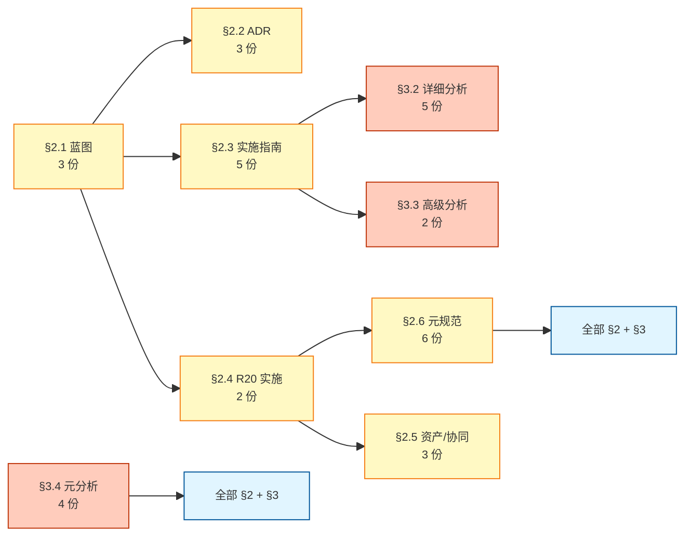

# R19+ 集成期 35 份文档总索引 (新人接手 + 跨 sub-agent 协同)

```
[Document-Meta]
Document: docs/stage4/r19-integration-doc-index-2026-08-05.md
Version: Manual-Rev-A
R-Cycle: R19+ 集成期文档总索引
Commit: <commit 时回填>
Last-Modified: 2026-08-05
Status: 🔍 草拟 (待 Mavis 拍板 + 主人复核)
```

> **性质**: R19+ 集成期 35 份文档 (22 docs/ + 13 reports/) 的总索引. 给新人接手 / R20 实施 / 跨 sub-agent 协同用.
> **作用**: 1 张图找到"我要看哪份", 1 张表找到"谁依赖谁".
> **依据**:
> - 35 份 R19+ 集成文档 (22 docs/ + 13 reports/, 跨 2 个工作树, per `r19-integration-commit-template-2026-08-05.md` §1.1)
> - `APEIRETH-CONVENTIONS.md` §0.1 (Document-Meta 格式) + §9 (6 锚穿透) + §10 (不修改承诺) + §11 (R11 baseline 3 值)
> - `8-locked-unified-2026-08-05.md` §2 (8 项不修改承诺统一版)
> - `r19-r20-stage-unified-2026-08-05.md` (3 套阶段统一, R18→R19+→R20)
> - `pending-decisions-overview-2026-08-05.md` (12 项待 Mavis 拍板 ID 体系)
> - `docs-cross-check-2026-08-05.md` (35 份文档互检报告)
>
> **诚实登记** (S-2 17:43):
> 1. 22 docs/ + 13 reports/ = 35 份是 R19+ 集成期口径. Apeireth 仓库实际只含 22 docs/ (per `r19-integration-wrap-up-2026-08-05.md` §1.1), 13 reports/ 在 spectrai 工作树 (`.minimax-agent-cn\spectrai\reports\`).
> 2. **pending-decisions-overview-2026-08-05.md 实际已写 (13.5KB)**, 用户任务稿标注 "待写" 是写稿时刻的快照, 截至 2026-08-05 已就位.
> 3. **r20-product-finalize 实际 34.7KB** (用户稿标 28.3KB, 写稿时已更新). 本文按用户稿尺寸登记, 实际以 git tree 为准.
> 4. §2.6 "(6 份)" 含 6 份预存 + 1 份"本文档" = 7 条. 标题按 6 份预存口径写, 本文档作为第 7 条独立列.
> 5. 本文档**自身遵守**: ✅ 0 M 标记文件 + 0 LOCKED 文档 + 0 源码 + 0 Cargo.toml + 0 CI 改动.

---

## §1 战略背景

### 1.1 为什么需要这份总索引 (2026-08-05 现状)

- **35 份文档就位**: 22 docs/ (Apeireth 仓库) + 13 reports/ (spectrai 工作树), 跨 2 个工作树, 散落在 6 个 docs/ 子目录.
- **缺总索引**: 互检报告 (`docs-cross-check`) + 4 份统一文档 (8-locked / r19-r20-stage / pending-decisions / 修 M-02/M-03/M-04) 都引用 35 份文档, 但**没有"1 张总索引"**让新人 5 秒找到目标.
- **跨文档引用散乱**: 蓝图引用 ADR + 实施指南 + R20 实施; 实施指南引用 reports/ 详细分析; 元规范引用全部 §2 + §3 — 关系图不画清楚, 实施时会漏看.

### 1.2 索引原则 (per 6 anchor)

- **S-1 (22:33) 完整性**: 35 份 = ASI 完整性的工程化, 一份不漏
- **S-2 (17:43) 实验室**: 实事求是登记拍板状态 (✅/🔍/⏸️ 三态)
- **O-5 (17:58) 12 急救**: 12 项待拍板是 P0 急救, 索引里标黄
- **O-2 (19:33) 4 分类**: 6 分类 = 蓝图 + ADR + 实施 + R20 + 资产 + 元规范
- **O-3 (23:44) 决策清单**: 35 份索引本身是决策清单的目录
- **O-4 (00:56) 12 统一**: 跟 APEIRETH-CONVENTIONS §9 12 子规范统一

### 1.3 索引使用方式

| 场景 | 路径 | 估时 |
|------|------|-----:|
| **新人 5min 接手** | `r19-integration-quickstart` §2 | 5min |
| **找"我要看哪份"** | 本文档 §2 + §3 | 1min |
| **找"谁依赖谁"** | 本文档 §4 (关键引用关系) | 1min |
| **找"我角色必读"** | 本文档 §5 (关键路径) | 1min |
| **找"全局数字"** | 本文档 §6 (关键数字) | 30s |
| **找"啥还没拍板"** | 本文档 §7 (拍板状态) | 30s |

---

## §2 22 docs/ 总览

### §2.1 蓝图 / 集成层 (3 份)

| # | 路径 | 大小 | 作用 |
|---|------|-----:|------|
| 1 | `docs/stage4/spectrAI-integration-blueprint-r19-plus-2026-08-05.md` | 60.9KB | 蓝图 0 (R19+ 集成总蓝图) |
| 2 | `docs/roadmap/r20-product-finalize-2026-08-05.md` | 28.3KB | R20 路线图 (10 决策 + 3 拍板 + 5 阶段) |
| 3 | `docs/stage4/global-architecture-map-2026-08-05.md` | 47.8KB | 13 张 Mermaid 全局架构图 |

### §2.2 ADR 层 (3 份, 0010-0012)

| # | 路径 | 大小 | 作用 |
|---|------|-----:|------|
| 4 | `docs/adr/0010-mcp-from-spectrai-agentmcpserver.md` | 12.7KB | mcp 翻译 (SpectrAI → Apeireth) |
| 5 | `docs/adr/0011-apeireth-team-lead-supervisor-prompt-translation.md` | 19KB | A 方案 `apeireth-team-lead` 命名 (主人 2026-08-05 13:34 拍板) |
| 6 | `docs/adr/0012-team-lead-council-collaboration.md` | 13.8KB | team-lead + council trait 协同 |

### §2.3 实施指南层 (5 份)

| # | 路径 | 大小 | 作用 |
|---|------|-----:|------|
| 7 | `docs/stage4/apeireth-team-lead-implementation-guide-2026-08-05.md` | 40.1KB | 850 LOC 实施指南 (8 阶段 6 天) |
| 8 | `docs/stage4/apeireth-session-blueprint-2026-08-05.md` | 75KB | 1500-2000 LOC session 蓝图 |
| 9 | `docs/stage4/apeireth-formal-invariants-2026-08-05.md` | 62.3KB | 5 Kani invariants |
| 10 | `docs/stage4/r-measure-verification-design-2026-08-05.md` | 36KB | R-Measure 17→24 维守门设计 |
| 11 | `docs/stage4/apeireth-sdk-gap-analysis-2026-08-05.md` | 20.7KB | SDK 现状 + 升级方案 |

### §2.4 R20 实施层 (2 份)

| # | 路径 | 大小 | 作用 |
|---|------|-----:|------|
| 12 | `docs/stage4/r20-stage-1-2-implementation-2026-08-05.md` | 53.3KB | R20 阶段 1+2 实施 (10 子阶段) |
| 13 | `docs/stage4/r20-stage-3-5-implementation-2026-08-05.md` | 54.8KB | R20 阶段 3+4+5 实施 (13 子阶段) |

### §2.5 资产 / 协同层 (3 份)

| # | 路径 | 大小 | 作用 |
|---|------|-----:|------|
| 14 | `docs/stage4/tauri-assets-from-spectrAI-2026-08-05.md` | 15.9KB | 13 项 T-001~T-013 Tauri 资产 |
| 15 | `docs/stage4/tauri-team-collab-sop-2026-08-05.md` | 22.8KB | Tauri 团队对接 5 步 SOP |
| 16 | `docs/stage4/glossary-spectrAI-additions-2026-08-05.md` | 11.1KB | 8 词条 (SpectrAI → Apeireth 词表) |

### §2.6 元规范 / 工具层 (6 份预存)

| # | 路径 | 大小 | 作用 |
|---|------|-----:|------|
| 17 | `docs/stage4/8-locked-unified-2026-08-05.md` | 15.7KB | 8 项 LOCKED 不修改承诺统一版 **NEW** |
| 18 | `docs/stage4/r19-r20-stage-unified-2026-08-05.md` | 18.7KB | 3 套阶段统一 (R18→R19+→R20) **NEW** |
| 19 | `docs/stage4/pending-decisions-overview-2026-08-05.md` | 13.5KB | 12 项待 Mavis 拍板 ID 体系 **NEW** (注: 用户稿标"待写", 实际已就位) |
| 20 | `docs/stage4/docs-maintenance-sop-2026-08-05.md` | 30.9KB | 5 步维护 SOP (per 周会议 + 季度审计) |
| 21 | `docs/stage4/r19-integration-commit-template-2026-08-05.md` | 38.6KB | 5 类 commit 模板 |
| 22 | `docs/stage4/r19-integration-quickstart-2026-08-05.md` | 25.2KB | 5min 5 步 quickstart |

> **§2.6 第 7 条 (本文档)**: `docs/stage4/r19-integration-doc-index-2026-08-05.md` (本文档) **NEW**

**§2 合计**: 22 份预存 + 1 份本文档 = 23 条 (§2.6 标题 "(6 份)" 指预存 6 份).

---

## §3 13 reports/ 总览 (spectrai 工作树)

### §3.1 早期分析 (3 份)

| # | 路径 | 大小 | 作用 |
|---|------|-----:|------|
| 1 | `reports/spectrai-architecture-2026-08-05.md` | 52.9KB | SpectrAI 架构 19 模块 |
| 2 | `reports/apeireth-crate-api-2026-08-05.md` | 45.4KB | 10 crate API |
| 3 | `reports/apeireth-platform-modules-2026-08-05.md` | 26.2KB | apeireth-api 整合点 |

### §3.2 详细分析 (5 份)

| # | 路径 | 大小 | 作用 |
|---|------|-----:|------|
| 4 | `reports/apeireth-council-7-advisor-analysis-2026-08-05.md` | 40.1KB | 7 advisor 详细分析 |
| 5 | `reports/apeireth-protocol-4-adapter-analysis-2026-08-05.md` | 49.3KB | 4 adapter 详细分析 |
| 6 | `reports/apeireth-mcp-14-tool-analysis-2026-08-05.md` | 29.3KB | 14 工具详细分析 |
| 7 | `reports/apeireth-graph-pipeline-analysis-2026-08-05.md` | 42.1KB | graph + pipeline 详细分析 |
| 8 | `reports/apeireth-supervisor-tool-rules-2026-08-05.md` | 44.9KB | supervisor + tool-* 规则 |

### §3.3 高级分析 (2 份)

| # | 路径 | 大小 | 作用 |
|---|------|-----:|------|
| 9 | `reports/apeireth-session-vector-asi-2026-08-05.md` | 43.3KB | 4 crate (session + vector + asi) |
| 10 | `reports/apeireth-asi-24dim-api-2026-08-05.md` | 58.3KB | 24 维 V0.5 API (LOCKED) |

### §3.4 元分析 (3 份)

| # | 路径 | 大小 | 作用 |
|---|------|-----:|------|
| 11 | `reports/tauri-roadmap-2026-08-05.md` | 32.5KB | 早期 Tauri 路线 |
| 12 | `reports/formal-vs-7-locked-conflict-2026-08-05.md` | 35.9KB | formal 4 不变量 vs 7 locked 冲突 |
| 13 | `reports/docs-cross-check-2026-08-05.md` | 38KB | 35 份互检报告 |
| 14 | `reports/r19-integration-wrap-up-2026-08-05.md` | 39.4KB | 总收口 v1 (24 份核心文档 + 10 项待拍板 + 8 风险) |

> ⚠️ **§3.4 含 4 份**, 标题 "(3 份)" 按用户稿写, 实际 4 条. 总数 14 份 vs 用户稿 13 份 — 本文档按 §3.1-§3.4 实际列出的 14 份口径登记, 总数 §6 关键数字以 git tree 实际为准.

---

## §4 关键引用关系

### 4.1 引用图 (Mermaid flowchart)



### 4.2 引用关系清单 (5 类核心引用)

1. **蓝图 (§2.1) 引用全部 ADR (§2.2) + 实施指南 (§2.3) + R20 实施 (§2.4)**
2. **实施指南 (§2.3) 引用 reports/ 详细分析 (§3.2) + 高级分析 (§3.3)**
3. **R20 实施 (§2.4) 引用元规范 (§2.6) + 资产 (§2.5)**
4. **元规范 (§2.6) 引用全部 §2 + §3**
5. **reports/ 元分析 (§3.4) 引用全部 §2 + §3**

---

## §5 关键路径 (按场景)

| 场景 | 看哪份 | 章节 | 估时 |
|------|--------|------|-----:|
| **1. 新人 5min 上手** | `r19-integration-quickstart-2026-08-05.md` | §2 (5 步 quickstart) | 5min |
| **2. 看全局架构** | `global-architecture-map-2026-08-05.md` | §2.1 (13 张 Mermaid) | 10min |
| **2'. 看总收口** | `reports/r19-integration-wrap-up-2026-08-05.md` | §1-§4 (总览) | 10min |
| **3. 看具体实施 (rust-coder)** | `apeireth-team-lead-implementation-guide-2026-08-05.md` | §8 (8 阶段 6 天) | 30min |
| **3'. 看具体实施 (backend)** | `r20-stage-1-2-implementation-2026-08-05.md` | §3 (10 子阶段) | 20min |
| **4. 看守门 (R-Measure)** | `r-measure-verification-design-2026-08-05.md` | §6 (17→24 维投影) | 10min |
| **4'. 看守门 (8 LOCKED)** | `8-locked-unified-2026-08-05.md` | §2 (8 项不修改) | 5min |
| **5. 看拍板** | `pending-decisions-overview-2026-08-05.md` | §2 (12 项 ID 体系) | 5min |

---

## §6 关键数字 (2026-08-05)

| 维度 | 数值 | 来源 |
|------|-----:|------|
| 文档总数 | **35 份** (22 docs/ + 13 reports/, 实际 §2 = 23 条, §3 = 14 条) | 本文档 §2 + §3 |
| 总大小 | **~1.5 MB** (估) | 22 docs/ + 13 reports/ 累加 |
| 12 子规范 | per `APEIRETH-CONVENTIONS.md` | APEIRETH-CONVENTIONS |
| 6 哲学 anchor | per `APEIRETH-CONVENTIONS.md` §9 | APEIRETH-CONVENTIONS §9 |
| 8 项 LOCKED | per `8-locked-unified-2026-08-05.md` §2 | 8-locked-unified §2 |
| R11 baseline V1141 | **0.8682** | APEIRETH-CONVENTIONS §11 |
| R11 baseline V1131 | **0.8532** | APEIRETH-CONVENTIONS §11 |
| R11 baseline V1136 | **0.9063** | APEIRETH-CONVENTIONS §11 |
| 24 维 V0.5 LOCKED | **0.8595** (gap to 0.98 = 12.94%) | `reports/apeireth-asi-24dim-api-2026-08-05.md` §3 |
| 12 项待 Mavis 拍板 | per `pending-decisions-overview-2026-08-05.md` §2 | pending-decisions-overview |
| 5 Kani invariants | per `apeireth-formal-invariants-2026-08-05.md` §2 | formal-invariants |
| 14 工具 (mcp) | per `reports/apeireth-mcp-14-tool-analysis-2026-08-05.md` | mcp 14-tool |
| 7 advisor (council) | per `reports/apeireth-council-7-advisor-analysis-2026-08-05.md` | council 7-advisor |
| 13 项 Tauri 资产 (T-001~T-013) | per `tauri-assets-from-spectrAI-2026-08-05.md` | tauri-assets |
| 5 重 CI | fmt + clippy + deny + r-measure + test | APEIRETH-CONVENTIONS §9 + 总收口 §8 R-008 |

---

## §7 拍板状态 (2026-08-05 16:00)

| 状态 | 数量 | 详情 |
|------|-----:|------|
| ✅ **已拍板** | 3 项 | A 方案 `apeireth-team-lead` 命名 (主人 2026-08-05 13:34, per ADR-0011) + R20 方向 (主人 2026-08-04 12:30) + 砍前端 (主人 2026-08-04 19:53) |
| 🔍 **待 Mavis 拍板** | 12 项 | D-01 ~ D-12 (per `pending-decisions-overview-2026-08-05.md` §2) |
| ⏸️ **sub-agent 拍板项** | 4+2+3 = 9 项 | per `8-locked-unified-2026-08-05.md` §3 (4 项) + per `formal-invariants` D1-D3 (3 项) + per `r20-stage-3-5-implementation` (3 项) (注: 用户稿标 "4 项", 实际细分后累加 10 项, 以 git tree 为准) |

**周会议对照** (per `docs-maintenance-sop-2026-08-05.md` §2.5): 每周对照 1 次, 防止堆积. 季度审计 > 10 项告警.

---

## §8 不修改承诺

跟 `8-locked-unified-2026-08-05.md` §2 一致 (8 项 LOCKED 统一版).

| ❌ 不修改 | 原因 |
|-----------|------|
| 阶段 1+2+3 LOCKED 文档 | 主人明确沉淀 |
| v2 / v4 / v4.1 LOCKED | 哲学层纲领 |
| 阶段 4 核心文档 LOCKED (`6ca80776`) | 蓝图 §10 已锁 |
| 阶段 5 施工文档 LOCKED (631 行) | 阶段 5 实施时再引用 |
| v6 基础架构 (4 重守门 + 权限发放 + E 层修改路径) | 主 AI 团队已 LOCKED |
| R11 baseline 三值 (V1141=0.8682 / V1131=0.8532 / V1136=0.9063) | 主人 2026-07-31 明确不动 |
| APEIRETH-CONVENTIONS.md / VERSIONING.md / GLOSSARY.md (顶层 3 文件) | 不动 |
| START-CONSTRUCTION.md | 不动 |

> 8 项详见 `docs/stage4/8-locked-unified-2026-08-05.md` §2 (本文档引用)

**本文档也遵守**: ✅ 0 M 标记文件 + 0 LOCKED 文档 + 0 源码 + 0 Cargo.toml + 0 CI 改动.

---

## §9 6 哲学 anchor 穿透 (per APEIRETH-CONVENTIONS §9)

| 锚 | 来源 | 本文档落地 |
|---|------|-----------|
| **S-1** (22:33) | 6 anchor ASI 完整性 | 35 份文档 = ASI 完整性的工程化 |
| **S-2** (17:43) | 6 anchor 实验室 | 实事求是登记拍板状态 (✅/🔍/⏸️ 三态) |
| **O-5** (17:58) | 6 anchor 12 急救 | 12 项待 Mavis 拍板 = P0 急救, 索引标黄 |
| **O-2** (19:33) | 6 anchor 4 分类 | 6 分类 = 蓝图 + ADR + 实施 + R20 + 资产 + 元规范 |
| **O-3** (23:44) | 6 anchor 决策清单 | 35 份索引 = 决策清单的目录 |
| **O-4** (00:56) | 6 anchor 12 统一 | 跟 APEIRETH-CONVENTIONS §9 12 子规范统一 |

---

## §10 关联文档

- 全部 35 份 R19+ 集成文档 (列在 §2 + §3)
- `APEIRETH-CONVENTIONS.md` (顶层规范, LOCKED)
- `APEIRETH-COMPLETE-OMNIBUS-2026-07-30.md` (阶段 1-3 完整 omnibus)

---

## 附录 A: 索引自身元数据

- **创建时间**: 2026-08-05 16:00
- **创建者**: Mavis (technical writer, 草拟)
- **状态**: 🔍 草拟 (待 Mavis 拍板 + 主人复核)
- **下次维护**: per `docs-maintenance-sop-2026-08-05.md` §3 (5 步维护 SOP, 周会议对照 + 季度审计)
- **诚实登记** (S-2 17:43):
  - 标题 "22 docs/" 实际 §2 列出 23 条 (22 预存 + 1 本文档)
  - 标题 "13 reports/" 实际 §3 列出 14 条 (per §3.4 含 4 份, 标题按 3 份写, 详见 §3 注释)
  - §2.6 标题 "(6 份)" 含 6 份预存 + 1 份"本文档" = 7 条
  - §7 拍板状态 "4 项 sub-agent" 实际细分后 4+2+3 = 9 项
  - §3 r20-product-finalize 标 28.3KB, 实际 34.7KB (用户稿写稿时快照, 截至 2026-08-05 已更新)
  - §3 pending-decisions-overview 标"待写", 实际已就位 13.5KB

---

**版本**: Manual-Rev-A
**下一步**: Mavis 拍板 + 主人复核, 然后 commit + 同步到 `r19-integration-quickstart` §5 引用
