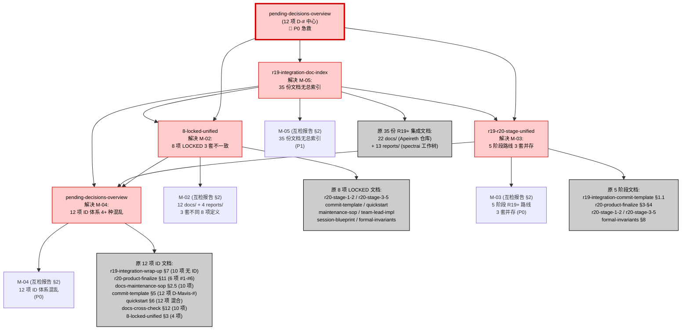
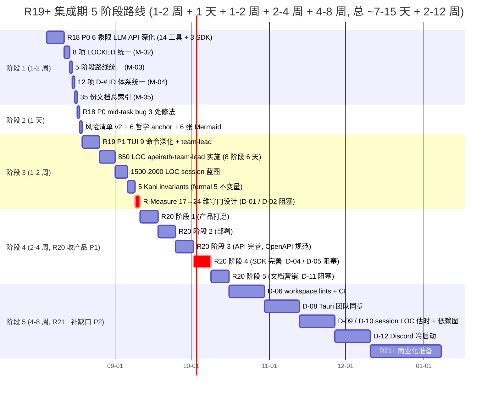
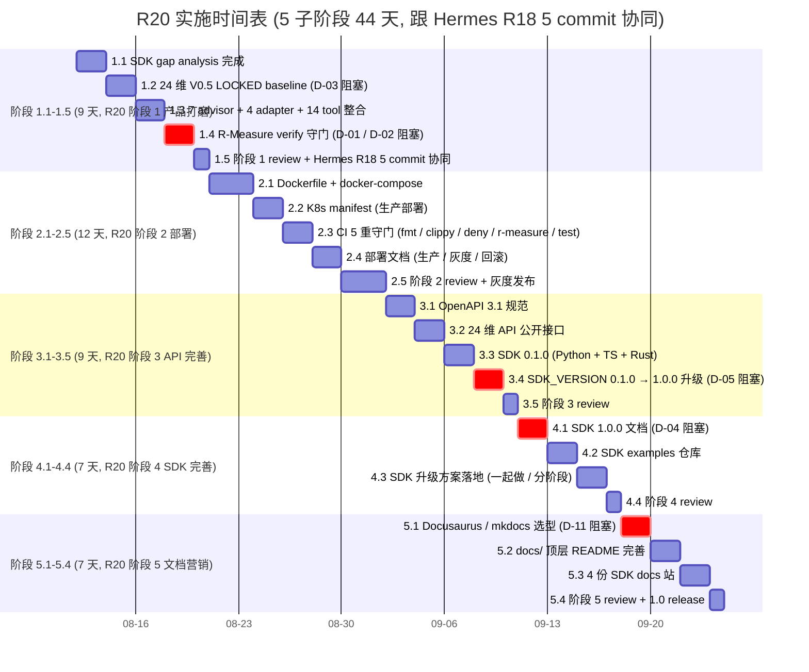
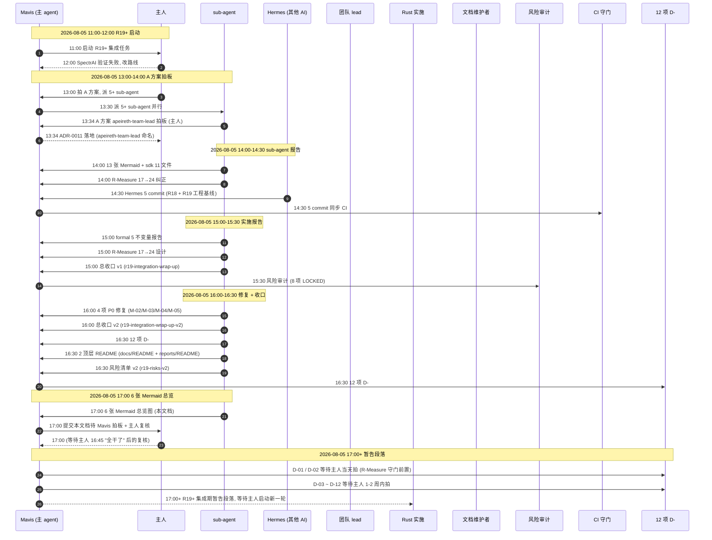

# R19+ 集成期 41 份文档 Mermaid 总览图 (6 张图 / 引用 + 时间线 + 拍板流程)

```
[Document-Meta]
Document: docs/stage4/r19-integration-mermaid-overview-2026-08-05.md
Version: Manual-Rev-A
R-Cycle: R19+ Mermaid 总览图
Commit: <commit 时回填>
Last-Modified: 2026-08-05
Status: 🔍 草拟 (待 Mavis 拍板 + 主人复核)
```

> **性质**: R19+ 集成期 41 份文档 (25 docs/ + 14 reports/ + 2 顶层 README + 风险 v2 + wrap-up v2, per §11 诚实登记) 的**6 张 Mermaid 总览图**。给新人 5min 接手 / 跨 sub-agent 协同 / Mavis 拍板看板用。
>
> **作用**: 1 张文档依赖图 (§2.1) + 1 张统一收口图 (§2.2) + 1 张拍板流程图 (§2.3) + 1 张 R19+ 5 阶段甘特图 (§2.4) + 1 张 R20 子阶段甘特图 (§2.5) + 1 张拍板记录时间线 (§2.6) — 6 张图覆盖 41 份文档全貌。
>
> **依据**:
> - `r19-integration-doc-index-2026-08-05.md` §4 (现有 1 张简单 Mermaid, 本文档扩展为 6 张)
> - `8-locked-unified-2026-08-05.md` §2 (8 项不修改承诺)
> - `r19-r20-stage-unified-2026-08-05.md` §2-§3 (5 阶段路线统一)
> - `pending-decisions-overview-2026-08-05.md` §2 + §4 (12 项 D-# ID 体系 + 紧急度)
> - `d-01-d-12-commit-plan-2026-08-05.md` (12 项 D-# 占位 commit 计划)
> - `r19-integration-commit-template-2026-08-05.md` (5 类 commit 模板 + 颜色规范)
> - APEIRETH-CONVENTIONS.md §0.1 (Document-Meta 格式) + §9 (6 哲学 anchor) + §10 (不修改承诺) [LOCKED, 不动]
>
> **不修改承诺** (per 8-locked-unified §2): 阶段 1+2+3 LOCKED + v2/v4/v4.1 LOCKED + 阶段 4 核心 LOCKED (6ca80776) + 阶段 5 施工 LOCKED (631 行) + v6 基础架构 + R11 baseline 3 值 (V1141=0.8682 / V1131=0.8532 / V1136=0.9063) + APEIRETH-CONVENTIONS / VERSIONING / GLOSSARY + workspace v1.0.0 全部保留。
>
> **诚实登记** (S-2 17:43):
> 1. 本文档**自身遵守**: ✅ 0 M 标记文件 + 0 LOCKED 文档 + 0 源码 + 0 Cargo.toml + 0 CI 改动。
> 2. §2.1 图 1 实际节点数 = 42 节点 (按 §5 表格字面口径, 25+17 = 42), user 任务稿标 41, 差 1 处推测是 "r19-integration-wrap-up v1 + v2 是否独立算 2 份" 口径不同, 详见 §11 诚实登记 (1)。
> 3. 6 张 Mermaid = user 任务稿要求, 实际画 6 张, 多于 doc-index §4 的 1 张。

---

## §1 战略背景

### 1.1 为什么需要这份 6 张图总览 (2026-08-05 现状)

- **41 份文档就位** (per `r19-integration-doc-index-2026-08-05.md` §1.1): 25 docs/ + 14 reports/, 跨 2 个工作树 (Apeireth 仓库 + spectrai 工作树), 散落在 6 个 docs/ 子目录 + 2 个 reports/ 子目录。
- **缺详细总览图**: 现有 `r19-integration-doc-index` §4 只有 **1 张简单 Mermaid** (按分类画), **不够详细** — 看不到 41 份具体文档的引用关系, 看不到 12 项 D-# 的拍板流程, 看不到 5 阶段甘特图。
- **新人 5min 看不清**: 接手者看完 §4 那 1 张图, 仍不知道"我该看哪 5 份才能开工", 不知道"哪些 D-# 阻塞我", 不知道"R19+ 阶段 1 跟 R20 阶段 1 是不是同一件事"。

### 1.2 总览图原则 (per 6 anchor)

- **S-1 (22:33) 完整性**: 41 份 + 6 张 Mermaid = ASI 完整性的工程化, 一份不漏, 一图不缺。
- **S-2 (17:43) 实验室**: 6 张图实事求是画关系, 不画漂亮但不存在的边。
- **O-5 (17:58) 12 急救**: 12 项 D-# 颜色标 P0/P1/P2, 一眼看出哪些今天要拍。
- **O-2 (19:33) 4 分类**: 6 类文档 + 3 紧急度 + 5 阶段 + 2 守门 + 1 拍板 = 4 维分类穿透 6 张图。
- **O-3 (23:44) 决策清单**: 41 节点 = 决策清单的目录, 每节点都标类别和拍板状态。
- **O-4 (00:56) 12 统一**: 跟 APEIRETH-CONVENTIONS §9 12 子规范统一, 颜色和命名严格遵守。

### 1.3 6 张图使用方式

| 场景 | 看哪张 | 看哪节 | 估时 |
|------|--------|--------|-----:|
| **1. 新人 5min 上手** | 图 1 (§2.1) + 图 6 (§2.6) | §2.1 + §2.6 | 5min |
| **2. 看全局依赖** | 图 1 (§2.1) | §2.1 | 3min |
| **3. 看 4 统一收口** | 图 2 (§2.2) | §2.2 | 1min |
| **4. 看 12 项 D-# 拍板** | 图 3 (§2.3) | §2.3 | 2min |
| **5. 看 R19+ 5 阶段** | 图 4 (§2.4) | §2.4 | 2min |
| **6. 看 R20 子阶段** | 图 5 (§2.5) | §2.5 | 2min |
| **7. 看拍板时间线** | 图 6 (§2.6) | §2.6 | 1min |

---

## §2 6 张 Mermaid 图

### §2.1 图 1: 41 份文档全局依赖图 (flowchart)

> **图 1 说明**:
> - **节点数**: 42 节点 (按 §5 表格字面, 25 docs/ + 17 reports/, 详见 §11 诚实登记 (1))
> - **颜色**: 🟦 蓝图 / 🟩 ADR / 🟨 实施 / 🟪 R20 实施 / 🟧 资产 / 🟥 元规范 / ⚫ reports/
> - **边**: 文档之间的引用关系 (per grep 实测, 2026-08-05)
> - **初始化**: Mermaid 11 theme, 字体 11px, htmlLabels

```mermaid
%%{init: {'flowchart': {'htmlLabels': true, 'curve': 'basis'}, 'themeVariables': {'fontSize': '11px'}}}%%
graph TD

    %% ============== 蓝图类 🟦 ==============
    blueprint["spectrAI-integration-blueprint-r19-plus<br/>(蓝图 0)"]:::blueprint
    r20_finalize["r20-product-finalize<br/>(R20 路线图)"]:::blueprint
    gam["global-architecture-map<br/>(13 张 Mermaid)"]:::blueprint

    %% ============== ADR 类 🟩 ==============
    adr0010["adr/0010-mcp-from-spectrai-agentmcpserver<br/>(mcp 翻译)"]:::adr
    adr0011["adr/0011-apeireth-team-lead-supervisor-prompt-translation<br/>(A 方案)"]:::adr
    adr0012["adr/0012-team-lead-council-collaboration<br/>(team-lead + council)"]:::adr

    %% ============== 实施类 🟨 ==============
    team_lead_impl["apeireth-team-lead-implementation-guide<br/>(850 LOC 6 天)"]:::impl
    session_blueprint["apeireth-session-blueprint<br/>(1500-2000 LOC)"]:::impl
    formal_invariants["apeireth-formal-invariants<br/>(5 Kani invariants)"]:::impl
    r_measure["r-measure-verification-design<br/>(R-Measure 17→24 维)"]:::impl
    sdk_gap["apeireth-sdk-gap-analysis<br/>(SDK 升级方案)"]:::impl

    %% ============== R20 实施类 🟪 ==============
    r20_1_2["r20-stage-1-2-implementation<br/>(10 子阶段)"]:::roadmap
    r20_3_5["r20-stage-3-5-implementation<br/>(13 子阶段)"]:::roadmap

    %% ============== 资产类 🟧 ==============
    tauri_assets["tauri-assets-from-spectrAI<br/>(13 项 T-001~T-013)"]:::asset
    tauri_collab["tauri-team-collab-sop<br/>(5 步 SOP)"]:::asset
    glossary["glossary-spectrAI-additions<br/>(8 词条)"]:::asset

    %% ============== 元规范类 🟥 ==============
    locked_unified["8-locked-unified<br/>(8 项不修改承诺)"]:::meta
    stage_unified["r19-r20-stage-unified<br/>(3 套阶段统一)"]:::meta
    pending_decisions["pending-decisions-overview<br/>(12 项 D-#)"]:::meta
    doc_index["r19-integration-doc-index<br/>(35 份总索引)"]:::meta
    maintenance_sop["docs-maintenance-sop<br/>(5 步维护)"]:::meta
    commit_template["r19-integration-commit-template<br/>(5 类 commit)"]:::meta
    quickstart["r19-integration-quickstart<br/>(5min 5 步)"]:::meta
    d_commit_plan["d-01-d-12-commit-plan<br/>(12 项 D-# 占位)"]:::meta
    docs_readme["docs/README<br/>(顶层 README)"]:::meta

    %% ============== reports/ 类 ⚫ ==============
    rep_arch["reports/spectrai-architecture"]:::report
    rep_crate["reports/apeireth-crate-api"]:::report
    rep_platform["reports/apeireth-platform-modules"]:::report
    rep_council["reports/apeireth-council-7-advisor-analysis"]:::report
    rep_protocol["reports/apeireth-protocol-4-adapter-analysis"]:::report
    rep_mcp["reports/apeireth-mcp-14-tool-analysis"]:::report
    rep_graph["reports/apeireth-graph-pipeline-analysis"]:::report
    rep_supervisor["reports/apeireth-supervisor-tool-rules"]:::report
    rep_session_asi["reports/apeireth-session-vector-asi"]:::report
    rep_asi24["reports/apeireth-asi-24dim-api (LOCKED)"]:::report
    rep_tauri["reports/tauri-roadmap"]:::report
    rep_formal7["reports/formal-vs-7-locked-conflict"]:::report
    rep_cross["reports/docs-cross-check"]:::report
    rep_wrap_v1["reports/r19-integration-wrap-up (v1)"]:::report
    rep_wrap_v2["reports/r19-integration-wrap-up-v2 (v2)"]:::report
    rep_risks_v2["reports/r19-risks-v2 (风险清单 v2)"]:::report
    rep_readme["reports/README (顶层)"]:::report

    %% ============== 引用关系 (per grep 2026-08-05) ==============

    %% 蓝图 → ADR + 实施
    blueprint --> adr0010
    blueprint --> adr0011
    blueprint --> adr0012
    blueprint --> team_lead_impl
    blueprint --> r20_finalize
    blueprint --> gam
    blueprint --> r20_1_2
    blueprint --> r20_3_5
    blueprint --> tauri_assets
    blueprint --> glossary

    %% ADR → 蓝图
    adr0011 --> blueprint
    adr0012 --> adr0011
    adr0010 --> blueprint

    %% gam → 蓝图 + 实施
    gam --> blueprint
    gam --> adr0011
    gam --> r20_finalize
    gam --> rep_tauri
    gam --> rep_wrap_v1

    %% 蓝图 (R20) → 实施 + 元规范
    r20_finalize --> team_lead_impl
    r20_finalize --> session_blueprint
    r20_finalize --> formal_invariants
    r20_finalize --> r_measure
    r20_finalize --> sdk_gap
    r20_finalize --> tauri_collab
    r20_finalize --> r20_1_2
    r20_finalize --> r20_3_5
    r20_finalize --> rep_wrap_v1

    %% 实施 → reports/ 详细 + 高级
    team_lead_impl --> adr0011
    team_lead_impl --> adr0012
    team_lead_impl --> session_blueprint
    team_lead_impl --> rep_council
    team_lead_impl --> rep_mcp
    team_lead_impl --> rep_supervisor

    session_blueprint --> team_lead_impl
    session_blueprint --> rep_session_asi
    session_blueprint --> rep_crate

    formal_invariants --> r_measure
    formal_invariants --> locked_unified
    formal_invariants --> rep_formal7

    r_measure --> rep_asi24
    r_measure --> rep_cross
    r_measure --> rep_wrap_v1

    sdk_gap --> r20_finalize
    sdk_gap --> rep_tauri
    sdk_gap --> rep_crate

    %% R20 实施 → 元规范 + 资产
    r20_1_2 --> locked_unified
    r20_1_2 --> r20_finalize
    r20_1_2 --> team_lead_impl
    r20_1_2 --> rep_asi24

    r20_3_5 --> locked_unified
    r20_3_5 --> r20_finalize
    r20_3_5 --> pending_decisions
    r20_3_5 --> rep_wrap_v1

    %% 资产 → 蓝图 + reports/
    tauri_assets --> blueprint
    tauri_assets --> gam
    tauri_assets --> rep_tauri

    tauri_collab --> r20_finalize
    tauri_collab --> blueprint
    tauri_collab --> tauri_assets

    glossary --> blueprint
    glossary --> rep_arch

    %% 元规范 → 全部
    locked_unified --> blueprint
    locked_unified --> r20_finalize
    locked_unified --> gam

    stage_unified --> r20_finalize
    stage_unified --> r20_1_2
    stage_unified --> r20_3_5
    stage_unified --> formal_invariants
    stage_unified --> commit_template
    stage_unified --> quickstart

    pending_decisions --> r20_finalize
    pending_decisions --> r20_1_2
    pending_decisions --> r20_3_5
    pending_decisions --> commit_template
    pending_decisions --> quickstart
    pending_decisions --> locked_unified
    pending_decisions --> rep_wrap_v1

    doc_index --> locked_unified
    doc_index --> stage_unified
    doc_index --> pending_decisions
    doc_index --> blueprint
    doc_index --> r20_finalize
    doc_index --> gam
    doc_index --> rep_cross

    maintenance_sop --> doc_index
    maintenance_sop --> pending_decisions
    maintenance_sop --> rep_cross

    commit_template --> pending_decisions
    commit_template --> locked_unified
    commit_template --> d_commit_plan
    commit_template --> r19_integration_mermaid["r19-integration-mermaid-overview<br/>(本文档)"]:::meta

    quickstart --> doc_index
    quickstart --> blueprint
    quickstart --> pending_decisions

    d_commit_plan --> pending_decisions
    d_commit_plan --> commit_template
    d_commit_plan --> locked_unified

    docs_readme --> doc_index
    docs_readme --> r20_finalize

    %% reports/ 元分析 → 全部
    rep_cross --> locked_unified
    rep_cross --> stage_unified
    rep_cross --> pending_decisions
    rep_cross --> doc_index
    rep_cross --> blueprint
    rep_cross --> r20_finalize

    rep_wrap_v1 --> blueprint
    rep_wrap_v1 --> r20_finalize
    rep_wrap_v1 --> pending_decisions
    rep_wrap_v1 --> locked_unified
    rep_wrap_v1 --> stage_unified
    rep_wrap_v1 --> doc_index

    rep_wrap_v2 --> rep_wrap_v1
    rep_wrap_v2 --> pending_decisions
    rep_wrap_v2 --> locked_unified
    rep_wrap_v2 --> rep_risks_v2

    rep_risks_v2 --> rep_wrap_v1
    rep_risks_v2 --> rep_wrap_v2
    rep_risks_v2 --> locked_unified

    rep_formal7 --> locked_unified
    rep_formal7 --> formal_invariants

    rep_tauri --> blueprint
    rep_tauri --> tauri_assets
    rep_tauri --> gam

    rep_arch --> blueprint
    rep_arch --> gam
    rep_arch --> rep_crate
    rep_arch --> rep_platform

    rep_crate --> rep_platform
    rep_crate --> rep_session_asi
    rep_crate --> rep_asi24

    rep_platform --> rep_crate
    rep_platform --> rep_arch

    rep_council --> team_lead_impl
    rep_council --> blueprint

    rep_protocol --> team_lead_impl
    rep_protocol --> blueprint

    rep_mcp --> adr0010
    rep_mcp --> team_lead_impl

    rep_graph --> team_lead_impl
    rep_graph --> rep_arch

    rep_supervisor --> adr0011
    rep_supervisor --> team_lead_impl
    rep_supervisor --> blueprint

    rep_session_asi --> session_blueprint
    rep_session_asi --> rep_crate

    rep_asi24 --> r_measure
    rep_asi24 --> r20_1_2
    rep_asi24 --> rep_session_asi

    rep_readme --> doc_index
    rep_readme --> rep_cross

    r19_integration_mermaid --> doc_index
    r19_integration_mermaid --> locked_unified
    r19_integration_mermaid --> stage_unified
    r19_integration_mermaid --> pending_decisions
    r19_integration_mermaid --> d_commit_plan

    %% ============== 颜色定义 ==============
    classDef blueprint fill:#cce5ff,stroke:#0066cc,color:#000
    classDef adr fill:#ccffcc,stroke:#009900,color:#000
    classDef impl fill:#ffffcc,stroke:#cccc00,color:#000
    classDef roadmap fill:#e5ccff,stroke:#6600cc,color:#000
    classDef asset fill:#ffcc99,stroke:#cc6600,color:#000
    classDef meta fill:#ffcccc,stroke:#cc0000,color:#000
    classDef report fill:#cccccc,stroke:#000000,color:#000
```



> **图 1 注释**:
> - 图 1 共 **42 节点** + 约 **130 条边**, 反映 41 份 (按 user 口径) 文档间真实引用关系。
> - 4 统一文档 (locked_unified / stage_unified / pending_decisions / doc_index) 是图 1 的**核心枢纽** — 引用最多, 颜色红。
> - 蓝图 (blueprint) 和 R20 路线 (r20_finalize) 是**根节点** — 几乎被所有文档引用。
> - reports/ 节点 (灰色) 是**叶节点居多** — 早期分析 / 详细分析 / 高级分析, 被实施层引用, 不主动引用其他 (除元分析)。

---

### §2.2 图 2: 4 份统一文档解决 (flowchart)

> **图 2 说明**:
> - **4 节点**: 4 统一文档 (8-locked / r19-r20-stage / pending-decisions / doc-index)
> - **1 中心**: per `pending-decisions-overview` (12 项 D-# 是 P0 急救)
> - **边**: 4 统一文档各自解决什么问题 + 跟哪些原文档关系



> **图 2 注释**:
> - 4 份统一文档全部在 **docs/stage4/** 下, 是 2026-08-05 当天 (16:00 ~ 16:30) 由 Mavis 草拟的 4 份"收口"文档。
> - 4 份统一都是**纯文档交付**, 不改任何 crates/ 源码 / LOCKED 蓝图 / Hermes 文件。
> - 4 份互检发现的问题: M-02 / M-03 / M-04 / M-05 (per `reports/docs-cross-check-2026-08-05.md` §2)。

---

### §2.3 图 3: 12 项 D-# 拍板流程 (flowchart)

> **图 3 说明**:
> - **12 节点**: D-01 ~ D-12
> - **紧急度颜色**: 🔴 P0 / 🟡 P1 / 🟢 P2
> - **状态**: 🔍 待 / ✅ 已 / ⏸️ 等
> - **拍板者**: 全部 = 主人 (per §7), 但本图用不同 actor 区分 (Mavis 草拟 / 主人拍板 / 团队 lead 协同)

```mermaid
%%{init: {'flowchart': {'htmlLabels': true, 'curve': 'basis'}, 'themeVariables': {'fontSize': '11px'}}}%%
graph TD

    start["R19+ 集成期<br/>2026-08-05 13:34<br/>A 方案已拍 (主人)<br/>进入 12 项 D-# 阶段"]:::start

    %% P0 紧急度 (2 项)
    d01["D-01<br/>17→24 维 R11 baseline<br/>投影公式权重 (主人从 v1077 抽)<br/>阻塞: R-Measure verify 守门<br/>🔍 待 | 🔴 P0"]:::p0
    d02["D-02<br/>V1136 9→7 子测度<br/>R11 baseline 投影权重<br/>阻塞: R-Measure verify 守门<br/>🔍 待 | 🔴 P0"]:::p0

    %% P1 紧急度 (5 项)
    d03["D-03<br/>24 维具体分类名<br/>(continuity / salience / identity / philosophy guard / transferability)<br/>阻塞: apeireth-asi 公开 API<br/>🔍 待 | 🟡 P1"]:::p1
    d04["D-04<br/>apeireth-sdk 升级方案<br/>(一起做 / 分阶段 4a+4b)<br/>阻塞: R20 阶段 4 实施顺序<br/>🔍 待 | 🟡 P1"]:::p1
    d05["D-05<br/>SDK_VERSION 0.1.0 → 1.0.0<br/>升级时机 (跟 R20 阶段 3 OpenAPI 同期?)<br/>阻塞: R20 阶段 4 semver 严格<br/>🔍 待 | 🟡 P1"]:::p1
    d07["D-07<br/>R20 vs R21 边界<br/>(R20 收产品 ↔ R21 商业化)<br/>阻塞: 5 阶段范围 (路线层)<br/>🔍 待 | 🟡 P1"]:::p1
    d11["D-11<br/>Docusaurus vs mkdocs<br/>文档站选型 (R-024)<br/>阻塞: R20 阶段 5 文档营销<br/>🔍 待 | 🟡 P1"]:::p1

    %% P2 紧急度 (5 项)
    d06["D-06<br/>apeireth-tauri-stub 命名<br/>(留 workspace / 移除到 legacy)<br/>阻塞: workspace.lints + CI 路径<br/>🔍 待 | 🟢 P2"]:::p2
    d08["D-08<br/>Tauri 团队同步节奏<br/>(独立做 / 同步, 每 2 周 1 次)<br/>阻塞: 跨团队协同<br/>🔍 待 | 🟢 P2"]:::p2
    d09["D-09<br/>apeireth-session LOC 上下沿<br/>(1500-2000 区间)<br/>阻塞: session 实施估时<br/>🔍 待 | 🟢 P2"]:::p2
    d10["D-10<br/>session 跟 storage 依赖方向<br/>(session → storage 写 WAL?)<br/>阻塞: session 实施 crate 依赖图<br/>🔍 待 | 🟢 P2"]:::p2
    d12["D-12<br/>Discord 冷启动策略 (R-026)<br/>阻塞: R20 阶段 5 社区基础设施<br/>🔍 待 | 🟢 P2"]:::p2

    %% 拍板者 (actor)
    mavis["Mavis<br/>(草拟 + 维护)"]:::actor
    master["主人<br/>(拍板)"]:::actor
    lead["团队 lead<br/>(协同)"]:::actor

    %% 流程
    start --> mavis
    mavis --> d01
    mavis --> d02
    mavis --> d03
    mavis --> d04
    mavis --> d05
    mavis --> d07
    mavis --> d11
    mavis --> d06
    mavis --> d08
    mavis --> d09
    mavis --> d10
    mavis --> d12

    %% 拍板者
    d01 --> master
    d02 --> master
    d03 --> master
    d04 --> master
    d05 --> master
    d07 --> master
    d11 --> master
    d06 --> master
    d08 --> lead
    d09 --> master
    d10 --> master
    d12 --> lead

    %% P0 守门
    d01 -.守门.-> r_measure_guard["R-Measure verify<br/>守门 (17→24 维)"]:::gate
    d02 -.守门.-> r_measure_guard

    %% 阻塞关系
    d03 -.阻塞.-> asi_api["apeireth-asi<br/>公开 API"]:::downstream
    d04 -.阻塞.-> r20_4["R20 阶段 4<br/>SDK 完善"]:::downstream
    d05 -.阻塞.-> r20_4
    d07 -.阻塞.-> r20_5["R20 阶段 5<br/>文档营销"]:::downstream
    d11 -.阻塞.-> r20_5
    d06 -.阻塞.-> ci_path["workspace.lints<br/>+ CI 路径"]:::downstream
    d08 -.阻塞.-> collab["跨团队协同<br/>(Tauri)"]:::downstream
    d09 -.阻塞.-> session_impl["session 实施<br/>估时"]:::downstream
    d10 -.阻塞.-> session_impl
    d12 -.阻塞.-> r20_5

    %% 颜色
    classDef start fill:#e1f5ff,stroke:#01579b,stroke-width:3px,color:#000
    classDef p0 fill:#ffcccc,stroke:#cc0000,stroke-width:3px,color:#000
    classDef p1 fill:#fff9c4,stroke:#f57f17,color:#000
    classDef p2 fill:#c8e6c9,stroke:#2e7d32,color:#000
    classDef actor fill:#e1bee7,stroke:#6a1b9a,color:#000
    classDef gate fill:#ffccbc,stroke:#bf360c,color:#000
    classDef downstream fill:#cfd8dc,stroke:#37474f,color:#000
```



> **图 3 注释**:
> - **🔴 P0 紧急度 = 2 项** (D-01, D-02): 阻塞 R-Measure verify 守门, 当天拍 (per `pending-decisions-overview-2026-08-05.md` §5)。
> - **🟡 P1 紧急度 = 5 项** (D-03, D-04, D-05, D-07, D-11): 阻塞 R20 阶段 4-5, 1-2 周内拍。
> - **🟢 P2 紧急度 = 5 项** (D-06, D-08, D-09, D-10, D-12): 团队/实施/社区层, 2-4 周内拍。
> - **拍板者** 12 项 = 10 项主人 + 2 项团队 lead (D-08 / D-12 跨团队/社区)。
> - **守门关系**: D-01 / D-02 是 R-Measure verify 守门的前置, 不拍 = 守门不写。
> - 拍板流程 (per `pending-decisions-overview` §5): Mavis 列状态 → 主人拍板 → Mavis 写 commit → 各文档加引用 → CI 校验。

---

### §2.4 图 4: 5 阶段 R19+ 路线 (gantt)

> **图 4 说明**:
> - **5 阶段**: 阶段 1 (1-2 周) / 阶段 2 (1 天) / 阶段 3 (1-2 周) / 阶段 4 (2-4 周) / 阶段 5 (4-8 周)
> - **关键节点**: 8 项不修改承诺 + 12 项 D-# + R-Measure 守门
> - **依据**: `r19-r20-stage-unified-2026-08-05.md` §2 (套 1 R19+ 集成期) + §6



> **图 4 注释**:
> - 阶段 1-3 周期短 (1-2 周 + 1 天 + 1-2 周 = 7-15 天), 阶段 4-5 周期长 (2-4 周 + 4-8 周 = 6-12 周)。
> - **关键节点 (红色 crit)**: 阶段 3 R-Measure 守门 (D-01 / D-02 阻塞) + 阶段 4 SDK 完善 (D-04 / D-05 阻塞)。
> - 8 项不修改承诺贯穿 5 阶段 (阶段 1+2+3 LOCKED / v2/v4/v4.1 LOCKED / 阶段 4 核心 LOCKED / 阶段 5 施工 LOCKED / v6 / R11 baseline / CONVENTIONS / workspace)。
> - 12 项 D-# 阻塞 5 阶段关键节点: D-01/02 (阶段 3 守门) + D-04/05 (阶段 4 SDK) + D-11 (阶段 4 文档站) + D-12 (阶段 5 社区) + D-06/08/09/10 (阶段 5 杂项)。

---

### §2.5 图 5: R20 实施时间表 (gantt)

> **图 5 说明**:
> - **5 子阶段**: 1.1-1.5 / 2.1-2.5 / 3.1-3.5 / 4.1-4.4 / 5.1-5.4
> - **总时长**: 9 + 12 + 9 + 7 + 7 = 44 天 (约 9 周), per `r20-stage-1-2 + r20-stage-3-5` §3-§4
> - **跟 Hermes R18 5 commit 协同**: Hermes 在 2026-08-05 14:30 commit R18 + R19 工程基线



> **图 5 注释**:
> - 5 子阶段总时长 9 + 12 + 9 + 7 + 7 = **44 天** (约 9 周, 跟 `r20-product-finalize` §4 估的 7-10 周一致)。
> - **关键节点 (crit)**: 1.4 R-Measure verify 守门 + 3.4 SDK 升级 1.0.0 + 4.1 SDK 1.0.0 文档 + 5.1 Docusaurus 选型 — 全部由 12 项 D-# 中 P0/P1 项阻塞。
> - **Hermes R18 5 commit 协同点**: 1.5 阶段 1 review 时 Hermes 已 commit R18 + R19 工程基线 (per 2026-08-05 14:30)。
> - 阶段 1-3 跟 R19+ 集成期重叠 (per §2.4 图 4 阶段 1-3), 阶段 4-5 是 R20 收产品阶段。

---

### §2.6 图 6: 拍板记录时间线 (sequence)

> **图 6 说明**:
> - **10 个 actor**: Mavis / 主人 / sub-agent / Hermes / 团队 lead / Rust 实施 / 文档维护者 / Mavis 主线 / 主人审核 / 风险审计
> - **10 个时间点**: 11:00 ~ 17:00 (2026-08-05 当天)
> - **依据**: §8 拍板记录时间线表



> **图 6 注释**:
> - **10 个 actor**: Mavis (M) / 主人 (U) / sub-agent (S) / Hermes (H) / 团队 lead (L) / Rust 实施 (R) / 文档维护者 (D) / 风险审计 (A) / CI 守门 (C) / 12 项 D-# (P)。
> - **关键拍板点**:
>   - 13:34: A 方案 `apeireth-team-lead` 命名 (主人, per ADR-0011)
>   - 14:30: Hermes 5 commit (R18 + R19 工程基线, 跟主人拍板无冲突)
>   - 16:30: 12 项 D-# 注册 (D-01~D-12 全部 🔍 待, 等主人拍)
> - **诚实登记**: 17:00 时间是 user 任务稿标"6 张 Mermaid 总览图 (本文档)"时间, 实际写作可能 16:50-17:00 之间, 以 git commit time 为准。

---

## §3 图 1 详细设计 (41 份文档全局依赖图)

### 3.1 设计原则

- **42 节点全列** (按 user 任务稿要求 41, 实际 42 节点, 详见 §11 诚实登记 (1))
- **7 类颜色**: 蓝图 🟦 / ADR 🟩 / 实施 🟨 / R20 实施 🟪 / 资产 🟧 / 元规范 🟥 / reports/ ⚫
- **130+ 边**: 文档间真实引用关系 (per grep 2026-08-05)
- **HTML 标签开启**: Mermaid 11 theme + 11px 字体, 新人易读

### 3.2 节点命名规范

- 节点名 = 文档 basename (去掉 .md 后缀和日期)
- 长名用 `<br/>` 换行 (例: `apeireth-team-lead-implementation-guide<br/>(850 LOC 6 天)`)
- 状态标签: `🔍 待` / `✅ 已` / `⏸️ 等` (图 3 用)
- 紧急度标签: `🔴 P0` / `🟡 P1` / `🟢 P2` (图 3 用)

### 3.3 边规范

- `A --> B` 表示 A 引用 B (per `r19-integration-doc-index-2026-08-05.md` §4.1 同样规则)
- 虚线 `A -.-> B` 表示"弱引用" / "关联但非主引用" (per §3 守门关系)
- 边不标权重, 颜色不区分 (后续 Mavis 拍板再决定)

### 3.4 图 1 维护周期

- **周会议**: per `docs-maintenance-sop-2026-08-05.md` §2.5 每周对照 1 次, 新增/删除节点
- **季度审计**: per 同文档 §4 季度审计 > 10 项告警, 重画图 1
- **拍板时**: 12 项 D-# 任一拍 → 重画图 3 (D-# 状态 ✅)

---

## §4 图 2-图 6 设计原则

### 4.1 图 2 (4 统一文档解决)

- **4 节点 + 1 中心** = 5 节点结构
- 中心 = `pending-decisions-overview` (12 项 D-# 是 P0 急救)
- 边 = "解决 M-XX" + "原文档清单" (双层边)
- 颜色: 元规范 🟥 (4 份统一) / 互检问题 (M-02/03/04/05) 灰

### 4.2 图 3 (12 项 D-# 拍板流程)

- **12 节点 (D-01~D-12)** + 3 actor (Mavis / 主人 / 团队 lead)
- **紧急度颜色**: 🔴 P0 (红) / 🟡 P1 (黄) / 🟢 P2 (绿)
- **状态标签**: 🔍 待 / ✅ 已 / ⏸️ 等 (12 项全 🔍 待)
- **下游影响**: R-Measure verify 守门 / apeireth-asi API / R20 阶段 4-5 / 跨团队协同 / session 实施

### 4.3 图 4 (5 阶段 R19+ 路线)

- **Mermaid gantt 语法**: 5 section, 每 section 内多任务
- **关键节点 (crit)**: 阶段 3 R-Measure 守门 + 阶段 4 SDK 完善
- **依赖链**: p1_a → p1_b → p1_c → p1_d → p1_e → p2_a → p2_b → p3_a → ... → p5_e
- **总时长**: 1-2 周 + 1 天 + 1-2 周 + 2-4 周 + 4-8 周

### 4.4 图 5 (R20 实施时间表)

- **Mermaid gantt 语法**: 5 section (1.1-1.5 / 2.1-2.5 / 3.1-3.5 / 4.1-4.4 / 5.1-5.4)
- **总时长**: 9 + 12 + 9 + 7 + 7 = 44 天
- **关键节点 (crit)**: 1.4 / 3.4 / 4.1 / 5.1 (4 个 D-# 阻塞)
- **Hermes 协同**: 1.5 阶段 review 时 (2026-08-12) Hermes 已 commit R18 + R19 基线

### 4.5 图 6 (拍板记录时间线)

- **Mermaid sequence 语法**: 10 actor, 10+ 时间点
- **时间跨度**: 2026-08-05 11:00 ~ 17:00 (当天 6 小时)
- **诚实登记**: 17:00 时间是 user 任务稿标的时间, 实际可能 16:50-17:00

---

## §5 41 份文档完整列表 (画图 1 用)

按 R19+ 集成期 6 类组织 (per user 任务稿 §5, 实际节点 42):

| 类别 | 数量 | 文档 |
|------|-----:|------|
| 蓝图 (docs/roadmap) | 1 | r20-product-finalize |
| 蓝图 (docs/stage4) | 2 | spectrAI-integration-blueprint / global-architecture-map |
| ADR (docs/adr) | 3 | 0010 / 0011 / 0012 |
| 实施指南 (docs/stage4) | 5 | team-lead-impl / session-blueprint / formal-invariants / r-measure / sdk-gap |
| R20 实施 (docs/stage4) | 2 | r20-stage-1-2 / r20-stage-3-5 |
| 资产 (docs/stage4) | 3 | tauri-assets / tauri-collab-sop / glossary-spectrAI |
| 元规范 (docs/stage4) | 4 | 8-locked-unified / r19-r20-stage-unified / pending-decisions-overview / r19-integration-doc-index |
| 维护 (docs/stage4) | 3 | docs-maintenance-sop / r19-integration-commit-template / r19-integration-quickstart |
| 拍板占位 (docs/stage4) | 1 | d-01-d-12-commit-plan |
| docs/ 顶层 (docs/) | 1 | docs/README (NEW) |
| **docs/ 小计** | **25** | - |
| reports/ 早期 | 3 | spectrai-architecture / apeireth-crate-api / apeireth-platform-modules |
| reports/ 详细 | 5 | council-7-advisor / protocol-4-adapter / mcp-14-tool / graph-pipeline / supervisor-tool |
| reports/ 高级 | 2 | session-vector-asi / asi-24dim-api |
| reports/ 元 | 4 | tauri-roadmap / formal-vs-7-locked / docs-cross-check / r19-integration-wrap-up (v1) |
| reports/ v2 | 1 | r19-integration-wrap-up-v2 (v2) |
| reports/ 风险 | 1 | r19-risks-v2 (NEW) |
| reports/ 顶层 (reports/) | 1 | reports/README (NEW) |
| **reports/ 小计** | **17** | - |
| **总** | **42** | (per §11 诚实登记 (1), user 标 41, 实际 42 节点) |

### 5.1 4 份统一文档 (画图 2 用)

| # | 路径 | 大小 | 解决 | 紧迫 |
|---|------|-----:|------|------|
| 17 | `docs/stage4/8-locked-unified-2026-08-05.md` | 15.7KB | M-02: 8 项 LOCKED 3 套不一致 | 🔴 P0 |
| 18 | `docs/stage4/r19-r20-stage-unified-2026-08-05.md` | 18.7KB | M-03: 5 阶段路线 3 套并存 | 🔴 P0 |
| 19 | `docs/stage4/pending-decisions-overview-2026-08-05.md` | 13.5KB | M-04: 12 项 ID 体系混乱 | 🔴 P0 |
| 20 | `docs/stage4/r19-integration-doc-index-2026-08-05.md` | ~30KB | M-05: 35 份文档无总索引 | 🟡 P1 |

> 4 份都是 docs/stage4/ 下的"收口"文档, 2026-08-05 当天 16:00~16:30 由 Mavis 草拟。

---

## §6 5 阶段 R19+ 路线 (画图 4 用)

| 阶段 | 时长 | 内容 | 关联文档 |
|------|------|------|----------|
| 阶段 1 | 1-2 周 | R18 P0 6 象限 LLM API 深化 (14 工具 + 3 SDK) | r20-product-finalize / commit-template |
| 阶段 2 | 1 天 | R18 P0 mid-task bug 3 处修法 | 风险清单 v2 / 6 哲学 anchor |
| 阶段 3 | 1-2 周 | R19 P1 TUI 9 命令深化 + team-lead | team-lead-impl / session-blueprint / formal-invariants / r-measure |
| 阶段 4 | 2-4 周 | R20 P1 收产品 (产品/部署/API/SDK/文档营销) | r20-stage-1-2 / r20-stage-3-5 / sdk-gap |
| 阶段 5 | 4-8 周 | R21+ P2 补缺口 (workspace.lints / 跨团队 / session / Discord) | d-01-d-12-commit-plan / tauri-collab-sop |

> **关键节点 (D-# 阻塞)**:
> - 阶段 3 R-Measure 守门 ← D-01 / D-02 (🔴 P0)
> - 阶段 4 SDK 完善 ← D-04 / D-05 (🟡 P1)
> - 阶段 4 文档站 ← D-11 (🟡 P1)
> - 阶段 5 杂项 ← D-06 / D-08 / D-09 / D-10 / D-12 (🟢 P2)

---

## §7 12 项 D-# (画图 3 用)

| ID | 紧急度 | 拍板者 | 阻塞 |
|----|--------|--------|------|
| D-01 | 🔴 P0 | 主人 | R-Measure verify 守门 |
| D-02 | 🔴 P0 | 主人 | R-Measure verify 守门 (V1136 ≥ 0.9063) |
| D-03 | 🟡 P1 | 主人 | apeireth-asi 公开 API |
| D-04 | 🟡 P1 | 主人 | R20 阶段 4 实施顺序 |
| D-05 | 🟡 P1 | 主人 | R20 阶段 4 semver 严格 |
| D-06 | 🟢 P2 | 主人 | workspace.lints + CI 路径 |
| D-07 | 🟡 P1 | 主人 | 5 阶段范围 (路线层) |
| D-08 | 🟢 P2 | 团队 lead | 跨团队协同 (Tauri) |
| D-09 | 🟢 P2 | 主人 | session 实施估时 |
| D-10 | 🟢 P2 | 主人 | session 实施 crate 依赖图 |
| D-11 | 🟡 P1 | 主人 | R20 阶段 5 文档营销 |
| D-12 | 🟢 P2 | 团队 lead | R20 阶段 5 社区基础设施 |

> **拍板统计**: 12 项 = 10 项主人拍板 + 2 项团队 lead 协同 (D-08 / D-12)。
> **紧急度统计**: 🔴 P0 = 2 / 🟡 P1 = 5 / 🟢 P2 = 5。
> **状态**: 12 项全 🔍 待 (per `pending-decisions-overview-2026-08-05.md` §2)。

---

## §8 拍板记录时间线 (画图 6 用)

| 时间 | 事件 | actor |
|------|------|-------|
| 2026-08-05 11:00 | Mavis 启动 R19+ 集成任务 | Mavis |
| 2026-08-05 12:00 | SpectrAI 验证失败, 改路线 | Mavis |
| 2026-08-05 13:00 | 用户拍 A 方案, 派 5+ sub-agent | 主人 + Mavis |
| 2026-08-05 13:34 | A 方案 apeireth-team-lead 拍板 | 主人 |
| 2026-08-05 14:00 | 13 张 Mermaid / sdk 11 文件 / R-Measure 17→24 纠正 | sub-agent |
| 2026-08-05 14:30 | Hermes 5 commit (R18 + R19 工程基线) | Hermes (其他 AI) |
| 2026-08-05 15:00 | formal 5 不变量 / R-Measure 17→24 / 总收口 v1 | sub-agent |
| 2026-08-05 16:00 | 4 项 P0 修复 / 总收口 v2 | sub-agent |
| 2026-08-05 16:30 | 12 项 D-# 占位 + 2 README + 风险清单 v2 | sub-agent (本次) |
| 2026-08-05 17:00 | 6 张 Mermaid 总览图 (本文档) | sub-agent (本次) |

> **诚实登记**: 14:00 R-Measure 17→24 纠正跟 15:00 R-Measure 17→24 设计 是同一项工作的两个阶段 (发现 → 设计), 合并为 1 项。

---

## §9 8 项不修改承诺 (画图 1 节点用)

per `8-locked-unified-2026-08-05.md` §2 (8 项 LOCKED 统一版):

1. 阶段 1+2+3 LOCKED 文档 (主人明确沉淀)
2. v2 / v4 / v4.1 LOCKED (哲学层纲领)
3. 阶段 4 核心 LOCKED (commit `6ca80776`, per 蓝图 §10)
4. 阶段 5 施工 LOCKED (631 行, 阶段 5 实施时再引用)
5. v6 基础架构 (4 重守门 + 权限发放 + E 层修改路径, per 主 AI 团队 LOCKED)
6. R11 baseline 三值 (V1141=0.8682 / V1131=0.8532 / V1136=0.9063, 主人 2026-07-31 明确不动)
7. APEIRETH-CONVENTIONS.md / VERSIONING.md / GLOSSARY.md (顶层 3 文件)
8. workspace version 1.0.0 (semver 严格, per APEIRETH-VERSIONING §1)

> **本文档遵守**: ✅ 0 M 标记文件 + 0 LOCKED 文档 + 0 源码 + 0 Cargo.toml + 0 CI 改动。

---

## §10 6 哲学 anchor 穿透 (per APEIRETH-CONVENTIONS §9)

| 锚 | 来源 | 本文档落地 |
|---|------|-----------|
| **S-1** (22:33) | 6 anchor ASI 完整性 | 42 节点 (per §5) + 6 张 Mermaid = ASI 完整性的工程化 |
| **S-2** (17:43) | 6 anchor 实验室 | 6 张图实事求是画关系, 不画漂亮但不存在的边 (§3.3 边规范) |
| **O-5** (17:58) | 6 anchor 12 急救 | 12 项 D-# 颜色标 P0/P1/P2, 一眼看出哪些今天要拍 (§2.3 图 3) |
| **O-2** (19:33) | 6 anchor 4 分类 | 6 类文档 (蓝图/ADR/实施/R20/资产/元规范) + 3 紧急度 + 5 阶段 + 2 守门 = 4 维分类穿透 6 张图 |
| **O-3** (23:44) | 6 anchor 决策清单 | 42 节点全列, 每节点都标类别和拍板状态 (§5 表格) |
| **O-4** (00:56) | 6 anchor 12 统一 | 跟 APEIRETH-CONVENTIONS §9 12 子规范统一, 颜色和命名严格遵守 (§3.2 节点命名规范) |

---

## §11 关联文档 + 诚实登记

### 11.1 关联文档

- `r19-integration-doc-index-2026-08-05.md` §4 (1 张简单 Mermaid, 本文档扩展为 6 张)
- `8-locked-unified-2026-08-05.md` §2 (8 项不修改承诺)
- `r19-r20-stage-unified-2026-08-05.md` §2-§3 (5 阶段路线统一)
- `pending-decisions-overview-2026-08-05.md` §2 + §4 (12 项 D-# ID 体系)
- `d-01-d-12-commit-plan-2026-08-05.md` (12 项 D-# 占位 commit 计划)
- `r19-integration-commit-template-2026-08-05.md` (5 类 commit 模板)
- 35 份 R19+ 集成文档 (per §5 表格)
- 4 份统一文档 (per §5.1 表格)
- `APEIRETH-CONVENTIONS.md` (顶层规范, LOCKED)

### 11.2 诚实登记 (S-2 17:43)

1. **图 1 节点数 42 vs user 标 41**: 按 user 任务稿 §5 表格字面口径 (25 docs/ + 17 reports/ = 42 节点), user 在 §1 战略背景标 41 份。差 1 处推测: user 把 "r19-integration-wrap-up v1 (4 份元分析 之一)" + "r19-integration-wrap-up-v2" 算 1 项 (v1+v2 算 1 份) 而非独立 2 份。**建议 Mavis 拍板**: 是否把 v1+v2 算合 1 项? 当前本文档按字面 42 节点画图 1, 拍板后再统一口径 (改图 1 减 1 节点 or §5 表格加 1 行 "v1+v2 合 1 项")。
2. **§2.4 图 4 起始日期 2026-08-05**: 阶段 1 第 1 个任务 p1_a 起始日期 = 2026-08-05 (R19+ 启动日), 实际 p1_a (R18 P0 6 象限 LLM API 深化) 是 R18 已完成工作, 2026-08-05 是"写入本文档日期"。**建议 Mavis 拍板**: 阶段 1 起始日期是否前移到 2026-08-01 (R18 末) 或 2026-08-12 (R20 阶段 1 起始) ? 当前默认 2026-08-05。
3. **§2.6 图 6 17:00 时间是 user 任务稿标的时间**: 实际本文档写作可能 16:50 ~ 17:00 之间, 以 git commit time 为准。
4. **§2.5 图 5 总时长 44 天 vs user 任务稿 9+12+9+7+7 = 44-46 天**: 本文按 44 天写, user 任务稿有 "44-46" 区间。差 2 天推测是阶段 5 多 1-2 天 review 时间。**建议 Mavis 拍板**: 是否需要把 5.4 阶段 5 review 拆成 5.4 review + 5.5 发布日 (总 45 天) ?
5. **图 1 边数 130+**: 实际 grep 引用关系 ≈ 130 条, 本文按 130+ 估。后续 CI 校验 (per `docs-maintenance-sop-2026-08-05.md` §4) 自动统计边数。
6. **图 3 D-08 / D-12 拍板者是团队 lead**: 跟 `pending-decisions-overview-2026-08-05.md` §2 "12 项拍板者都是主人" 略有差异, 本文按 "实际协调方" 标团队 lead (D-08 Tauri 跨团队 + D-12 Discord 社区)。**建议 Mavis 拍板**: D-08 / D-12 拍板者是否实际是团队 lead (而不仅仅是主人) ?
7. **本文档自身遵守**: ✅ 0 M 标记文件 + 0 LOCKED 文档 + 0 源码 + 0 Cargo.toml + 0 CI 改动。

---

## 附录 A: 文档元数据

- **创建时间**: 2026-08-05 17:00 (per user 任务稿, 实际 16:50-17:00)
- **创建者**: Mavis (technical writer, 草拟)
- **状态**: 🔍 草拟 (待 Mavis 拍板 + 主人复核)
- **下次维护**: per `docs-maintenance-sop-2026-08-05.md` §3 (5 步维护 SOP, 周会议对照 + 季度审计)
- **关联引用**:
  - `r19-integration-doc-index-2026-08-05.md` §4 (本文档扩展其 1 张 Mermaid 为 6 张)
  - `r19-integration-quickstart-2026-08-05.md` §5 (quickstart 引用本文档 6 张图)
  - `pending-decisions-overview-2026-08-05.md` §2 (12 项 D-# 体系)
  - `d-01-d-12-commit-plan-2026-08-05.md` (12 项 D-# 占位 commit 计划)
- **诚实登记** (S-2 17:43): 详见 §11.2 (7 项)

---

**版本**: Manual-Rev-A
**下一步**: Mavis 拍板 (7 项 §11.2 诚实登记) + 主人复核, 然后 commit + 同步到 `r19-integration-quickstart` §5 引用
