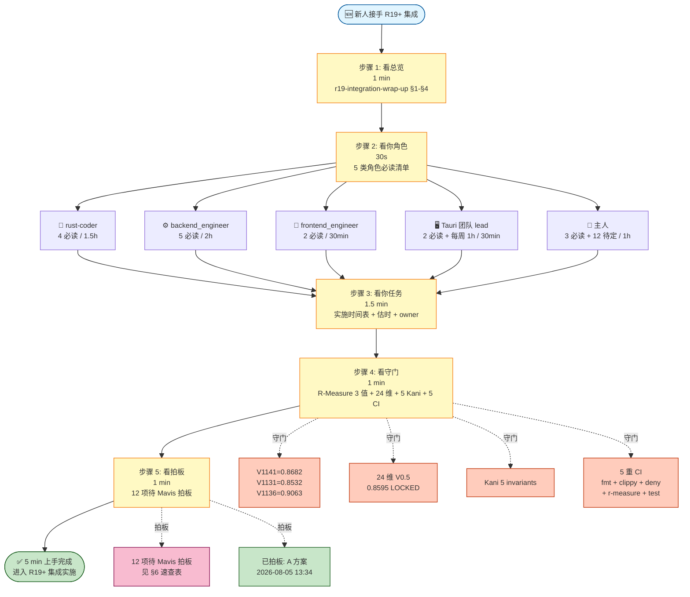

# R19+ 集成 5 分钟 Quickstart (新人接手 5 步路径)

```
[Document-Meta]
Document: docs/stage4/r19-integration-quickstart-2026-08-05.md
Version: Manual-Rev-A
R-Cycle: R19+ 集成 quickstart
Commit: <commit 时回填>
Last-Modified: 2026-08-05
Status: 🔍 草拟 (待 Mavis 拍板 + 主人复核)
```

> **性质**: R19+ 集成 5 分钟快速上手指南. 给后续接手的人 (rust-coder / backend_engineer / frontend_engineer / Tauri 团队 / 主人).
> **作用**: 30 份文档地图中, 5 步找到必读 + 必做 + 必守 + 必拍板.
> **依据**:
> - 30 份 R19+ 集成文档 (17 docs/ + 13 reports/, 跨 2 个工作树, per `r19-integration-commit-template-2026-08-05.md` §1.1)
> - `APEIRETH-CONVENTIONS.md` §0.1 (Document-Meta 格式) + §9 (6 锚穿透) + §10 (不修改承诺) + §11 (R11 baseline 3 值)
> - `r19-integration-wrap-up-2026-08-05.md` §1-§12 (总收口, 24 份核心文档地图 + 10 项待拍板 + 8 风险 + 11 不修改承诺)
> - `r19-integration-commit-template-2026-08-05.md` §5.1 (12 项待拍板完整清单, 总收口 §7 10 项 + R20 §11 R-024/R-026 2 项)
> - `docs-maintenance-sop-2026-08-05.md` §3 (5 步维护 SOP) + §2.5 (10 项待拍板周会议)
> - 主人 2026-08-05 13:34 A 方案拍板 `apeireth-team-lead`
>
> **诚实登记** (S-2 17:43):
> 1. 30 份 = 17 docs/ + 13 reports/ 是 `r19-integration-commit-template-2026-08-05.md` §1.1 口径. `r19-integration-wrap-up-2026-08-05.md` §5 表列 25 行 (14 docs/ + 10 reports/ + 1 标 25*), 表注 14 docs/ + 10 reports/ = 24 份. 差异在 commit-template 含 3 份"自维护文档" (本 quickstart + commit-template + maintenance-sop), 主人复核时确认以哪份为准.
> 2. 12 项待拍板 = 总收口 §7 (10 项) + R20 路线图 §11 R-024 (Docusaurus vs mkdocs) + R-026 (Discord 冷启动) 2 项 = **12 项组合**口径.
> 3. 5 类角色必读清单是 "最小必要", 不是 "全部" — 全部必读请按 §4 5 类角色清单.

---

## §1 战略背景

### 1.1 R19+ 集成是 Apeireth v2.0.0-alpha 收尾工程

- **v2.0.0-alpha 已部署**: 41 crate + HTTP API 表面稳定 + 9/9 业界标准达标 + 2416 tests (per 总收口 §1.4).
- **R19+ 集成期** (7-15 周, 估 50-80 commit): 装**团队协作** + 修 **mid-task bug** + **R-Measure 17→24 维守门** + **apeireth-team-lead 新 crate**.
- **R20 收产品期** (7-10 周, 目标 2026-09-30): 装**产品形态 + 部署形态 + API 形态**.
- **R21+ 商业化**: 计费/订阅/配额 (R20 后再启动).

### 1.2 30 份文档就位 (2026-08-05)

| 维度 | 数量 | 路径 | 用途 |
|---|---:|---|---|
| **17 份 docs/** | 17 | `.openclaw\workspace\promethean\Apeireth-rust\docs\` | 蓝图 (1) + ADR (3) + 实施指南 (6) + 路线图 (2) + 全局架构图 (1) + 形式化不变量 (1) + SDK 差距 (1) + 资产/SOP/词条 (3) + 自维护 (3) |
| **13 份 reports/** | 13 | `.minimax-agent-cn\spectrai\reports\` | 1 SpectrAI 架构 + 11 Apeireth 现状 + 1 总收口 |
| **总额** | **30** | 跨 2 个工作树 | 覆盖 R19+ 集成全维度 |

> ⚠️ 跨工作树 (Apeireth-rust 仓库 + spectrai 工作树) 是 R19+ 集成的特殊结构. **Apeireth 仓库只有 17 docs/**, 13 reports/ 全部在 spectrai 工作树 (per `r19-integration-wrap-up-2026-08-05.md` §1.1).

### 1.3 5 类角色

R19+ 集成期需 5 类角色协同:

| 角色 | 干啥 | 估时 |
|------|------|------|
| **rust-coder** | 写 Rust 代码 (11 个 crate) | 1.5h 阅读 + 实施 |
| **backend_engineer** | 写后端 (14 工具 + 3 ADR + mid-task 修法) | 2h 阅读 + 集成 |
| **frontend_engineer** | 写前端 (13 项 Tauri 资产对接) | 30min 阅读 |
| **Tauri 团队 lead** | 另一团队, 跨团队协同 (Tauri 2 .exe) | 30min 读 SOP + 每周 1h 同步 |
| **主人** | 战略决策 (10 决策 + 3 拍板 + 12 项待定) | 1h 拍板 |

### 1.4 关键路径 (5 步 quickstart)

```
看总览 (1min) → 看你角色 (30s) → 看你任务 (1.5min) → 看守门 (1min) → 看拍板 (1min) = 5min
```

---

## §2 5 步 quickstart (5 分钟)

### 步骤 1: 看总览 (1 分钟)

> 读 `reports/r19-integration-wrap-up-2026-08-05.md` §1-§4

- **§1.1** 24 份核心文档 + 14 docs/ + 10 reports/ (跟 §1.2 的 30 份口径差异已在诚实登记 #1 注明)
- **§1.2** 跟 Hermes R18 0 冲突 (Hermes 改 src/Cargo/CI, 我改 docs/ + reports/)
- **§1.3** A 方案 `apeireth-team-lead` 命名已拍板 (主人 2026-08-05 13:34)
- **§2.1** 全局 Mermaid 图 (8 层架构: 战略 → ADR → 实施 → 资产 → reports → Hermes 协同 → R20 衔接 → 拍板)
- **§5** 24 份文档地图 (25 行表, 知道有什么)

### 步骤 2: 看你角色 (30 秒)

> 5 类角色, 各自必读清单

#### 🦀 rust-coder (写 Rust 代码)

| # | 必读 | 路径 | 估时 |
|---|------|------|------|
| 1 | 实施指南 (850 LOC) | `docs/stage4/apeireth-team-lead-implementation-guide-2026-08-05.md` | 30min |
| 2 | session 蓝图 (1500-2000 LOC) | `docs/stage4/apeireth-session-blueprint-2026-08-05.md` | 30min |
| 3 | 5 Kani invariants | `docs/stage4/apeireth-formal-invariants-2026-08-05.md` §2 | 20min |
| 4 | R-Measure 守门 | `docs/stage4/r-measure-verification-design-2026-08-05.md` | 10min |
| **小计** | | | **1.5h** |

**关键产出**: 11 个 crate (含 5 Kani invariants + apeireth-team-lead 850 LOC + apeireth-session 1500-2000 LOC + 3 SDK 升级).

#### ⚙️ backend_engineer (写后端)

| # | 必读 | 路径 | 估时 |
|---|------|------|------|
| 1 | 集成蓝图 (60.9KB) | `docs/stage4/spectrAI-integration-blueprint-r19-plus-2026-08-05.md` | 30min |
| 2 | ADR-0010 mcp 翻译 | `docs/adr/0010-mcp-from-spectrai-agentmcpserver.md` | 10min |
| 3 | ADR-0011 team-lead 命名 | `docs/adr/0011-apeireth-team-lead-supervisor-prompt-translation.md` | 10min |
| 4 | ADR-0012 team-lead + council 协同 | `docs/adr/0012-team-lead-council-collaboration.md` | 10min |
| 5 | 14 工具 trait 分析 | `reports/apeireth-mcp-14-tool-analysis-2026-08-05.md` | 20min |
| **小计** | | | **2h** |

**关键产出**: 14 工具 + 3 ADR + mid-task 3 处一起改.

#### 🎨 frontend_engineer (写前端)

| # | 必读 | 路径 | 估时 |
|---|------|------|------|
| 1 | 13 项 Tauri 资产 | `docs/stage4/tauri-assets-from-spectrAI-2026-08-05.md` | 15min |
| 2 | Tauri 团队对接 SOP | `docs/stage4/tauri-team-collab-sop-2026-08-05.md` | 15min |
| **小计** | | | **30min** |

**关键产出**: 13 项 T-001~T-013 资产对接 (HTTP API 消费方).

#### 🖥️ Tauri 团队 lead (另一团队)

| # | 必读 | 路径 | 估时 |
|---|------|------|------|
| 1 | Tauri SOP | `docs/stage4/tauri-team-collab-sop-2026-08-05.md` | 15min |
| 2 | 13 项 Tauri 资产 | `docs/stage4/tauri-assets-from-spectrAI-2026-08-05.md` | 15min |
| **每周同步** | 每 2 周会议 1 次 + GitHub Issue 跟踪 | | **每周 1h** |
| **小计** | | | **30min + 每周 1h** |

**关键产出**: Tauri 2 .exe (跨团队, 不在 Apeireth 工作树).

**特别提醒**: 每周一 10:00 `git pull docs/stage4/` + `docs/api/` (per `tauri-team-collab-sop` §3 Step 4).

#### 👑 主人 (战略决策)

| # | 必读 | 路径 | 估时 |
|---|------|------|------|
| 1 | 集成蓝图 §8 10 决策 | `docs/stage4/spectrAI-integration-blueprint-r19-plus-2026-08-05.md` §8 | 20min |
| 2 | R20 路线图 §11 3 拍板 | `docs/roadmap/r20-product-finalize-2026-08-05.md` §11 | 20min |
| 3 | 12 项待 Mavis 拍板 | `r19-integration-wrap-up-2026-08-05.md` §7 + `r19-integration-commit-template-2026-08-05.md` §5.1 | 20min |
| **小计** | | | **1h** |

**关键产出**: 战略决策 (10 决策 + 3 拍板 + 12 项待定).

### 步骤 3: 看你任务 (1.5 分钟)

> 看你角色对应的"实施时间表" + 估时 + owner + 依赖

| 角色 | 实施时间表来源 | 估 LOC | 估时 |
|------|--------------|------:|------|
| rust-coder | `apeireth-team-lead-implementation-guide` §8 (8 阶段 6 天) | 850 + 1500-2000 | 6 天 |
| backend_engineer | `r20-stage-1-2-implementation` §3 (10 子阶段) | 14 工具 + mid-task 3 处 | 2 天 |
| frontend_engineer | `tauri-assets-from-spectrAI` §1 (13 项 T-001~T-013) | 13 项资产对接 | 1 天 |
| Tauri 团队 lead | `tauri-team-collab-sop` §3 (5 步 SOP) | Tauri 2 .exe | 跨 7-10 周 |
| 主人 | 拍板机制 (见步骤 5) | — | 即时 |

**关键依赖链**:
```
rust-coder (apeireth-team-lead 850 LOC) ──→ backend_engineer (14 工具) ──→ frontend_engineer (13 资产)
                                          ↑
                              Tauri 团队 lead (Tauri 2 .exe)
                                          ↑
                              主人 (12 项拍板)
```

### 步骤 4: 看守门 (1 分钟)

> 4 重守门, 集成期**必跑**

#### 守门 1: R-Measure baseline 3 值 (per APEIRETH-CONVENTIONS §11)

| 指标 | 值 | 含义 |
|---|---|---|
| **V1141-R11** | 0.8682 | IC-001 fresh 测量 (17 维 V0.5) |
| **V1131-R11** | 0.8532 | dashboard v05_total |
| **V1136-R11** | 0.9063 | 真测引擎 7 子测度 |

> ⚠️ **17→24 维 R11 baseline 投影公式权重**待主人拍板 (#1, 见 §6). 拍板后编译期 hardcode.

#### 守门 2: 24 维 V0.5 LOCKED (per `reports/apeireth-asi-24dim-api-2026-08-05.md` §3)

- V0.5 公式: `v04*0.85 + continuity*0.05 + autonomy*0.05 + transferability*0.05`
- 当前 V0.5 = 0.8595 (LOCKED)
- 0.9800 = BASE_FULLY_EQUIPPED (主人任何时代能做的最大)
- gap to 0.98 R10-W4 = 12.94%
- 24 维具体分类名待主人拍板 (#3, 见 §6)

#### 守门 3: Kani 5 invariants (per `docs/stage4/apeireth-formal-invariants-2026-08-05.md` §2)

| 不变量 | 守什么 |
|--------|--------|
| **1. e_layer 隔离** | 跨 e_layer 写入 = 拒绝 |
| **2. L0 联合 + HA 签名** | L0 = PID 1 + sovereignty + ≥1 HA 票 (人类决策) |
| **3. mid-task 状态机原子性** | 6 状态机 (Running / MidTask / MidTaskState 5 子状态) |
| **4. 7 advisor 完整性** | Council 7 强制 advisor 完整 |
| **5. <第 5 不变量>** | 见 §2.5 |

> ⚠️ Kani 0.50 Windows 兼容性需 WSL2 (per `apeireth-formal-invariants` §0.4). CI workflow 待 R20 阶段 1.5 加.

#### 守门 4: 5 重 CI (per APEIRETH-CONVENTIONS §9 + 总收口 §8 R-008)

1. `fmt` (rustfmt)
2. `clippy -D warnings` (R19 T10 Hermes 真正生效)
3. `deny` (cargo-deny)
4. `r-measure` (V1141/V1131/V1136 baseline)
5. `test` (122 tests for 12 product crates, Hermes R18 阶段 2)

> 5 重守门串行跑, r-measure-verify 单独 workflow (不挡 PR). 总耗时 30+ min, GitHub Actions cache 加速.

### 步骤 5: 看拍板 (1 分钟)

> 12 项待 Mavis 拍板 + 拍板机制

**当前已拍板** (per 总收口 §6 拍板时间线):
- ✅ A 方案 `apeireth-team-lead` 命名 (主人 2026-08-05 13:34)
- ✅ R20 方向: "Apeireth OS 长程 AI 成长平台对外, 含计费 + 订阅 + API 配额" (主人 2026-08-04 12:30)
- ✅ 砍前端, 交给 Tauri 团队 (主人 2026-08-04 19:53)

**12 项待拍板**: 见 §6 速查表.

**拍板机制** (per `r19-integration-commit-template-2026-08-05.md` §5):
```
1. 主人/拍板人在聊天里给指令
2. 写 commit message:
   - 拍板: <事项> (主人 2026-08-XX HH:MM, per <来源>)
3. 更新文档 Document-Meta Status: 🔍 草拟 → ✅ 拍板
4. 末尾加拍板记录
5. grep "拍板:" 可秒查决策点
```

---

## §3 关键路径图 (Mermaid flowchart, 1 张)



---

## §4 5 类角色速查表

| 角色 | 必读数 | 估时 | 关键产出 | 实施时间表 |
|------|------:|-----:|---------|-----------|
| 🦀 **rust-coder** | 4 | **1.5h** | 11 个 crate (含 5 Kani invariants + apeireth-team-lead 850 LOC + apeireth-session 1500-2000 LOC + 3 SDK 升级) | `apeireth-team-lead-implementation-guide` §8 (8 阶段 6 天) |
| ⚙️ **backend_engineer** | 5 | **2h** | 14 工具 + 3 ADR + mid-task 3 处修法 | `r20-stage-1-2-implementation` §3 (10 子阶段) |
| 🎨 **frontend_engineer** | 2 | **30min** | 13 项 T-001~T-013 资产对接 | `tauri-assets-from-spectrAI` §1 |
| 🖥️ **Tauri 团队 lead** | 2 + 每周 1h | **30min** | Tauri 2 .exe (跨团队) | `tauri-team-collab-sop` §3 (5 步 SOP) |
| 👑 **主人** | 3 + 12 项待定 | **1h** | 战略决策 (10 决策 + 3 拍板 + 12 项待定) | 拍板机制 (步骤 5) |

**详细必读清单**: 见 §2 步骤 2.

---

## §5 必看关键文件 (按优先级)

> 30 份文档中, **8 份最关键** (按优先级排序, 高 → 低)

| # | 文件 | 大小 | 谁必读 | 估时 |
|---|------|-----:|--------|-----:|
| 1 | `docs/stage4/spectrAI-integration-blueprint-r19-plus-2026-08-05.md` | 60.9KB | **所有角色** | 30min |
| 2 | `r19-integration-wrap-up-2026-08-05.md` | 40KB (721 行) | **所有角色** | 10min |
| 3 | `docs/stage4/apeireth-team-lead-implementation-guide-2026-08-05.md` | 40.1KB | rust-coder | 30min |
| 4 | `docs/stage4/apeireth-session-blueprint-2026-08-05.md` | 75.0KB | rust-coder / backend_engineer | 30min |
| 5 | `docs/stage4/apeireth-formal-invariants-2026-08-05.md` | 60.9KB | rust-coder | 20min |
| 6 | `docs/stage4/r-measure-verification-design-2026-08-05.md` | 47.5KB | **所有角色** (守门) | 10min |
| 7 | `docs/stage4/r19-integration-commit-template-2026-08-05.md` | 38.7KB | **所有角色** (commit 模板) | 10min |
| 8 | `docs/stage4/docs-maintenance-sop-2026-08-05.md` | 30.2KB | 团队 lead / 文档维护者 | 10min |

**完整 30 份清单**: 见 `r19-integration-wrap-up-2026-08-05.md` §5 (24 份核心) + `r19-integration-commit-template-2026-08-05.md` §1.1 (30 份含自维护 3 份).

---

## §6 12 项待 Mavis 拍板 (速查)

> 12 项 = 总收口 §7 (10 项) + R20 路线图 §11 R-024 + R-026 2 项 = 12 项组合口径
> 来源: `r19-integration-commit-template-2026-08-05.md` §5.1 (完整清单)

| # | 事项 | 阻塞 | 决策紧迫度 |
|---|------|------|-----------|
| **1** | 17→24 维 R11 baseline 投影公式权重 (主人从 v1077 抽) | R-Measure verify 守门 | 🔴 R20 阶段 1.5 阻塞 |
| **2** | V1136 9→7 子测度 R11 baseline 投影权重 | R-Measure verify | 🔴 R20 阶段 1.5 阻塞 |
| **3** | 24 维具体分类名 (continuity / salience / identity / philosophy guard / transferability) | apeireth-asi 公开 API | 🟡 R20 阶段 1 必拍 |
| **4** | apeireth-sdk 升级方案 (一起 / 分阶段) | R20 阶段 4 | 🟡 R20 阶段 4 拍 |
| **5** | SDK_VERSION 0.1.0 → 1.0.0 升级时机 (跟 R20 阶段 3 OpenAPI 同期?) | semver 严格 | 🟡 R20 阶段 3 拍 |
| **6** | `apeireth-tauri-stub` 命名 (留 / 移除, per `global-architecture-map` §2.4 ⛔ DEPRECATED) | workspace.lints + CI | 🟡 R20 阶段 4 拍 |
| **7** | R20 vs R21 边界 (R20 收产品 ↔ R21 商业化) | 5 阶段范围 | 🟡 R20 启动拍 |
| **8** | Tauri 团队同步节奏 (per `tauri-team-collab-sop` §3 Step 4 每 2 周 1 次) | 跨团队协同 | 🟢 团队层 |
| **9** | `apeireth-session` LOC 上下沿 (1500-2000 区间) | session 实施估时 | 🟡 R19+ 阶段 5 拍 |
| **10** | session 跟 storage 依赖方向 (session → storage 写 WAL?) | crate 依赖图 | 🟡 R19+ 阶段 5 拍 |
| **11** | Docusaurus vs mkdocs (R-024 用户文档站) | R20 阶段 4 文档 | 🟢 R20 阶段 4 拍 |
| **12** | Discord 冷启动策略 (R-026 社区基础设施) | R20 阶段 5 社区 | 🟢 R20 阶段 5 拍 |

**累计来源分布**:
- r-measure-verification-design: 2 项 (#1, #2)
- spectrAI §7.4 + apeireth-asi 24 dim: 1 项 (#3)
- apeireth-sdk-gap-analysis: 2 项 (#4, #5)
- global-architecture-map: 1 项 (#6)
- r20-product-finalize: 1 项 (#7) + 2 项 (#11, #12)
- tauri-team-collab-sop: 1 项 (#8)
- session-blueprint / session-vector-asi: 2 项 (#9, #10)

**周会议对照** (per `docs-maintenance-sop-2026-08-05.md` §2.5): 每周对照 1 次, 防止堆积. 季度审计 > 10 项告警.

---

## §7 风险 + 防御

| 风险 | 严重度 | 缓解 | 触发 |
|------|--------|------|------|
| **R-Q1** 30 份文档太多 → 新人迷路 | 🔴 高 | §2 5 步 quickstart + §4 5 类角色速查表 | 新人接手 |
| **R-Q2** 12 项待拍板堆积 → 决策阻塞 | 🟡 中 | §6 速查表 + 周会议对照 + 季度审计 | 季度审计 > 10 项 |
| **R-Q3** Hermes 5 commit 风格不同 → 团队不一致 | 🟡 中 | `r19-integration-commit-template-2026-08-05.md` 5 类模板统一 | 第一次 sub-agent commit |
| **R-Q4** 17→24 维投影公式没拍板 → R-Measure verify 阻塞 | 🔴 高 | #1 列为 🔴 阻塞, 主人 2026-08-05 拍板优先 | R20 阶段 1.5 启动 |
| **R-Q5** mid-task 3 处一起改 → 撕裂状态复发 | 🔴 高 | 3 处一起改, 改 1 留 2 = 禁止 (per 总收口 §8 R-004) | 第一次想拆 commit 时 |
| **R-Q6** Tauri 团队节奏不可控 | 🔴 高 | `tauri-team-collab-sop` §3 5 步 SOP + 每 2 周会议 + GitHub Issue 跟踪 | 主人周会议题 |
| **R-Q7** 3 SDK 跨语言 ABI 一致性 | 🔴 高 | OpenAPI 规范做 single source + ts-rs/openapi-typescript 自动生成 | R20 阶段 4 |
| **R-Q8** 跨工作树 (Apeireth + spectrai) → 文档散乱 | 🟡 中 | §1.2 注明 17 docs/ 在 Apeireth, 13 reports/ 在 spectrai | 文档引用时 |
| **R-Q9** Kani 0.50 Windows 兼容性 | 🟡 中 | 需 WSL2, CI workflow 待 R20 阶段 1.5 加 (per 总收口 §8 R-003) | 不在本蓝图范围 |
| **R-Q10** 5 重 CI 30+ 分钟 | 🟡 中 | r-measure-verify 单独 workflow (不挡 PR) + GitHub Actions cache | 提交时 |

---

## §8 不修改承诺 (跟 ADR-0011 §不修改承诺 一致)

> 跟 `r19-integration-wrap-up-2026-08-05.md` §9 (11 项) + `APEIRETH-CONVENTIONS.md` §10 (8 项) 一致

| ❌ 不修改 | 原因 |
|-----------|------|
| 阶段 1+2+3 LOCKED 文档 | 主人明确沉淀 |
| v2 / v4 / v4.1 LOCKED | 哲学层纲领 |
| 阶段 4 核心文档 LOCKED (`6ca80776`) | 蓝图 §10 已锁 |
| 阶段 5 施工文档 LOCKED (631 行) | 阶段 5 实施时再引用 |
| v6 基础架构 (4 重守门 + 权限发放 + E 层修改路径) | 主 AI 团队已 LOCKED |
| R11 baseline 三值 (V1141=0.8682 / V1131=0.8532 / V1136=0.9063) | 主人 2026-07-31 明确不动 |
| APEIRETH-CONVENTIONS.md / VERSIONING.md / GLOSSARY.md (顶层 3 文件) | 不动 |
| START-CONSTRUCTION.md | 不动 |
| `apeireth-legacy/` (R17 finalize 后归档) | 不删 |
| workspace version 1.0.0 (Cargo.toml, semver 严格) | 不动 |
| 现有 ADR 0001~0009 | 不动 |

> 8 项详见 docs/stage4/8-locked-unified-2026-08-05.md §2 (本指南统一版)

**本 quickstart 也遵守**: ✅ 0 M 标记文件 + 0 LOCKED 文档 + 0 源码 + 0 Cargo.toml + 0 CI 改动.

---

## §9 6 哲学 anchor 穿透 (按 APEIRETH-CONVENTIONS §9)

| 锚 | 来源 | 本 quickstart 落地 |
|---|------|-------------------|
| **S-1** 主 22:33 | 6 anchor ASI 完整性 | 5 步 quickstart 是 ASI 完整性的入口 (24 份文档 + 5 类角色 + 4 重守门 = ASI 基座的工程化路径) |
| **S-2** 主 17:43 | 6 anchor 实事求是 | 30 份 vs 24 份口径差异诚实登记 (诚实登记 #1); 17→24 维纠正 (R11 baseline 投影源); 12 项待拍板组合口径 |
| **O-5** 主 17:58 | 6 anchor 不假装 | 4 重守门 (R-Measure + 24 维 + Kani + 5 CI) 编译期 hardcode, 0 unsafe 兜底, 不允许"软阈值"绕过 |
| **O-2** 主 19:33 | 6 anchor 走在前人经验上 | 30 份文档分 5 分类 (蓝图 / ADR / 实施 / 路线 / reports) + 5 类角色必读清单借鉴前人工程经验 (Linux kernel / Rust crate / GitHub Releases) |
| **O-3** 主 23:44 | 6 anchor 决策清单 | 12 项待拍板 (见 §6) + 5 步 SOP (见 §2) + 4 重守门 (见 §7) = 3 类 5/12/4 项清单 |
| **O-4** 主 00:56 | 6 anchor 任何人都能接手 | 5 步 quickstart (5min) + 5 类角色速查表 (估时) + 12 项待拍板 (1 表查) = 任何接手者查表即可 |

---

## §10 关联文档

**总收口 + 索引**:
- [R19+ 集成收口报告 (24 份核心文档地图)](file:///.minimax-agent-cn/spectrai/reports/r19-integration-wrap-up-2026-08-05.md)
- [SpectrAI 集成蓝图 (R19+ 根)](file:///.openclaw/workspace/promethean/Apeireth-rust/docs/stage4/spectrAI-integration-blueprint-r19-plus-2026-08-05.md)
- [R19+ 集成 commit 模板 (5 类 + 12 项拍板 + 8 项不修改承诺)](file:///.openclaw/workspace/promethean/Apeireth-rust/docs/stage4/r19-integration-commit-template-2026-08-05.md)
- [文档维护 SOP (5 步)](file:///.openclaw/workspace/promethean/Apeireth-rust/docs/stage4/docs-maintenance-sop-2026-08-05.md)
- [全局架构图 13 张 Mermaid](file:///.openclaw/workspace/promethean/Apeireth-rust/docs/stage4/global-architecture-map-2026-08-05.md)

**5 类角色必读 (按 §2 步骤 2 速查)**:

rust-coder (4):
- [apeireth-team-lead 实施指南 850 LOC](file:///.openclaw/workspace/promethean/Apeireth-rust/docs/stage4/apeireth-team-lead-implementation-guide-2026-08-05.md)
- [apeireth-session 蓝图 1500-2000 LOC](file:///.openclaw/workspace/promethean/Apeireth-rust/docs/stage4/apeireth-session-blueprint-2026-08-05.md)
- [apeireth-formal 5 不变量 + Kani](file:///.openclaw/workspace/promethean/Apeireth-rust/docs/stage4/apeireth-formal-invariants-2026-08-05.md)
- [R-Measure 验证设计 17→24 维](file:///.openclaw/workspace/promethean/Apeireth-rust/docs/stage4/r-measure-verification-design-2026-08-05.md)

backend_engineer (5):
- [SpectrAI 集成蓝图](file:///.openclaw/workspace/promethean/Apeireth-rust/docs/stage4/spectrAI-integration-blueprint-r19-plus-2026-08-05.md)
- [ADR-0010 apeireth-mcp 翻译](file:///.openclaw/workspace/promethean/Apeireth-rust/docs/adr/0010-mcp-from-spectrai-agentmcpserver.md)
- [ADR-0011 apeireth-team-lead 命名](file:///.openclaw/workspace/promethean/Apeireth-rust/docs/adr/0011-apeireth-team-lead-supervisor-prompt-translation.md)
- [ADR-0012 team-lead 跟 council 协同](file:///.openclaw/workspace/promethean/Apeireth-rust/docs/adr/0012-team-lead-council-collaboration.md)
- [14 工具 trait 分析](file:///.minimax-agent-cn/spectrai/reports/apeireth-mcp-14-tool-analysis-2026-08-05.md)

frontend_engineer (2):
- [Tauri 资产沉淀 13 项](file:///.openclaw/workspace/promethean/Apeireth-rust/docs/stage4/tauri-assets-from-spectrAI-2026-08-05.md)
- [Tauri 团队对接 SOP](file:///.openclaw/workspace/promethean/Apeireth-rust/docs/stage4/tauri-team-collab-sop-2026-08-05.md)

Tauri 团队 lead (2 + 每周同步):
- [Tauri 团队对接 SOP](file:///.openclaw/workspace/promethean/Apeireth-rust/docs/stage4/tauri-team-collab-sop-2026-08-05.md)
- [Tauri 资产沉淀 13 项](file:///.openclaw/workspace/promethean/Apeireth-rust/docs/stage4/tauri-assets-from-spectrAI-2026-08-05.md)

主人 (3 + 12 项):
- [SpectrAI 集成蓝图 §8 10 决策](file:///.openclaw/workspace/promethean/Apeireth-rust/docs/stage4/spectrAI-integration-blueprint-r19-plus-2026-08-05.md)
- [R20 路线图 §11 3 拍板](file:///.openclaw/workspace/promethean/Apeireth-rust/docs/roadmap/r20-product-finalize-2026-08-05.md)
- [总收口 §7 10 项 + commit-template §5.1 12 项](file:///.minimax-agent-cn/spectrai/reports/r19-integration-wrap-up-2026-08-05.md)

**规范引用**:
- [APEIRETH-CONVENTIONS.md](file:///.openclaw/workspace/promethean/Apeireth-rust/APEIRETH-CONVENTIONS.md) §0.1 (Document-Meta 格式) + §9 (6 锚穿透) + §10 (不修改承诺) + §11 (R11 baseline 3 值) + §12 (架构图编号 P1-P5)

---

_本 quickstart 草拟 (Mavis / software-architect + technical_writer 角色) — 5 步 quickstart (5min) + 5 类角色速查表 + 12 项待 Mavis 拍板 + 6 哲学 anchor 穿透 + 30 份 R19+ 集成文档地图._

_等 Mavis 拍板后由 architect2 在 R20 阶段 1 落地, 跟 `r19-integration-commit-template-2026-08-05.md` §5 (12 项待拍板 commit 引用) + `docs-maintenance-sop-2026-08-05.md` §3 (5 步维护 SOP) 协同, 任何新人接手 R19+ 集成 5min 即可上手._
