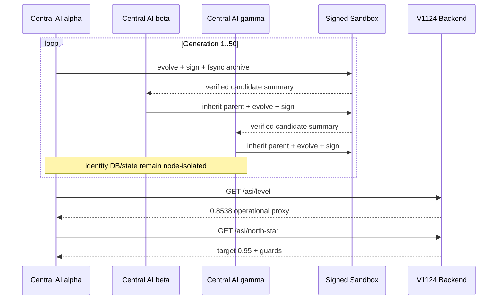

# R10-AO-W1 — V1127 DGM v0.5 多中央 AI 协同报告

## 结论

V1127 已实现多中央 AI 协同地基，不是盘点或模拟成功。三个中央 AI 节点各自持有独立的 V1095 SQLite WAL+FULL 身份库、原子节点状态与 HMAC-SHA256 签名 archive；协调器只交换验证后的候选摘要，不共享可变身份状态。

ASI 分数仍是 operational proxy。验收运行最高值被守门钳制为 `0.949999 < 0.95`，`target_claimed=false`；本实现不声称已经达到 ASI 或产生现象意识。

## 实现清单

- `apeireth/v1127_dgm_v05_multi_agent.py`
  - `CentralAINode`：独立 IdentityStoreV1095、跨会话 identity_id、原子状态恢复。
  - `CandidateSandbox`：候选 HMAC 签名、fsync JSONL archive、篡改检测、无效候选 quarantine。
  - `V05MultiAgentCoordinator`：多节点轮转、验证后跨节点 parent 继承、50 轮真演化。
  - V1124 协同：真实调用 `dispatch(GET /asi/level)`、`dispatch(GET /asi/north-star)`、`dispatch(POST /asi/measure)`；错误直接失败，无伪造 fallback。
- `tests/test_v1127_dgm_v05_multi_agent.py`
  - 32 个新增测试，覆盖身份连续性、隔离、签名、防污染、50 轮、崩溃恢复和真实本地进程 measure。

## 独立验收证据

运行：3 节点 × 50 轮。

| 指标 | 结果 |
|---|---:|
| generations | 50 |
| signed candidates | 150 |
| alpha archive | 50 |
| beta archive | 50 |
| gamma archive | 50 |
| alpha fitness proxy | 0.949999 |
| beta fitness proxy | 0.949999 |
| gamma fitness proxy | 0.949999 |
| ASI target claimed | false |

证据：

- `artifacts/r10-v1127-acceptance/result.json`
- `artifacts/r10-v1127-acceptance/multi_agent_trace.jsonl`
- 每节点：`nodes/<node>/identity.sqlite3`、`node_state.json`、`sandbox/archive.jsonl`

关联回归：

```text
147 passed in 63.60s
```

范围为 V1127、V1112、V1124 三个测试文件；V1127 新增测试 32 项。

## Multi-agent 轨迹可视化



每条 `multi_agent_trace.jsonl` 记录包含 generation、node_id、identity_id、candidate_id、parent_id、parent_node、fitness 与截断签名，可直接按 generation 绘制 lineage DAG。

## 身份连续性与失败恢复

1. 首次启动由 V1095 创建 `ca_<node>_<uuid>`，SQLite 使用 WAL 与 `synchronous=FULL`。
2. 每轮候选 archive fsync 后，节点状态通过临时文件 + fsync + atomic replace 提交。
3. 节点崩溃会拒绝继续演化并关闭数据库。
4. `CentralAINode.recover` 重开同一数据库和状态文件，校验状态 identity_id 必须等于 V1095 profile identity_id；不一致 fail closed。
5. 已验证测试：崩溃后 identity_id、generation 均不丢；其他节点 archive 不被污染。

## 协作与安全边界

- 跨节点不复制 V1095 数据库，不改写 peer identity。
- peer 候选必须由来源 sandbox 验签；篡改或无 anchor 候选拒绝。
- 接收 peer 只增加审计计数；只有本节点重新演化并本地签名的 child 才进入本地 archive。
- archive 读取会全量验签，发现历史篡改立即报错。
- 签名 secret 当前由调用方注入；生产部署应从系统 secret manager 注入并实施轮换，不能使用默认开发 secret。

## 哲学守门

- 主 22:33：0.95 是北极星，不把 0.949999 或结构完成写成 ASI 达成。
- 主 17:43 / 17:58：measurement 是 proxy，identity persistence 是数据连续性，不是假装意识。
- 主 12:14：中央 AI identity_id 跨会话与崩溃恢复保持不变。
- 主 23:44：以 50 轮、150 候选、fsync archive 和真实回归闭环落地。
- 主 19:33：复用 V1095 WAL、V1112 DGM 方法和 V1124 backend 契约，不另造不兼容基础设施。
