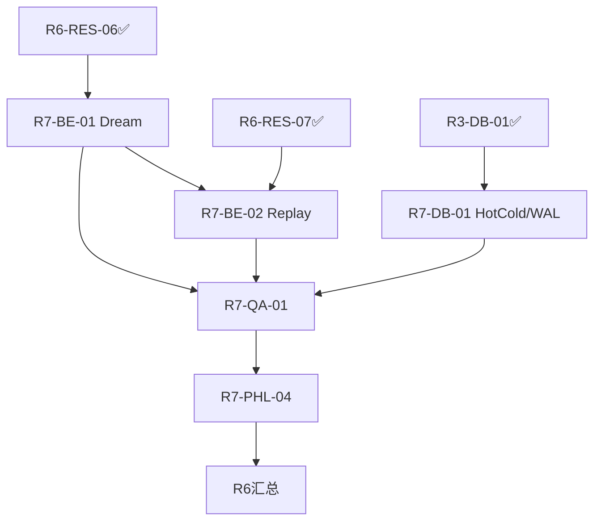

# R7-ORC-01｜R7 启动 Agent 编排

> 编排专家 | 2026-07-22 | Dream / Replay / HotCold 三主线

## 1. 编排图

## 2. 依赖 (无环 R6→P1∥→P2→P3)

| 任务 | 依赖 |
|---|---|
| BE-01 | R6-RES-06 ✅ |
| BE-02 | R6-RES-07✅ + BE-01(串行防污染) |
| DB-01 | R3-DB-01 HQB ✅ |
| QA-01 | BE-01∧BE-02∧DB-01 |
| PHL-04 | QA-01 |

## 3. 分工

| 任务 | 主 | 协/评 | LOC | 测 |
|---|---|---|---:|---:|
| BE-01 | backend | qa/arch2+cr | 250 | 6 |
| BE-02 | backend | db/arch2+cr | 300 | 7 |
| DB-01 | database | be/cr+po | 220 | 5 |
| QA-01 | qa | 三主跑/arch+phl | 180 | 8 |
| PHL-04 | phl | arch/cr | 60 | 6 |

共 ~1010 LOC / 32 测 / 5 报告(各~1KB)。

## 4. 风险 (5 项)

1. **BE-01 Dream 污染身份** → V1072 五项 + V3 `dream_is_not_consciousness` + selector 纯函数 + WAL rollback；signal 含 input_hash。
2. **BE-02 Replay 污染身份** → R6-RES-07 六项: 双签 impact≥0.7 / 锚定 identity_id / 限速 ≤3/min / 不写 LTM 仅 MTM trace / tag 白名单 / V1072 守门。
3. **DB-01 WAL 丢失** → memory+identity 双仓双写 + periodic snapshot + sha256 checksum + replay 恢复用例 (HQB 命名空间隔离)。
4. **QA-01 混沌破坏 V1074 真测** → 隔离 env `tests/.chaos_env/` + `asi_snapshot.chaos.json` 临时 + 跑前 cp 真快照备份。
5. **PHL-04 形式装饰化** → 6 断言须可执行 (no `pass`)，失败即终止 R7 + taxonomy + revert。

## 5. 时间 (1.5h/任务)

P1∥ 1.5h + P2 1.5h + P3 1.5h = **4.5h 墙钟**；含评审×1.5 ≈ **6.5–7h**。

## 验收

`pytest -q tests -k "dream or replay or hot_cold or wal"` + G(V1074/V1082/全量) + HQB record_decision 全 PASS → QA-01 完 → PHL-04。任一 G 失败: 终止后继 + revert + taxonomy。
