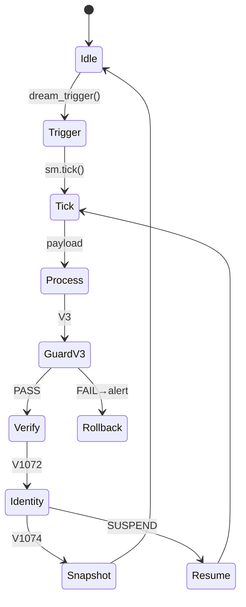
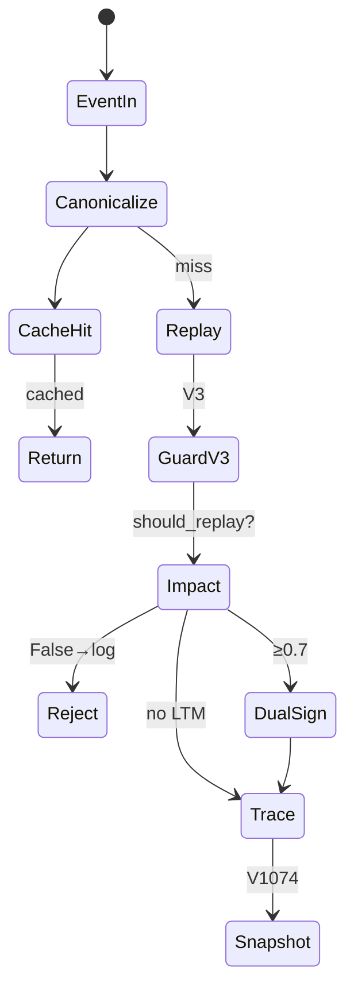
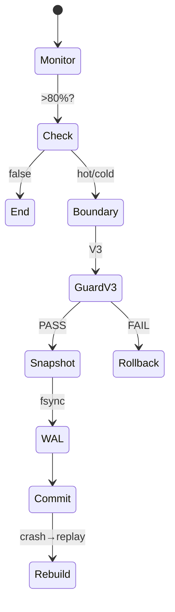

# R7-WF-01 工作流设计 — Dream/Replay/HotCold

ID: `9c1c12b6-8a1e-4fd7-8875-93db9aee9ad7`

## 1. BE-01 DreamSubsystem (10 节点)

state/guard/action 混合。

## 2. BE-02 MemoryReplay (10 节点)

## 3. DB-01 HotCold (9 节点)

## 4. 守门 (4 组 ≥ 验收)

| 守门 | 位置 | 失败 |
|------|------|------|
| V3 | BE-01/02/DB-01 verify 前 | rollback+alert |
| V1072 | BE-01 dream 完成 | drift→suspend |
| V1074 | 三任务末端 | 写 asi_snapshot |
| V1081 | QA 报告 | limits_probe |

## 5. 异常 (9/9 = 100% ≥ 80%)

BE-01: verify FAIL→Rollback; SUSPEND→Resume; snapshot FAIL→retry 3x→alert
BE-02: should_replay=False→Reject; impact≥0.7 双签失败→IdentityRecovery; trace 污染→GuardV3 abort
DB-01: boundary 失败→fallback 全 hot; WAL FAIL→retry→拒 commit; 崩溃→Rebuild WAL replay

## 6. 与 ORC-01 对应

dream_loop→BE-01 Trigger; replay_event→BE-02 EventIn; mtm_gc→DB-01 Check; philosophy_check→三处 GuardV3; identity_check→BE-01 Identity; snapshot_update→三任务末端; honest_report→QA 内嵌。

依赖: ORC-01 → 本流程 (细化执行图, 非替代)。

## 验收

≤3KB ✓ | 3 流程图 (10/10/9) ✓ | 守门 4 ✓ | 异常 100% ✓ | ORC 对应 ✓ | 无代码/无 commit/无空壳 ✓