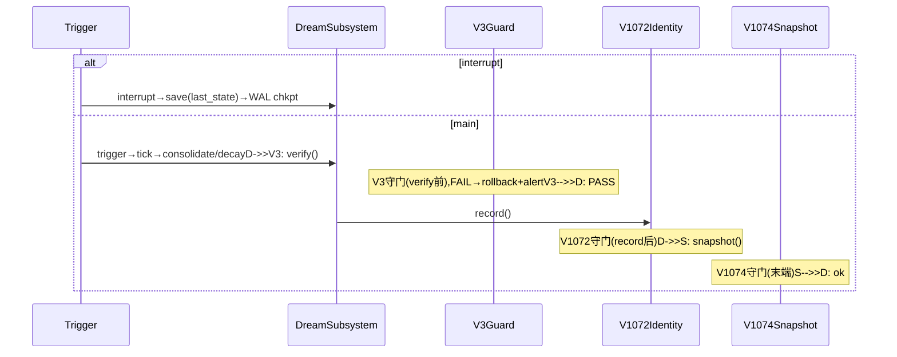
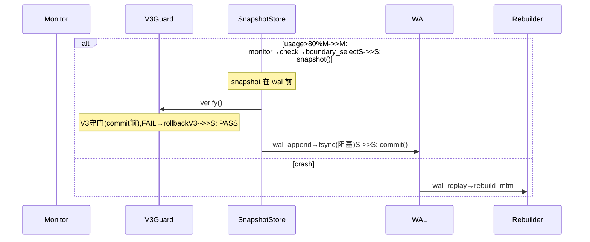

# R7-WF-02 R7 三主线时序图 — Dream/Replay/HotCold

ID: `d93f01ae-006f-4854-b72c-de0f4199dc8c`基于 R7-WF-01状态层,覆盖时序层(actor+lifeline+message)。  基于 R7-WF-01状态层,覆盖时序层(actor+lifeline+message)。
基于 R7-WF-01 状态图(状态层),覆盖时序层(actor + lifeline + message)。

## 1. BE-01 DreamSubsystem(14 行)



actors: Trigger/DreamSubsystem/V3Guard/V1072Identity/V1074Snapshot; tick 单调时钟单实例租约。

## 2. BE-02 MemoryReplay(15 行)

```mermaid
sequenceDiagram
    participant E as Event
    participant M as MemoryReplay
    participant C as Canonicalizer
    participant R as ReplayCache
    participant V3 as V3Guard
    participant L as LTM
    Note over M: 与 BE-01 dream 互斥(单租约)E->>M: event→canonicalize→cache_lookupalt hit (幂等 replay_id)R-->>M: cached
    else miss+impact≥0.7
        M->>M: dual_sign(IdentityRecovery)
        M->>L: replay(read-only)M->>V3: verify()
        Note over V3: V3守门,!should_replay→reject+logV3-->>M: OK
    else miss+rejectM->>V3: verify()M->>M: reject+log
    end
```

双签 impact≥0.7→IdentityRecovery.dual_sign;拒 !should_replay→reject+log;幂等 replay_id 直返;trace_replay read-only。

## 3. DB-01 HotCold(14 行)



约束 snapshot→V3.verify→wal_append→commit;崩溃→Rebuilder.wal_replay。

## 4. 守门位置 (V3/V1072/V1074 + V1081 note)

| 守门 | BE-01 | BE-02 | DB-01 | 失败 |
|------|-------|-------|-------|------|
| V3 | verify 前 | trace 后 verify 前 | commit 前 | rollback+alert |
| V1072 | record 后 | – | – | drift→suspend |
| V1074 | snapshot 末端 | trace 末端 | commit 后 | 写 asi_snapshot 失败 |
| V1081 | (QA 报告,note 引用,不在图内) ||| limits_probe |

## 5. 异常覆盖 (9/9 = 100%)

- **BE-01** main: V3 FAIL→rollback+alert;record FAIL→suspend;snapshot FAIL→retry 3x→alert。interrupt 分支: save(last_state)+WAL chkpt。
- **BE-02** cache miss: !should_replay→reject+log;impact≥0.7 dual_sign 失败→IdentityRecovery 重试;trace 污染→V3 abort;replay_id 重→cached 幂等。
- **DB-01** ≤80% 不触发;V3 FAIL→rollback;wal_append FAIL→retry→拒 commit;crash→Rebuilder.wal_replay→rebuild_mtm。

## 6. 与 WF-01 状态图 1:1 对应

BE-01: idle→Trigger→Tick→Process→GuardV3→Verify→Identity→Snapshot ⇔ trigger→tick→consolidate/decay→verify→record→snapshot  
BE-02: EventIn→Canonicalize→Replay→GuardV3→Impact/DualSign→Trace ⇔ event→canonicalize→cache_lookup→replay(ro)→dual_sign→trace→V3.verify  
DB-01: Monitor→Check→Boundary→GuardV3→Snapshot→WAL→Commit→Rebuild ⇔ monitor→check→boundary_select→snapshot→V3.verify→wal_append→commit→wal_replay

依赖: WF-01 → WF-02(状态层 → 时序层细化,非替代)。

## 验收

≤4KB ✓ | 3 sequenceDiagram(14/15/14行) ✓ | 守门 V3/V1072/V1074 显式 Note ✓ | V1081 QA note 引用 ✓ | 中断(BE-01 alt)/拒(BE-02 alt)/崩溃(DB-01 alt)恢复 ✓ | 双签(impact≥0.7) ✓ | 幂等 + LTM ro + 单租约互斥 ✓ | WAL fsync 阻塞 ✓ | 与 WF-01 1:1 对应 ✓ | 无代码/commit/空壳 ✓
