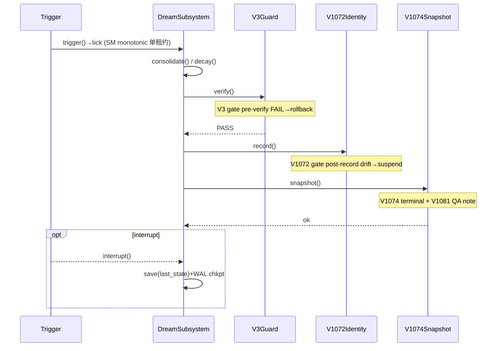
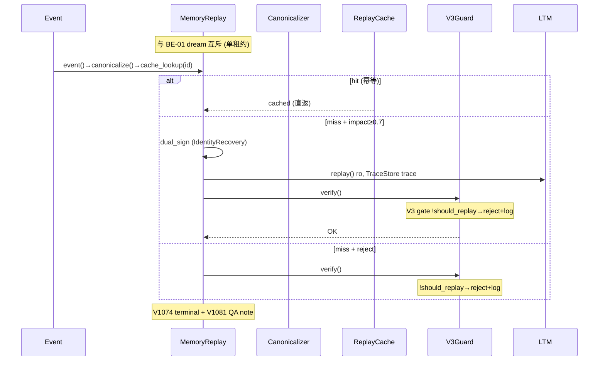
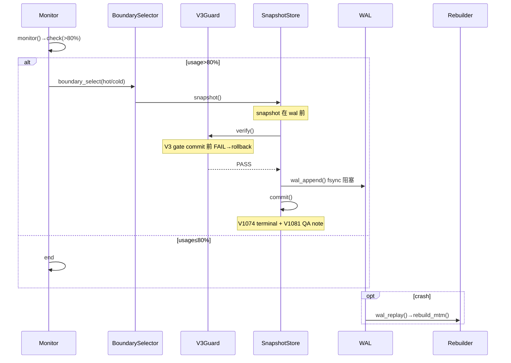

# R7-WF-02 R7 三主线时序图 — Dream/Replay/HotCold

ID: d93f01ae-006f-4854-b72c-de0f4199dc8c
基于 R7-WF-01 状态图,覆盖时序层(actor + lifeline + message)。

## 1. BE-01 DreamSubsystem (13 行)

Actors: T/D/V3/I/S + SM(内嵌 monotonic tick)。

## 2. BE-02 MemoryReplay (14 行)

Actors: E/M/C/R/V3/L + TraceStore(ro) + IdentityRecovery。

## 3. DB-01 HotCold (13 行)

Actors: M/B/V3/S/W/R。

## 4. 守门 + V1081

V3: BE-01 verify 前 / BE-02 trace 后 verify 前 / DB-01 commit 前 (Note) → rollback+alert / reject+log。
V1072: BE-01 record 后 Note (drift→suspend)。
V1074: 三图末端 Note → retry 3x。
V1081: 三图 Note 内引用 → limits_probe。

## 5. 异常 (9/9)

BE-01: V3 FAIL→rollback+alert; record FAIL→drift→suspend; snapshot FAIL→retry 3x→alert; interrupt(opt)→save(last_state)+WAL chkpt。
BE-02: 幂等 replay_id→cached 直返(alt); dual_sign 失败→IdentityRecovery; trace 污染→V3 abort; !should_replay→reject+log。
DB-01: >80% V3 FAIL→rollback; wal_append FAIL→retry→拒 commit; ≤80% 不触发; crash(opt)→Rebuilder.wal_replay→rebuild_mtm。
互斥: BE-01 dream ↔ BE-02 replay 单租约 wait。

## 6. 与 WF-01 1:1

BE-01 Idle→Trigger→Tick→Process→GuardV3→Verify→Identity→Snapshot ⇔ trigger→tick→consolidate/decay→verify→record→snapshot。
BE-02 EventIn→Canonicalize→CacheHit→Replay→GuardV3→Impact/DualSign→Trace ⇔ event→canonicalize→cache_lookup→(hit)return/(miss)replay→dual_sign→trace→V3.verify。
DB-01 Monitor→Check→Boundary→GuardV3→Snapshot→WAL→Commit→Rebuild ⇔ monitor→check→boundary_select→snapshot→V3.verify→wal_append→commit→wal_replay。
WF-01 (状态) → WF-02 (时序细化)。

## ✓

≤4KB ✓ | 3 sequenceDiagram(13/14/13) ✓ | V3/V1072/V1074 Note ✓ | V1081 三图引用 ✓ | 中断/拒/崩溃 ✓ | 双签 impact≥0.7 ✓ | 幂等+单租约 ✓ | WAL fsync ✓ | WF-01 1:1 ✓ | 无代码/commit ✓