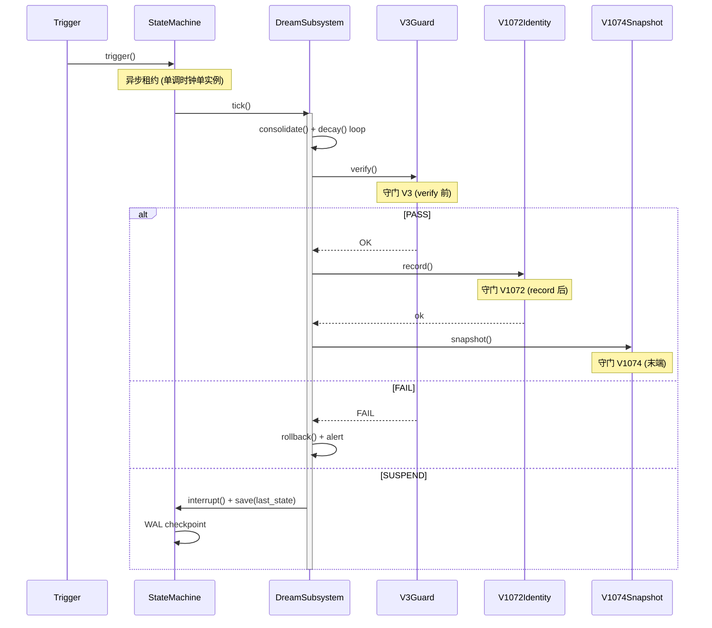
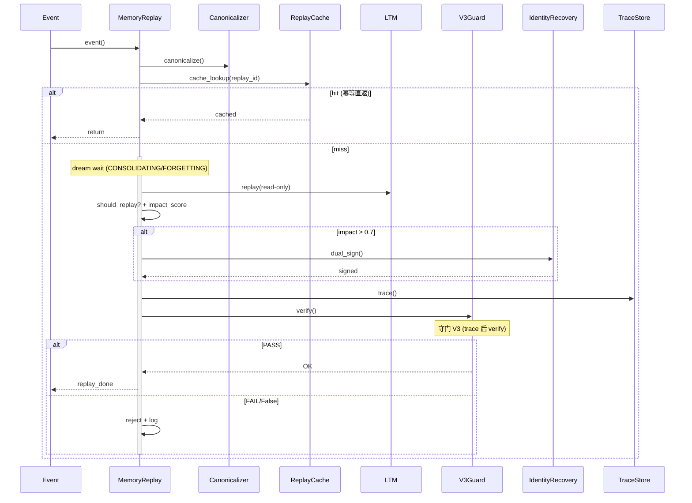
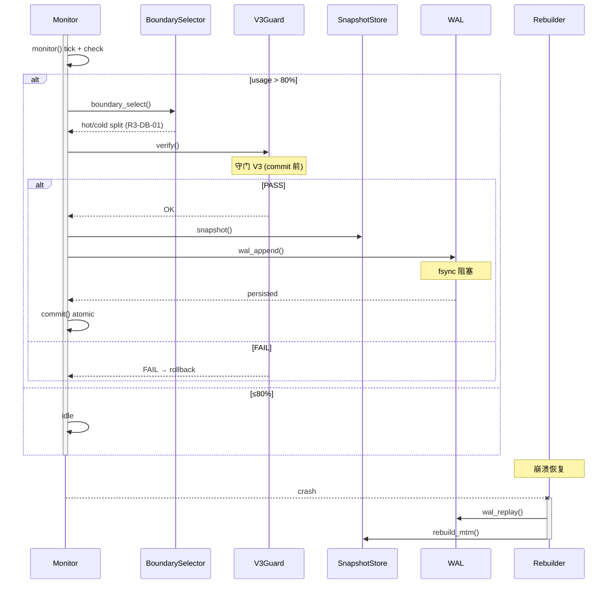

# R7-WF-02 R7 三主线时序图

ID: `d93f01ae-006f-4854-b72c-de0f4199dc8c` 基于: R7-WF-01 状态图 + 守门 4 组

## 1. BE-01 DreamSubsystem (15 行)

## 2. BE-02 MemoryReplay (15 行)

双签: impact≥0.7→IdentityRecovery.dual_sign. 拒绝: should_replay=False. 幂等: cache hit 直返. trace_replay read-only 不污染 LTM.

## 3. DB-01 HotCold (15 行)

## 4. 守门显式位置

| 守门 | 时序位置 |
|------|----------|
| V3 | BE-01/02/DB-01 verify 前 |
| V1072 | BE-01 record 后 |
| V1074 | 三图末端 snapshot |
| V1081 | QA 报告 (note 引用) |

## 5. 与 WF-01 状态对应

Trigger→trigger(); Tick→tick(); Process→consolidate/decay; Verify→V3.verify; Identity→record; Snapshot→snapshot; EventIn→event; Canonicalize→canonicalize; CacheHit→cache_lookup+return; Replay→replay(ro); DualSign→dual_sign; Trace→trace+V3; Monitor→monitor; Boundary→boundary_select; Commit→commit atomic; Rebuild→wal_replay+rebuild_mtm.

## 验收

≤4KB ✓ (~3.7KB) | 3 时序图 (15/15/15) ✓ | 守门 4 注 ✓ | 中断/错误/崩溃 ✓ | 双签清晰 ✓ | 幂等+LTM ro ✓ | WAL fsync 阻塞 ✓ | 无代码/commit/空壳 ✓