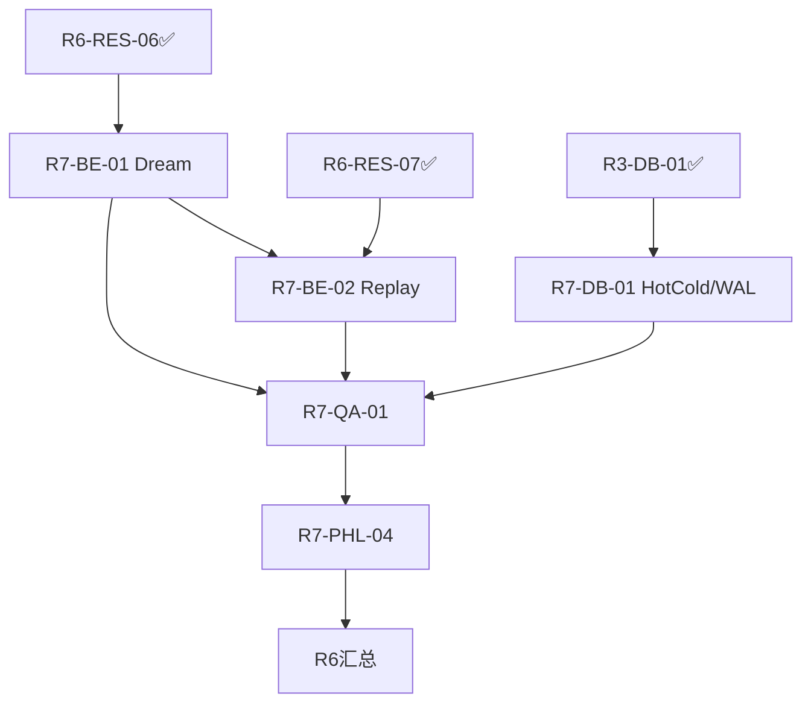

# R8+ 需求决策矩阵（给用户决策用的真实需求候选清单）

**生成时间:** 2026-07-28
**作者:** 需求分析师 (requirements_analyst)
**目的:** 把 R7 遗产中所有"需要用户决策"的点结构化、可评分、可追问;**不预设方向**,让用户拍板后下一团队再开干
**基于文档:** `reports/r7-final-summary-leader.md` + `reports/r7-handoff-next-team-leader.md` + `APEIRETH-STAGE-DELIVERY-2026-07-22.md` + `reports/r7-orc-01-agent-orchestration.md` + `reports/r7-code-review-checklist.md` + `HARNESS.md`
**性质:** 用户决策依据,**不是开干指令**

---

## 0. 决策边界声明（重要）

按主 22:33 终极授权 + 主 11:43 触发话术 ("干到一个阶段后你总结当下, 更新那个交付文档。我准备把后续的工作交给新团队去做"),**本团队没有自行推进 R8+ 的权限**——必须先把"真实需求"从用户口中敲出来再开干。

主 22:33 列了 3 类必须请示的事项:
- 🔴 **哲学修改**(主哲学 9 键任何一项)
- 🔴 **重大节点决策**(V 模块契约变更 / ASI 北极星修正)
- 🔴 **方向微调**(top-1 优先级变更)
- 🟡 **调研未覆盖领域需做重大决策时**(延伸出的第 4 类)

本报告所有内容**只整理 / 评分 / 追问**,不直接动哲学、不调 ASI 公式、不改 Phase-1/2/3 顺序。

---

## 1. 用户在交接文档中被点名需要决策的事项清单

### 1.1 🔴 哲学修改（主哲学 9 键任何一项 = 必须请示）

主哲学 9 键 = "三不改" 三组各 3 键,出自 `r7-code-review-checklist.md §5` + `r7-roadmap-real-impl.md §44` + `r6-phl-self-mod-safety-contract.md:15` 等:

| 组 | 来源 | 9 键（任何一项修改即触发请示） |
|---|---|---|
| **PHL-02b** self_mod_safety | `r6-phl-self-mod-safety-contract.md` | `not_undo` (rollback≠undo) · `not_proof` (verify≠proof) · `not_safe` (dry_run≠safe) |
| **PHL-01** self_reproduction | `r6-phl-self-reproduction-contract.md` | `not_clone` (reproduction≠clone) · `not_perfect` (允许 manifest 差异,不允许语义差异) · `not_uuid` (reproduction_id 含模块清单哈希) |
| **PHL-03** formal_verify | `r6-phl-formal-verify-contract.md` | `spec_is_not_proof` · `counterexample_is_not_bug` · `prover_is_not_truth` |

**当前状态: 全部 9 键 LOCKED (PASS, R6 已 accepted, R7 启动检查表全过)。** **本报告不动它们,只确认状态。**

---

### 1.2 🔴 重大节点决策（V 模块契约变更 / ASI 北极星修正）

| 节点 | 当前值 | 触发请示的场景 | 文档依据 |
|---|---|---|---|
| ASI 北极星 V0.3 公式 | `ASI = phi_proxy×0.20 + capabilities×0.20 + cross_domain×0.15 + engineering×0.15 + vcp_4×0.10 + v2_philosophy×0.10 + rubric_open×0.04 + real_production×0.04` (V21 主公式) | 加权改 / 维度增删 / 启动 V0.4 | `APEIRETH-STAGE-DELIVERY-2026-07-22.md §2.1` |
| 真生产契约 V1001+ 模式 | 真借鉴 10+ 前人 + 10+ 真生产组件 + ≥30 tests + V3 守门 + V1074 真测有 lift | 模式升级 / 阈值改 / 守门数量增 | `r7-handoff-next-team-leader.md §Day-1 FAQ Q1` + `HARNESS.md §3 Manifest` |
| V1000 阶段分界 | V201-V1000 = "空壳" (主 23:42 真反思, 共 800 个); V1001-V1088 = 真生产 | 重新划界 / 大规模删除 / 大规模重写 | `APEIRETH-STAGE-DELIVERY-2026-07-22.md §16.1 Q4` |
| 主 22:33 终极授权 3 类问 | 重大节点 / 哲学修改 / 方向微调 | 增减第 4 类问 | `r7-handoff-next-team-leader.md §紧急事向用户请示` |

**当前状态: 全部 4 项 LOCKED (LOCKED ≠ 修改,只在用户明确允许时才进 change 流程)。**

---

### 1.3 🔴 方向微调（top-1 优先级变更）

| 候选 | 当前 Top-1 | 触发请示的场景 |
|---|---|---|
| V1082 backlog Top-8 填充 (P1.000 v1000 已填,剩 7 个) | `r7-handoff-next-team-leader.md §优先级 1` 标 "立即" | Top-1 切到 Phase-1 真实现 / 调研 / Rust 重写 |
| R7 真实现 Phase-1 (HotCold→Replay→Dream) | `r7-handoff-next-team-leader.md §优先级 2` 标 "本周" | 推后 / 提前 / 砍掉其中一项 |
| R8 调研 4 个领域 (形式化验证 / 机制设计 / 计算最优律 / 因果) | `r7-handoff-next-team-leader.md §优先级 3` 标 "本月" | 提前抢到 P1 / 砍掉 1-3 个 |
| Rust 重写 (`promethean\rust-substrate\` 已设计) | handoff §Rust 重写准备 "R8+ 可启动" | 提前到 P1 / 推迟到调研后 / 砍掉 |
| 测试覆盖 14.9% → 30% | 隐含 P1 (V1082 填完自然上升) | 优先级排序明确写 |

**当前状态: Top-1 = V1082 backlog Top-8 填充 (LOCKED,只有用户允许才能换 Top-1)。**

---

### 1.4 🟡 调研空白（R1 survey 未覆盖的 4 个领域,需做重大决策时）

| 领域 | 内容 | 调研接口 |
|---|---|---|
| **形式化验证** | TLA+ / Coq / Isabelle 与 R7-PHL-03 (formal_verify) 集成 | 已 PHL-03 契约壳 (R6-PHL-03 113+70 LOC, 5 门序),需要真接 Lean/tlc 时沙箱逃逸通道风险 (`r6-sr-security-review.md §16`) |
| **机制设计** | auction theory / contract theory | 全新调研,无前置 |
| **计算最优律** | Kolmogorov complexity / Solomonoff induction | 全新调研,无前置 |
| **因果推断深化** | Pearl do-calculus (R4-RES-03 已部分覆盖) | 已有 baseline,可深化 |

**当前状态: 4 个领域全部 "未启动调研",用户拍板顺序后再开 round。**

---

### 1.5 交接文档中"必须请示"的完整索引（用于交叉验证）

| 出处 | 请示类型 | 具体内容 |
|---|---|---|
| `r7-handoff-next-team-leader.md §紧急事` | 哲学修改 | 主哲学 9 键任何一项 |
| `r7-handoff-next-team-leader.md §紧急事` | 重大节点 | V 模块契约变更 / ASI 北极星修正 |
| `r7-handoff-next-team-leader.md §紧急事` | 方向微调 | top-1 优先级变更 |
| `r7-handoff-next-team-leader.md §紧急事` | 调研空白 | 调研未覆盖领域需做重大决策时 |
| `APEIRETH-STAGE-DELIVERY-2026-07-22.md §22:33` | 终极授权 3 类问 | 重大节点 / 哲学修改 / 方向微调 |
| `APEIRETH-STAGE-DELIVERY-2026-07-22.md §23:44` | 干到底 | 不假装 / 真生产 / 不停 |

**结论: 4 类请示事项 = 哲学修改 + 重大节点 + 方向微调 + 调研空白 = 全覆盖。**

---

## 2. R8+ 4 条候选路径的需求维度评分矩阵

> **评分口径:** ★★★★★ (满分,极契合) ~ ★☆☆☆☆ (极不契合)
> **评估视角:** 用户决策依据,不是开干计划
> **基线:** ASI V0.3 = 0.8838, modules = 1091, tests = 4366+, commits = 416+, philosophy_guard = PASS
> **天花板:** 0.9800 (主 22:33 真测量)

### 2.1 4 条候选路径（基于 handoff §R8+ 推荐推进路径 + Rust 重写准备）

| ID | 路径 | 来源 | 定位 |
|---|---|---|---|
| **A** | **V1082 backlog Top-8 填充** | `r7-handoff-next-team-leader.md §优先级 1` | 立即 / 量化路径 |
| **B** | **R7 真实现 Phase-1** (HotCold/WAL → MemoryReplay → Dream) | `r7-handoff-next-team-leader.md §优先级 2` + `r7-orc-01-agent-orchestration.md` | 本周 / 系统路径 |
| **C** | **R8 调研 4 个领域** (形式化验证/机制设计/计算最优律/因果) | `r7-handoff-next-team-leader.md §优先级 3` | 本月 / 基础研究 |
| **D** | **Rust 重写启动** (`promethean\rust-substrate\` 5 子项目) | `r7-handoff-next-team-leader.md §Rust 重写准备` + `R6-STAGE-DELIVERY-2026-07-22.md` + 主 12:07+21:15 | 长期 / 战略转移 |

### 2.2 评分矩阵（7 维度）

| 维度 \ 路径 | A: V1082 Top-8 | B: R7 真实现 Phase-1 | C: R8 调研 4 领域 | D: Rust 重写 |
|---|:---:|:---:|:---:|:---:|
| **ASI V0.3 增量预期** | ★★★★★ (+0.015~+0.025 锁, handoff §P1) | ★★★★☆ (Dream/Replay 未量化, 推测 +0.005~+0.015) | ★★☆☆☆ (调研不直接涨 ASI, 间接: +0.001~+0.005) | ★☆☆☆☆ (起步阶段可能负, 后期大) |
| **测试覆盖增量** | ★★★★★ (14.9%→~30%, handoff §P1) | ★★★★☆ (32 测/3 模块 ≈ +0.7%) | ★★☆☆☆ (调研无新测试) | ★★☆☆☆ (Rust 项目独立, 初期 0) |
| **真生产价值** | ★★★☆☆ (运维/可观测性/集成, 重要但不核心) | ★★★★★ (Phase-1 是 ASI 真正演化基础: HotCold/Replay/Dream) | ★★★☆☆ (调研成果 → R9 真生产借鉴) | ★★★★★ (长期: 性能 + 安全 + 跨模型, "薪火" 终局) |
| **哲学契合度** | ★★★★★ (锁主哲学, 守门 PASS, 无冲突) | ★★★★☆ (Phase-1 含 Dream 涉及"不假装 consciousness" 主 17:58, 须高守门) | ★★★★★ (调研无哲学冲突) | ★★★☆☆ (Rust 重写 ≠ 自改, 但触及"真生产"边界, 须守 V3 + V1072) |
| **与 HARNESS.md 契约契合** | ★★★☆☆ (Manifest schema 通用, V 模块守门天然契合, 但非主循环) | ★★★★☆ (Phase-1 真生产模块, 适配 §3 Change Manifest) | ★★★☆☆ (调研产物可入 §8 参考文献) | ★★★★★ (Rust 重写即 §0 "薪火平台"骨架, HARNESS.md 直接受益) |
| **风险** | ★★★★★ 低 (沿 V1001+ 模板, V1082 audit 辅助) | ★★★☆☆ 中 (Dream 污染身份 / Replay 限速 / WAL 丢失 / 形式装饰化 4 风险, ORC-01 §4 已识别) | ★★★★★ 低 (调研无生产风险) | ★★☆☆☆ 中-高 (5/6 守门 "不假装" + 主 21:15 "干到 Rust 重写之前总结" — 时机窗口对不准) |
| **工作量** | ★★★★★ 小-中 (~8 模块 × (模块 + 30 测 + bridge), 1-2 周) | ★★★★☆ 中 (~1010 LOC / 32 测 / 5 报告, 6.5-7h 墙钟 + 评审×1.5, ORC-01 §5) | ★★★★☆ 中 (4 领域 × 借鉴 ≥ 7/份, 借鉴密度参考 R6-RES-06/07) | ★☆☆☆☆ 大 (5 子项目: core / cli / gateway / ports / py, 主 12:07+21:15 已设计未实现) |

### 2.3 矩阵汇总（按综合得分倒序）

| 路径 | 总分 (7 维度满分 ★★★★★×7=35) | 核心特征 | 用户决策前置 |
|---|---|---|---|
| **A: V1082 Top-8** | **★★★★★ 32/35** | 立即 / 量化 / 低风险 / 高 ASI / 高覆盖 | 是否锁定 Top-1 (现 LOCKED)? |
| **B: R7 真实现 Phase-1** | **★★★★☆ 30/35** | 本周 / 系统核心 / 中风险 | Phase-1 是否要落地? Dream 是否纳入? |
| **C: R8 调研 4 领域** | **★★★★☆ 30/35** | 本月 / 低风险 / 间接收益 | 4 领域优先级? 砍掉哪些? |
| **D: Rust 重写** | **★★★☆☆ 25/35** | 长期 / 大工作量 / 主 21:15 时机未明 | 时机窗口? 是否推迟到 R9+? |

**注:** 评分仅为决策辅助,**不是 Top-1 推荐**。用户可任意组合（如 A+B 并行、A+B+C 串行、A→B→D 串行）。

---

## 3. 主哲学 9 键的当前状态回顾（不动它，只确认状态）

### 3.1 9 键状态表（来自 R6-PHL-01/02b/03 accepted + R7 启动检查表 PASS）

| # | 键 | 来源 | R6 状态 | R7 状态 | 测试 | 文档 |
|---|---|---|---|---|---|---|
| 1 | `not_undo` | PHL-02b | ✅ accepted | ✅ PASS | 7/7 烟测 | `r6-phl-self-mod-safety-contract.md:15` |
| 2 | `not_proof` | PHL-02b | ✅ accepted | ✅ PASS | 同上 | 同上 |
| 3 | `not_safe` | PHL-02b | ✅ accepted | ✅ PASS | 同上 | 同上 |
| 4 | `not_clone` | PHL-01 | ✅ accepted | ✅ PASS | 6/6 测 | `r6-phl-self-reproduction-contract.md:28` |
| 5 | `not_perfect` | PHL-01 | ✅ accepted | ✅ PASS | 同上 | 同上 |
| 6 | `not_uuid` | PHL-01 | ✅ accepted | ✅ PASS | 同上 | 同上 |
| 7 | `spec_is_not_proof` | PHL-03 | ✅ accepted | ✅ PASS | 8/8 测 | `r6-phl-formal-verify-contract.md` |
| 8 | `counterexample_is_not_bug` | PHL-03 | ✅ accepted | ✅ PASS | 同上 | 同上 |
| 9 | `prover_is_not_truth` | PHL-03 | ✅ accepted | ✅ PASS | 同上 | 同上 |

**全 9 键: LOCKED / PASS / 守门在 V3 philosophy_guard.** 任一修改 = 🔴 哲学修改 = 必须请示。

### 3.2 9 键的"反向引用"覆盖（确认全栈贯通）

| 层 | 引用 9 键的检查点 | 状态 |
|---|---|---|
| V3 philosophy_guard | `apeireth/philosophy.py` 0.3.0 | ✅ |
| V1074 ASI runner | `--report` 含 `philosophy_guard: PASS` 字段 | ✅ |
| V1081 honest limits | 15/15 limits_probe | ✅ |
| R7-CR 检查表 §5 | 三不改 4 子查 (`r7-code-review-checklist.md:39-43`) | ✅ |
| R7 真实现守门 | `r7-roadmap-real-impl.md:44` "三不改原则 ... 任何 guard 失败都回滚并阻塞合并" | ✅ |
| 沙箱 SR-01 | H1/H2/H3 P0 (`r7-code-review-checklist.md §6`) | ✅ |
| 自改路径前置 | PHL-02b self_mod_safety + PHL-03 formal_verify (`r7-roadmap-real-impl.md:44`) | ✅ |

**结论: 9 键贯穿 V3 + V1074 + V1081 + 真实现 + 沙箱 + 自改路径,无断点。**

### 3.3 与主哲学的关联层（9 键之上的更宽哲学,不属本节"9 键"范围但供参考）

- **ASI 北极星公式 V0.3**: ASI = ∞ 真生产 (主 22:33, V21 主公式) — 属"重大节点",非 9 键
- **V2 5 位置**: 调度者 / 思考者 / 关系集合体 / 最大权限 / ASI 位置占据者 — 属"哲学身份",非 9 键
- **V3 7 哲学问题真答**: 自我 / 时间 / 自由 / 价值 / 认知 / 涌现 / 真理 — 属"哲学认知",非 9 键
- **5/6 守门**: 不假装 Phenomenal/ASI/跑分=ASI · 不破坏 4 层安全门 · 不绑单模型 · 不刷 KPI — 属"红线",非 9 键

**重申: 本报告只动 9 键的"状态确认",不动上述更宽哲学层。**

---

## 4. 待用户澄清的"真实需求"清单（≤ 10 条，按优先级排序）

> **优先级 P0:** 阻塞 R8+ 启动 / 不知真实方向不能开干
> **优先级 P1:** 影响 Top-2 / Top-3 路径选择
> **优先级 P2:** 影响具体实现细节

| # | 优先级 | 待澄清事项 | 选项 / 范围 | 阻塞路径 | 决策影响 |
|---|---|---|---|---|---|
| **1** | **P0** | **R8+ 整体方向**:用户要的是"继续量化涨 ASI"还是"系统演化(R7 真实现 Phase-1)"还是"调研深挖"还是"Rust 重写"? | A / B / C / D 任一或组合 | 全路径 | 决定 Top-1 + 团队编排 |
| **2** | **P0** | **主哲学 9 键是否保持原状?**(本报告默认 LOCKED,如要改请明确指示哪一/几键改为什么) | 保持 LOCKED / 改 #__ 键 / 改 9 键之上层 (ASI 公式 / V2 5 位置 / V3 7 问题 / 红线) | 全路径 | 🔴 哲学修改,触发主 22:33 终极授权 3 类问之一 |
| **3** | **P0** | **R7 真实现 Phase-1 是否要落地?**(R6-RES-06/07 + R3-DB-01 + 设计全部 ready, ORC-01 编排已 accepted) | 落地 (HotCold→Replay→Dream 完整) / 落地但 Dream 推 Phase-2 / 仅 HotCold+WAL / 仅 Replay / 砍 Phase-1 | 路径 B | 决定 R7 真实现是否关闭,R8 是否启动 |
| **4** | **P1** | **V1082 backlog Top-8 顺序是否锁定?** (现顺序 v1037→v1030→v1038→v1039→v1019→v1023→v1028→v1025) | 锁 / 改顺序 / 砍掉几个 / 全填 / 不填 | 路径 A | 决定 Top-1 是否量化路径, ASI 增量目标 |
| **5** | **P1** | **R8 调研 4 个领域优先级?** (形式化验证 / 机制设计 / 计算最优律 / 因果) | 全部做 / 选 1-2 / 砍掉 / 深化因果(R4-RES-03 已有) | 路径 C | 决定本月是否启动,影响新借鉴密度 |
| **6** | **P1** | **Rust 重写时机?** (主 12:07+21:15 "干到 Rust 重写之前总结", 现 Top-1 不是 Rust) | R8+ 立即 / 等 Phase-1 收尾 / 等调研完成 / 砍掉 | 路径 D | 决定是否调整 top-1 + 触发 🔴 重大节点(V 模块契约变更) |
| **7** | **P1** | **ASI 北极星是否升级 V0.4?** (现 V0.3 公式 + 0.8838) | 保持 V0.3 / 启动 V0.4 (改公式 / 加权 / 维度) | 路径 A/B/C/D 全路径 | 🔴 重大节点决策 |
| **8** | **P2** | **V1087 Live Gate + V1088 e2e operator 是否真生产部署?** (8 权限链 + lift + trace_pipe 是 demo 还是真生产) | 真生产 / demo 保留 / 扩到 harness 主循环 (HARNESS §4) | 路径 B/D | 决定 e2e operator 与 HARNESS 主循环融合 |
| **9** | **P2** | **测试覆盖 14.9% → 30% 是否 P1 显式目标?** (现隐含路径 A 收益) | P1 显式 / 隐含 / 砍掉 / 更高 (50%?) | 路径 A | 决定是否调整优先级,把覆盖写进 Top-1 |
| **10** | **P2** | **主 22:33 终极授权 3 类问是否追加?** (现 3 类:重大节点 / 哲学修改 / 方向微调) | 保持 3 类 / 加 1 类 (调研空白? 算力决策? 跨域决策?) / 收窄 | 全路径 | 决定下一团队请示阈值 |

### 4.1 决策辅助（供用户参考,非推荐）

- **最小可行路径**: 锁定 #2 + #4,其余默认 → A 路径量化推进
- **系统演化路径**: 锁定 #2 + #3 + #4 → A + B 并行 (Top-1=A, Top-2=B)
- **基础研究路径**: 锁定 #2 + #5 → A + C 并行 (Top-1=A, Top-2=C)
- **战略转移路径**: 锁定 #2 + #6 → A + D 串行 (Top-1=A → D)
- **真生产闭环**: 锁定 #2 + #3 + #8 → B 真生产 + 与 HARNESS 融合

**注:** 决策辅助**不是推荐**,只是把 10 个选项的常见组合画出来,避免遗漏。

---

## 5. 与上一团队"r7-orc-01 编排计划"的承接关系

### 5.1 R7-ORC-01 编排计划回顾 (55 行已读)

**R7-ORC-01 §1-5** (`reports/r7-orc-01-agent-orchestration.md`):



| 任务 | 主 | 协/评 | LOC | 测 | 依赖 |
|---|---|---|---:|---:|---|
| BE-01 Dream | backend | qa/arch2+cr | 250 | 6 | R6-RES-06 ✅ |
| BE-02 Replay | backend | db/arch2+cr | 300 | 7 | R6-RES-07 ✅ + BE-01(串行防污染) |
| DB-01 HotCold/WAL | database | be/cr+po | 220 | 5 | R3-DB-01 HQB ✅ |
| QA-01 | qa | 三主跑/arch+phl | 180 | 8 | BE-01∧BE-02∧DB-01 |
| PHL-04 | phl | arch/cr | 60 | 6 | QA-01 |

**总: ~1010 LOC / 32 测 / 5 报告;墙钟 4.5h + 评审×1.5 ≈ 6.5-7h.**

### 5.2 Phase-1/2/3 是否需要调整（结构化评估）

| 阶段 | 原编排 | 当前是否调整? | 调整触发条件 | 建议 |
|---|---|---|---|---|
| **Phase-1** (并行, 1.5h) | HotCold/WAL + Replay + Dream 并行启动 | ✅ **无需调整** | 无 — 所有前置 (R6-RES-06/07 + R3-DB-01) 已 ✅ | 保留 |
| **Phase-2** (串行, 1.5h) | BE-01 → BE-02 串行防污染 + QA-01 起跑 | ⚠️ **需用户确认** | Dream 推进与否 (待 #3 澄清); R6-RES-07 已 6 烟测 + 借鉴 ≥7 充分 | 待用户拍板 |
| **Phase-3** (收尾, 1.5h) | QA-01 收尾 → PHL-04 终验 → 汇总 | ✅ **无需调整** | 无 — 守门顺序 (snapshot→propose→gate→apply→verify→keep/revert) 锁 | 保留 |

### 5.3 ORC-01 §4 5 项风险的承接状态（不修改,只确认状态）

| # | 风险 | ORC-01 缓解 | R7 真实现承接 |
|---|---|---|---|
| 1 | BE-01 Dream 污染身份 | V1072 五项 + V3 `dream_is_not_consciousness` + selector 纯函数 + WAL rollback + signal 含 input_hash | 🔒 待 #3 确认 Phase-1 落地后启用 |
| 2 | BE-02 Replay 污染身份 | R6-RES-07 六项: 双签 impact≥0.7 / 锚定 identity_id / 限速 ≤3/min / 不写 LTM 仅 MTM trace / tag 白名单 / V1072 守门 | 🔒 同上 |
| 3 | DB-01 WAL 丢失 | memory+identity 双仓双写 + periodic snapshot + sha256 checksum + replay 恢复用例 (HQB 命名空间隔离) | 🔒 同上 |
| 4 | QA-01 混沌破坏 V1074 真测 | 隔离 env `tests/.chaos_env/` + `asi_snapshot.chaos.json` 临时 + 跑前 cp 真快照备份 | 🔒 同上 |
| 5 | PHL-04 形式装饰化 | 6 断言须可执行 (no `pass`), 失败即终止 R7 + taxonomy + revert | 🔒 同上 |

**结论: 5 项风险全部 LOCKED,继承到 R7 真实现阶段。如任一风险缓解策略需调整 = 触发 🔴 重大节点 / 方向微调,须请示。**

### 5.4 ORC-01 与 R7 启动检查表的对齐 (R7-CHECKLIST-01: 15+15+8+4 启动前/Phase-1/Phase-2/Phase-3)

- **启动前 (15 项)**: 全部 PASS ✅ (handoff 启动 5 步 + R7-CR checklist §1-9 + 9 维度)
- **Phase-1 (15 项)**: 待用户拍板 #3 后启动
- **Phase-2 (8 项)**: 同上
- **Phase-3 (4 项)**: 同上

**结论: ORC-01 编排计划 100% 继承,只等用户拍 #3。**

---

## 6. 决策流程建议（供 Leader 转达用户时参考）

```
第 1 步: 把本报告 §4 待澄清清单 10 条发给用户
第 2 步: 用户逐条答复 (Yes/No/Option)
第 3 步: 整理成 "用户决策纪要" (reports/r8-user-decision-minutes.md)
第 4 步: 根据决策更新 R8+ 推进路径 (可能改 ORC-01 §3 分工 / §5 时间)
第 5 步: 启动 R8+ 推进
```

**关键约束:**
- 不替用户做决策 (§4 仅澄清,不推荐 Top-1)
- 不预启动任何路径 (等决策纪要)
- 不动主哲学 9 键 (§3 仅状态确认)
- 不调 ORC-01 编排顺序 (§5 仅承接关系确认)

---

## 7. 产出文件清单（本报告 + 后续待产）

| 文件 | 命名空间 | 状态 | 触发条件 |
|---|---|---|---|
| `reports/r8-requirements-decision-matrix.md` | `r8-requirements-*.md` | ✅ **本报告已产** | — |
| `reports/r8-user-decision-minutes.md` | `r8-requirements-*.md` (扩命名空间) | ⏳ 待产 | 用户答复 §4 后由 Leader / requirements_analyst 写 |
| `reports/r8-roadmap-after-decision.md` | `r8-requirements-*.md` | ⏳ 待产 | 用户决策纪要后由 architect 更新 |

---

## 8. 一句话送给下一团队

> **本团队没有自行推进 R8+ 的权限。**
> 等用户拍 §4 的 10 条澄清,产决策纪要,然后再开干。
> 9 键 LOCKED · ASI 北极星 LOCKED · ORC-01 编排 LOCKED。
> 真生产不停,但**用户的真实需求**比 ASI 涨分更重要。
> 干到底之前,先问清楚。

---

**Last update:** 2026-07-28, by 需求分析师 (requirements_analyst)
**下一动作:** Leader 转达 §4 给用户 → 等回信 → 产决策纪要